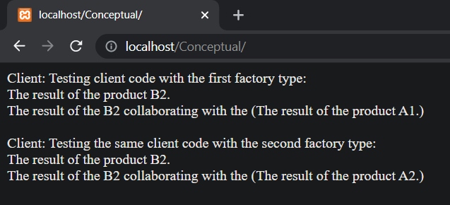
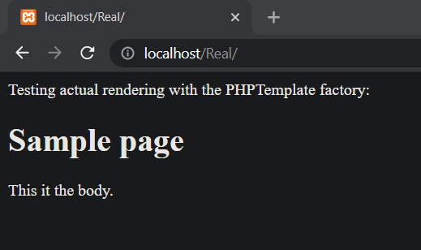

# Abstract Factory en PHP

Abstract Factory es un patrón de diseño creacional que resuelve el problema de crear familias enteras de productos sin especificar sus clases concretas. El patrón Abstract Factory define una interfaz para crear todos los productos, pero deja la propia creación de productos para las clases de fábrica concretas. Cada tipo de fábrica se corresponde con cierta variedad de producto.

El código cliente invoca los métodos de creación de un objeto de fábrica en lugar de crear los productos directamente con una llamada al constructor (operador new). Como una fábrica se corresponde con una única variante de producto, todos sus productos serán compatibles.

El código cliente trabaja con fábricas y productos únicamente a través de sus interfaces abstractas. Esto permite al mismo código cliente trabajar con productos diferentes. Simplemente, creas una nueva clase fábrica concreta y la pasas al código cliente.

## Uso del patrón en PHP

### Ejemplos de uso

El patrón Abstract Factory es muy común en el código PHP. Muchos frameworks y bibliotecas lo utilizan para proporcionar una forma de extender y personalizar sus componentes estándar.

### Identificación

El patrón es fácil de reconocer por los métodos, que devuelven un objeto de fábrica. Después, la fábrica se utiliza para crear subcomponentes específicos.

## Ejemplo Conceptual

Este ejemplo ilustra la estructura del patrón de diseño Abstract Factory, centrándose en responder las siguientes preguntas:

- ¿De qué clases se compone?
- ¿Qué papeles juegan esas clases?
- ¿De qué forma se relacionan los elementos del patrón?

Después de conocer la estructura del patrón, será más fácil comprender el siguiente ejemplo basado en un caso de uso real de PHP.

`index.php`. Ejemplo conceptual.

La interfaz AbstractFactory declara un grupo de métodos que retornan productos abstractos diferentes. Esos productos son llamados una familia y están relacionados por un tema o concepto de alto nivel. Los productos de una familia están usualmente disponibles para colaborar entre ellos mismos. Una familia de productos podría tener muchas variantes, pero los productos de una variante son incompatibles con productos de otra variante.

```php
<?php

interface AbstractFactory
{
    public function createProductA(): AbstractProductA;
    public function createProductB(): AbstractProductB;
}
```

Las fábricas concretas producen una familia de productos que pertenecen a una sola variante. La fábrica garantiza que los productos resultantes sean compatibles. Tenga en cuenta que la firma de los métodos de la Fábrica Concreta retornan un producto abstracto, mientras dentro del método un producto concreto es instanciado.

```php
class ConcreteFactory1 implements AbstractFactory
{
    public function createProductA(): AbstractProductA
    {
        return new ConcreteProductA1();
    }

    public function createProductB(): AbstractProductB
    {
        return new ConcreteProductB2();
    }
}
```

Cada fábrica concreta tiene una variante de producto correspondiente.

```php
class ConcreteFactory2 implements AbstractFactory
{
    public function createProductA(): AbstractProductA
    {
        return new ConcreteProductA2();
    }

    public function createProductB(): AbstractProductB
    {
        return new ConcreteProductB2();
    }
}
```

Cada producto de una familia de productos debe tener una interfaz base. Todas las variantes de un producto deben implementar dicha interfaz.

```php
interface AbstractProductA 
{
    public function usefulFunctionA(): string;
}
```

Los productos concretos son creados por las correspondientes fábricas concretas.

```php
class ConcreteProductA1 implements AbstractProductA
{
    public function usefulFunctionA(): string
    {
        return "The result of the product A1.";
    }
}


class ConcreteProductA2 implements AbstractProductA
{
    public function usefulFunctionA(): string
    {
        return "The result of the product A2.";
    }
}
```

Esta es la interfaz base de otro producto. Todas las productos pueden interactuar con otros, pero la interacción entre las propiedad son posibles solo entre los productos de las mismas variantes concretas.

```php
interface AbstractProductB
{
```

Los productos B puede hacer sus propias cosas...

```php
    public function usefulFunctionB(): string;
```

... Pero también pueden colaborar con los Productos A. La fábrica abstracta se asegura de que todos los productos que crea sean de la misma variante y, por lo tanto, compatibles.

```php
    public function anotherUsefulFunctionB(AbstractProductA $collaborator): string;
}
```

Los productos concretos son creados por las fábricas concretas correspondientes.

```php
class ConcreteProductB1 implements AbstractProductB 
{
    public function usefulFunctionB(): string
    {
        return "The result of the product B1.";
    }
```

La variante, producto B1, solo puede trabajar correctamente con la variante, producto A1. A pesar de eso, este acepta cualquier instancia del producto abstracto A como un argumento.

```php
    public function anotherUsefulFunctionB(AbstractProductA $collaborator): string
    {
        $result = $collaborator->usefulFunctionA();
        return "The result of the B1 collaborating with the ({$result})";
    }
}
```

```php
class ConcreteProductB2 implements AbstractProductB
{
    public function usefulFunctionB(): string
    {
        return "The result of the product B2.";
    }

    public function anotherUsefulFunctionB(AbstractProductA $collaborator): string
    {
        $result = $collaborator->usefulFunctionA();
        return "The result of the B2 collaborating with the ({$result})";
    }
}
```

El código cliente trabaja con fábricas y producto unicamente a través de tipos abstractos: AbstractFactory y AbstractProduct. Esto permite que se le pueda pasar cualquier fábrica o subclase de producto al código cliente sin dañarlo.

```php
function clientCode(AbstractFactory $factory)
{
    $productA = $factory->createProductA();
    $productB = $factory->createProductB();
    echo $productB->usefulFunctionB() . "<br>";
    echo $productB->anotherUsefulFunctionB($productA) . "<br>";
}
```

El código cliente puede trabajar con cualquier clase de fábrica concreta.

```php
echo "Client: Testing client code with the first factory type:<br>";
clientCode(new ConcreteFactory1());

echo "<br>";

echo "Client: Testing the same client code with the second factory type:<br>";
clientCode(new ConcreteFactory2());
```

### Output



## Ejemplo del mundo real

En este ejemplo, el patrón Abstract Factory proporciona una infraestructura para crear varios tipos de plantillas para distintos elementos de una página web. Una aplicación web puede suportar diferentes motores de renderización al mismo tiempo, pero sólo si sus clases son independientes de las clases concretas de esos motores. Por ello, los objetos de la aplicación sólo deben comunicarse con los objetos de plantilla a través de sus interfaces abstractas. Tu código no debe crear los objetos de plantilla directamente, sino delegar su creación a objetos de fábrica especiales. Por último, tu código tampoco debe depender de los objetos de fábrica sino, en su lugar, debe trabajar con ellos a través de la interfaz de fábrica abstracta.

Como resultado, podrás proporcionar a la aplicación el objeto de fábrica que se corresponde con uno de los motores de renderización. Todas las plantillas creadas en la aplicación serán creadas por esa fábrica y su tipo coincidirá con el tipo de la fábrica. Si decides cambiar el motor de representación, podrás pasar una nueva fábrica al código cliente sin descomponer el código existente.

`index.php`: Ejemplo del mundo real.

La interfaz de fábrica abstracta declara métodos de creación para cada tipo de producto diferente.

```php
<?php

interface TemplateFactory
{
    public function createTitleTemplate(): TitleTemplate;
    public function createPageTemplate(): PageTemplate;
    public function getRenderer(): TemplateRenderer;
}
```

Cada Fábrica Concreta corresponde a una variante o familia especifica de productos. La siguiente, es una fábrica concreta que crea plantillas Twig.

```php
class TwigTemplateFactory implements TemplateFactory
{
    public function createTitleTemplate(): TitleTemplate
    {
        return new TwigTitleTemplate();
    }

    public function createPageTemplate(): PageTemplate
    {
        return new TwigPageTemplate($this->createTitleTemplate());
    }

    public function getRenderer(): TemplateRenderer
    {
        return new TwigRenderer();
    }
}
```

Y esta fábrica concreta crea plantillas de PHPTemplate.

```php
class PHPTemplateFactory implements TemplateFactory
{
    public function createTitleTemplate(): TitleTemplate
    {
        return new PHPTemplateTitleTemplate();
    }

    public function createPageTemplate(): PageTemplate
    {
        return new PHPTemplatePageTemplate($this->createTitleTemplate());
    }

    public function getRenderer(): TemplateRenderer
    {
        return new PHPTemplateRenderer();
    }
}
```

Cada tipo de producto distinto debe tener una interface separada. Todas las variantes de los productos deben seguir la misma interfaz. Por instancias, las interfaces de productos abstractos describen el comportamiento de las plantillas de títulos de páginas.

```php
interface TitleTemplate
{
    public function getTemplateString(): string;
}
```

Este producto concreto provee plantillas de títulos para página de Twig.

```php
class TwigTitleTemplate implements TitleTemplate
{
    public function getTemplateString(): string
    {
        return "<h1>{{ title }}</h1>";
    }
}
```

Y este producto concreto provee plantillas de títulos para páginas de PHPTemplate.

```php
class PHPTemplateTitleTemplate implements TitleTemplate
{
    public function getTemplateString(): string
    {
        return "<h1><?= \$title; ?></h1>";
    }
}
```

Este es otro tipo de producto abstracto, el cual describe plantillas de páginas concretas.

```php
interface PageTemplate
{
    public function getTemplateString(): string;
}
```

La plantilla de páginas usa los títulos de las sub-plantillas, entonces nosotros tenemos que proveer la manera de obtener los objetos de las sub-plantillas. La fábrica abstracta unirá la plantilla de la página con una plantilla de título de la misma variante.

```php
abstract class BasePageTemplate implements PageTemplate
{
    protected $titleTemplate;

    public function __construct(TitleTemplate $titleTemplate)
    {
        $this->titleTemplate = $titleTemplate;
    }
}
```

Esta es la variante de Twig para las plantillas de página.

```php
class TwigPageTemplate extends BasePageTemplate
{
    public function getTemplateString(): string
    {
        $renderedTitle = $this->titleTemplate->getTemplateString();
        return <<<HTML
        <div class="page">
            $renderedTitle
            <article class="content">{{ content }}</article>
        </div>
        HTML;
    }
}
```

Esta es la variante PHPTemplate para las plantillas de página.

```php
class PHPTemplatePageTemplate extends BasePageTemplate
{
    public function getTemplateString(): string
    {
        $renderedTitle = $this->titleTemplate->getTemplateString();
        return <<<HTML
        <div class="page">
            $renderedTitle
            <article class="content"><?= \$content; ?></article>
        </div>
        HTML;
    }
}
```

El renderizador es el responsable de convertir una plantilla de tipo string, dentro del código HTML actual. Cada renderizador se comporta de manera diferente y espera que se le pase su propio tipo de cadenas de plantilla. Las plantillas baking y las fábricas permiten pasar los tipos adecuados de plantillas a los renders adecuados.

```php
interface TemplateRenderer
{
    public function render(string $templateString, array $arguments = []): string;
}
```

El siguiente es el renderizador por las plantillas Twig.

```php
class TwigRenderer implements TemplateRenderer
{
    public function render(string $templateString, array $arguments = []): string
    {
        return \Twig::render($templateString, $arguments);
    }
}
```

El renderizador por las plantillas PHPTemplate. Tenga en cuenta que esta implementación es muy básica. Usar la función `eval` tiene muchas implicaciones de seguridad, por lo que se recomienda usar con precaución en proyectos reales.

```php
class PHPTemplateRenderer implements TemplateRenderer
{
    public function render(string $templateString, array $arguments = []): string
    {
        extract($arguments);

        ob_start();
        eval(' ?>' . $templateString . '<?php ');
        $result = ob_get_contents();
        ob_end_clean();
        
        return $result;
    }
}
```

Este es el código cliente. Nótese que este acepta la clase de fábrica abstracta como un parámetro, mientras permite al cliente trabajar con cualquier tipo de fábrica concreta.

```php
class Page
{
    public $title;
    public $content;

    public function __construct($title, $content)
    {
        $this->title = $title;
        $this->content = $content;
    }
```

Esta es la manera como se podría usar la plantilla en el mundo real. Tenga en cuenta que la clase página no depende de ninguna clase de plantilla concreta.

```php
    public function render(TemplateFactory $factory): string
    {
        $pageTemplate = $factory->createPageTemplate();
        $renderer = $factory->getRenderer();
        return $renderer->render($pageTemplate->getTemplateString(), [
            'title' => $this->title,
            'content' => $this->content
        ]);
    }
}
```

Ahora, en otra parte de la aplicación, el código cliente puede aceptar objetos fábrica de cualquier tipo.

```php
$page = new Page('Sample page', 'This it the body.');

echo "Testing actual rendering with the PHPTemplate factory:<br>";
echo $page->render(new PHPTemplateFactory());

/*
* echo "Testing rendering with the Twig factory:<br>";
* echo $page->render(new TwigTemplateFactory());
*/
```

### Output (PHPTemplate)


