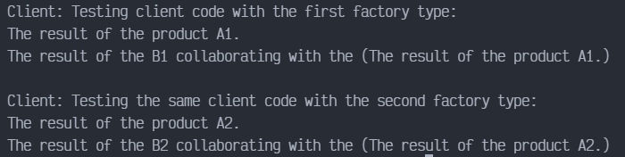

# Abstract Factory en PYTHON

Abstract Factory es un patrón de diseño creacional que resuelve el problema de crear familias enteras de productos sin especificar sus clases concretas. El patrón Abstract Factory define una interfaz para crear todos los productos, pero deja la propia creación de productos para las clases de fábrica concretas. Cada tipo de fábrica se corresponde con cierta variedad de producto.

El código cliente invoca los métodos de creación de un objeto de fábrica en lugar de crear los productos directamente con una llamada al constructor (operador new). Como una fábrica se corresponde con una única variante de producto, todos sus productos serán compatibles.

El código cliente trabaja con fábricas y productos únicamente a través de sus interfaces abstractas. Esto permite al mismo código cliente trabajar con productos diferentes. Simplemente, creas una nueva clase fábrica concreta y la pasas al código cliente.

## Uso del patrón en Python

### Ejemplos de uso

El patrón Abstract Factory es muy común en el código Python. Muchos frameworks y bibliotecas lo utilizan para proporcionar una forma de extender y personalizar sus componentes estándar.

### Identificación

El patrón es fácil de reconocer por los métodos, que devuelven un objeto de fábrica. Después, la fábrica se utiliza para crear subcomponentes específicos.

## Ejemplo Conceptual

Este ejemplo ilustra la estructura del patrón de diseño Abstract Factory. Se centra en responder las siguientes preguntas:

- ¿De qué clases se componen?
- ¿Qué papeles juegan esas clases?
- ¿De qué forma se relacionan los elementos del patrón?

`main.py`. Ejemplo conceptual.

```python
from __future__ import annotations
from abc import ABC, abstractmethod
```

La interfaz de fábrica abstracta declara un conjunto de métodos que retornan diferentes productos abstractos. Esos productos son llamados una familia y están relacionados por un tema o concepto de alto nivel. Los productos de una familia están usualmente disponibles para colaborar entre ellos mismos. Una familia de productos tienen muchas variantes, pero los productos de una variante son incompatibles con los productos de otros.

```python
class AbstractFactory(ABC):
    @abstractmethod
    def create_product_a(self) -> AbstractProductA:
        pass

    @abstractmethod
    def create_product_b(self) -> AbstractProductB:
        pass
```

Las fábricas concretas producen una familia de productos que pertenecen a una sola variante. La fábrica garantiza que los productos resultantes sean compatibles. Tenga en cuenta que la firma de los métodos de fábricas concretas retornan un producto abstracto, mientras dentro del método un producto concreto es instanciado.

```python
class ConcreteFactory1(AbstractFactory):
    def create_product_a(self) -> AbstractProductA:
        return ConcreteProductA1()
    
    def create_product_b(self) -> AbstractProductB:
        return ConcreteProductB1()
```

Cada fábrica concreta tiene una variante de producto correspondiente.

```python
class ConcreteFactory2(AbstractFactory):
    def create_product_a(self) -> AbstractProductA:
        return ConcreteProductA2()
    
    def create_product_b(self) -> AbstractProductB:
        return ConcreteProductB2()
```

Cada producto de una familia de productos debe tener una interfaz base. Todas las variantes de los productos deben implementar dicha interfaz.

```python
class AbstractProductA(ABC):
    @abstractmethod
    def useful_function_a(self) -> str:
        pass
```

Los productos concretos son creados por las fábricas concretas correspondientes.

```python
class ConcreteProductA1(AbstractProductA):
    def useful_function_a(self) -> str:
        return "The result of the product A1."


class ConcreteProductA2(AbstractProductA):
    def useful_function_a(self) -> str:
        return "The result of the product A2."
```

Esta es la interfaz base de otro producto. Todos los productos pueden interactuar con otros, pero la interacción de propiedades es posible solo entre productos de la misma variante concreta. La primera función tiene en cuenta que el producto B esta disponible para hacer sus propias cosas, mientras la segunda función puede hacer que colabore con el producto A. La fábrica abstracta hace posible que todos los productos sean creados por la misma variante, y por lo tanto, compatibles.

```python
class AbstractProductB(ABC):
    @abstractmethod
    def useful_function_b(self) -> None:
        pass

    @abstractmethod
    def another_useful_function_b(self, collaborator: AbstractProductA) -> None:
        pass
```

Los productos concretos son creados por las fábricas abstractas correspondientes.

La variante, producto B1, esta solo disponible para trabajar correctamente con la variante producto A1. A pesar de eso, acepta cualquier instancia de los productos abstractos A como un argumento.

```python
class ConcreteProductB1(AbstractProductB):
    def useful_function_b(self) -> str:
        return "The result of the product B1"
    
    def another_useful_function_b(self, collaborator: AbstractProductA) -> str:
        result = collaborator.useful_function_a()
        return f"The result of the B1 collaborating with the ({result})"
```

La variante, producto B2, esta solo disponible para trabajar correctamente con la variante producto A2. A pesar de eso, acepta cualquier instancia de los productos abstractos A como un argumento.

```python
class ConcreteProductB2(AbstractProductB):
    def useful_function_b(self) -> str:
        return "The result of the product B2"
    
    def another_useful_function_b(self, collaborator: AbstractProductA) -> str:
        result = collaborator.useful_function_a()
        return f"The result of the B2 collaborating with the ({result})"
```

El código cliente trabaja con fábricas y productos solo a través de tipos abstractos: AbstractFactory y AbstractProduct. Esto permite que se pase cualquier subclase de fábrica o producto al código cliente sin dañarlo.

```python
def client_code(factory: AbstractFactory) -> None:
    product_a = factory.create_product_a()
    product_b = factory.create_product_b()
    print(f"{product_a.useful_function_a()}")
    print(f"{product_b.another_useful_function_b(product_a)}", end="")
```

El código cliente puede trabajar con cualquier clase de fábrica concreta.

```python
if __name__ == "__main__":
    print("Client: Testing client code with the first factory type:")
    client_code(ConcreteFactory1())
    print("\n")
    print("Client: Testing the same client code with the second factory type:")
    client_code(ConcreteFactory2())
```

### Output

Resultado de la ejecución:


