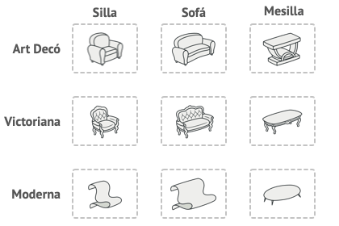
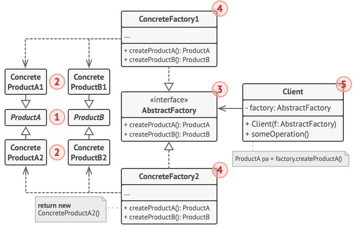

# Abstract Factory

## Propósito

Abstract Factory es un patrón de diseño creacional que nos permite producir familias de objetos relacionado sin especificar sus clases concretas.


## Problema

Imagina que estás creando un simulador de tiendas de muebles. Tu código está compuesto por clases que representan lo siguiente:

1. Una familia de productos relacionados, digamos: Silla, Sofá, Mesilla.
2. Algunas variante de esta familia. Por ejemplo, los productos Silla, Sofá, Mesilla están disponibles en estas variantes: Moderna, Victoriana, ArtDecó.



Necesitamos una forma de crear objetos individuales de mobiliario para que combinen con otros objetos de la misma familia. Los clientes se enfadan bastante cuando reciben muebles que no combinan. Por ejemplo, un sofá de estilo moderno no combina con unas sillas de estilo victoriano.


Además, no queremos cambiar el código existente al añadir al programa nuevo productos o familias de productos. Los comerciantes de muebles actualizan sus catálogos muy a menudo, y debemos evitar tener que cambiar el código principal cada vez que ocurra.

## Solución

Lo primero que sugiere el patrón Abstract Factory es que declaremos de forma explicita interfaces para cada producto diferente de la familia de productos (por ejemplo silla, sofá o mesilla). Después podemos hacer que todas las variantes de los productos sigan esas interfaces. Por ejemplo, todas las variantes de silla pueden implementar la interfaz Silla, as como todas las variantes de mesilla pueden implementar la interfaz Mesilla, y asi sucesivamente. Todas las variantes del mismo objeto deben moverse a una única jerarquía de clase.


El siguiente paso consiste en declarar la Fábrica Abstracta: Una interfaz con una lista de métodos de creación para todos los productos que son parte de la familia de productos (por ejemplo `crearSilla`, `crearSofá`, `crearMesilla`). Estos métodos deben devolver productos abstractos representados por las interfaces que extrajimos previamente: Silla, Sofá, Mesilla, etc. Cada fábrica concreta se corresponde con una variante específica del producto.


Ahora bien, ¿qúe hay de las variantes de los productos? Para cada variante de una familia de productos, creamos una clase de fábrica independiente basada en la interfaz FábricaAbstracta. Una fábrica es una clase que devuelve productos de un tipo particular. Por ejemplo, la FábricaMueblesModernos, sólo puede crear objetos de SillaModerna, SofáModerno y MesillaModerna.

El código cliente tiene que funcionar con fábricas y productos a través de sus respectivas interfaces abstractas. Esto nos permite cambiar el tipo de fábrica que pasamos al código cliente, asi como la variante del producto que recibe el código cliente, sin descomponer el propio código cliente. Al cliente no le debe importar la clase concreta de la fábrica con la que funciona.


Digamos que el cliente quiere una fábrica para producir una silla. El cliente no tiene que conocer la clase de la fábrica y tampoco importa el tipo de silla que obtiene. Ya sea un modelo moderno o una silla de estilo victoriano, el cliente debe tratar a todas las sillas del mismo modo, utilizando la interfaz abstracta Silla. Con este sistema, lo único que sabe el cliente sobre la silla es que implementa de algún modo el método sentarse. Además, sea cual sea la variante de silla devuelta, siempre combinará con el tipo de sofá o mesilla producida por el mismo objeto de fábrica.

Queda otro punto por aclarar: Si el cliente sólo está expuesto a las interfaces abstractas, ¿Cómo se crean los objetos de fábrica? Normalmente, la aplicación crea un objeto de fábrica concreto en la etapa de inicialización. Justo antes, la aplicación debe seleccionar el tipo de fábrica, dependiendo de la configuración o de los ajustes del entorno.

## Estructura



1. Los *Productos Abstractos* declaran interfaces para un grupo de productos diferentes pero relacionados, que forman una familia de productos.
2. Los *Productos Concretos* son implementaciones distintas de productos abstractos agrupados por variante. Cada producto abstracto (silla/sofá), debe implementarse en todas las variantes dadas (victoriano/moderno).
3. La interfaz *Fábrica Abstracta* declara un grupo de métodos para crear cada uno de los productos abstractos.
4. Las *Fábricas Concretas* implementan métodos de creación de la fábrica abstracta. Cada fábrica concreta se corresponde con una variante específica de los productos y crea tan solo dichas variantes de los productos.
5. Aunque las fábricas concretas instancian productos concretos, las firmas de sus métodos de creación deben devolver los productos abstractos correspondientes. DE este modo, el código cliente que utiliza una fábrica no se acopla a la variante específica del producto que obtiene de una fábrica. El *Cliente* puede funcionar con cualquier variante fábrica/producto concreta, siempre y cuando se comunique con sus objetos a través de interfaces abstractas.

## Pseudocódigo

Este ejemplo ilustra cómo puede utilizarse el patrón Abstract Factory para crear elementos de interfaz de usuario (UI) multiplataforma, sin acoplar el código cliente a clases UI concretas, mientras se mantiene la consistencia de todos los elementos creados respecto al sistema operativo seleccionado.


Es de esperar que los mismos elementos UI de una aplicación multiplataforma se comporten de forma parecida, aunque tengan un aspecto un poco diferente en distintos sistemas operativos. Además, es nuestro trabajo que los elementos UI coincidan con el estilo del sistema operativo en cuestión. No queremos que nuestro programa represente controles de macOS al ejecutarse en Windows.

La interfaz fábrica abstracta declara un grupo de métodos de creación que el código cliente puede utilizar para producir distintos tipos de elementos UI. Las fábricas concretas coinciden con sistemas operativos específicos y crean los elementos UI correspondientes.

Funciona así: Cuando se lanza, la aplicación comprueba el tipo de sistema actual. La aplicación utiliza esta información para crear un objeto de fábrica a partir de una clase que coincida con el sistema operativo. El resto de código utiliza esta fábrica para crear elementos UI. Esto evita que se creen elementos equivocados.

Con este sistema, el código cliente no depende de clases concretas de fábricas y elementos UI, siempre y cuando trabaje con estos objetos a través de sus interfaces abstractas. Esto también permite que el código cliente soporte otras fábricas o elementos UI que pudiéramos añadir más adelante.

Como consecuencia, no necesitas modificar el código cliente cada vez que añades una nueva variedad de elementos UI a tu aplicación. Tan solo debes crear una nueva clase de fábrica que produzca estos elementos y modifique ligeramente el código de inicialización de la aplicación, de modo que seleccione esa clase cuando resulte apropiado.

### Puesta en código *(Nim)*

```nim
interface GUIFactory is
    method createButton():Button
    method createCheckbox():Checkbox

class WinFactory implements GUIFactory is
    method createButton():Button is
        return new WinButton()
    method createCheckbox():Checkbox is
        return new WinCheckbox()

class MacFactory implements GUIFactory is
    method createButton():Button is
        return new MacButton()
    method createCheckbox():Checkbox is
        return new MacCheckBox()

interface Button is
    method paint()

class WinButton implements Button is
    method paint() is

class MacButton implements Button is
    method paint() is

interface Checkbox is
    method paint()

class WinCheckbox implements Checkbox is
    method paint() is

class MacCheckbox implements Checkbox is
    method paint() is

class Application is
    private field factory: GUIFactory
    private field button: Button
    constructor Application(factory: GUIFactory) is
        this.factory = factory
    method createUI() is
        this.button = factory.createButton()
    method paint() is
        button.paint()

class ApplicationConfigurator is
    method main() is
    config = readApplicationConfigFile()
    if (config.OS == "Windows") then
        factory = new WinFactory()
    else if (config.OS == "Mac") then
        factory = new MacFactory()
    else
        throw new Exception("Error! Unknown operating system.")
    Application app = new Application(factory)
```

### Explicación

La interfaz fábrica abstracta declara un grupo de métodos que devuelven distintos productos abstractos. Estos productos se denominan familia y están relacionados por un tema o concepto de alto nivel. Normalmente, los productos de una familia pueden colaborar entre si. Una familia de productos puede tener muchas variantes, pero los productos de una variante son incompatibles con los productos de otra.

```nim
interface GUIFactory is
    method createButton():Button
    method createCheckbox():Checkbox
```

Las fábricas concretas producen una familia de productos que pertenecen a una única variante. La fábrica garantiza que los productos resultantes sean compatibles. Las firmas de los métodos de las fábricas concretas devuelven un producto abstracto mientras que dentro del método se instancia un producto concreto. Cada fábrica concreta tiene una variante de producto correspondiente.

```nim
class WinFactory implements GUIFactory is
    method createButton():Button is
        return new WinButton()
    method createCheckbox():Checkbox is
        return new WinCheckbox()

class MacFactory implements GUIFactory is
    method createButton():Button is
        return new MacButton()
    method createCheckbox():Checkbox is
        return new MacCheckBox()
```

Cada producto individual de una familia de productos debe tener una interfaz base. Todas las variantes del producto deben implementar esta interfaz.

```nim
interface Button is
    method paint()
```

Los productos concretos son creados por las fábricas concretas correspondientes.

Representación de un botón en estilo Windows.

```nim
class WinButton implements Button is
    method paint() is
```

Representación de botón en estilo macOS.

```nim
class MacButton implements Button is
    method paint() is
```

Aquí está la interfaz base de otro producto. Todos los productos pueden interactuar entre si, pero sólo entre productos de la misma variante concreta es posible una interacción adecuada.

```nim
interface Checkbox is
    method paint()

class WinCheckbox implements Checkbox is
    method paint() is

class MacCheckbox implements Checkbox is
    method paint() is
```

El código cliente funciona con fábricas y productos únicamente a través de tipos abstractos: GUIFactory, Button y Checkbox. Este te permite pasar cualquier subclases fábrica o producto al código cliente sin descomponerlo.

```nim
class Application is
    private field factory: GUIFactory
    private field button: Button
    constructor Application(factory: GUIFactory) is
        this.factory = factory
    method createUI() is
        this.button = factory.createButton()
    method paint() is
        button.paint()
```

La aplicación elige el tipo de fábrica dependiendo de la configuración actual o de los ajustes del entorno y la crea durante el tiempo de ejecución (normalmente en la etapa de inicialización).

```nim
class ApplicationConfigurator is
    method main() is
    config = readApplicationConfigFile()
    if (config.OS == "Windows") then
        factory = new WinFactory()
    else if (config.OS == "Mac") then
        factory = new MacFactory()
    else
        throw new Exception("Error! Unknown operating system.")
    Application app = new Application(factory)
```

## Aplicabilidad

1. Utiliza el patrón Abstract Factory cuando tu código deba funcionar con varias familias de productos relacionados, pero no desees que dependa de las clases concretas de esos productos, ya que puede ser que no los conozcas de antemano o sencillamente quieras permitir una futura extensibilidad.
2. El patrón Abstract Factory nos ofrece una interfaz para crear objetos a partir de cada clase de familia de productos. Mientras tu código cree objetos a través de esta interfaz, no tendrás que preocuparte por crear la variante errónea de un producto que no combine con los productos que ya ha creado tu aplicación.
   - Considera la implementación del patrón Abstract Factory cuando tengas una clase con un grupo de métodos de fábrica que nublen su responsabilidad principal.
   - En un programa bien diseñado *cada clase es responsable tan solo de una cosa*. Cuando una clase lidia con varios tipos de productos, puede ser que valga la pena extraer sus métodos de fábrica para ponerlos en una clase única de fábrica o una implementación completa del patrón Abstract Factory.

## Cómo implementarlo

1. Mapea una matriz de distintos tipos de productos frente a variantes de dichos productos.
2. Declara interfaces abstractas de producto para todos los tipos de productos. Después haz que todas las clases concretas de productos implementen esas interfaces.
3. Declara la interfaz de la fábrica abstracta con un grupo de métodos de creación para todos los productos abstractos.
4. Implementa un grupo de clases concretas de fábrica, una por cada variante de producto.
5. Crea un código de inicialización de la fábrica en algún punto de la aplicación. Deberá instanciar una de las clases concretas de la fábrica, dependiendo de la configuración de la aplicación o del entorno actual. Pasa este objeto de fábrica a todas las clases que construyen productos.
6. Explorar el código y encuentra todas las llamadas directas a constructores de producto. Sustitúyelas por llamadas al método de creación adecuado dentro del objeto de fábrica.

## Pros y Contras

|Ventajas|Desventajas|
|--|--|
|Puedes tener la certeza de que los productos que obtienes de una fábrica son compatibles entre sí.|Puede ser que el código se complique más de lo que debería, ya que se introducen muchas nuevas interfaces y clases junto al patrón|
|Evitas un acoplamiento fuerte entre productos concretos y el código cliente||
|*Principio de responsabilidad única*: Puedes mover el código de creación de productos a un solo lugar, haciendo que el código sea más fácil de mantener||
|*Principio de abierto/cerrado*: Puedes introducir nuevas variantes de productos sin descomponer el código cliente existente.||

## Relaciones con otros patrones

- Muchos diseños empiezan utilizando el Factory Method (menos complicado y más personalizable mediante las subclases) y evolucionan hacia Abstract Factory, Prototype o Builder (más flexibles, pero más complicados).
- Builder se enfoca en construir objetos complejos, paso a paso. Abstract Factory se especializa en crear familias de objetos relacionados. Abstract Factory devuelve el producto inmediatamente, mientras que Builder te permite ejecutar algunos pasos adicionales de construcción antes de extraer el producto.
- Las clases del Abstract Factory a menudo se basan en un grupo de método de fábrica, pero también puedes utilizar Prototype para escribir los métodos de estas clases.
- Abstract Factory puede servir como alternativa a Facade cuando tan solo deseas esconder la forma en que se crean los objetos de subsistema a partir del código cliente.
- Puedes utilizar Abstract Factory junto a Bridge. Este emparejamiento resulta útil cuando algunas abstracciones definidas por Bridge sólo pueden funcionar con implementaciones específicas. En este caso, Abstract Factory puede encapsular estas relaciones y esconder la complejidad al código cliente.
- Los patrones Abstract Factory, Builder y Prototype pueden todos ellos implementarse como Singleton.
