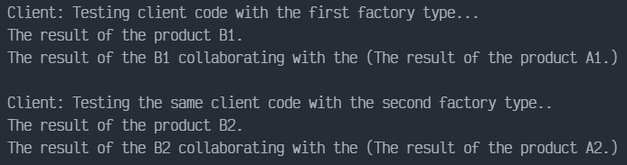

# Abstract Factory en TYPESCRIPT

Abstract Factory es un patrón de diseño creacional que resuelve el problema de crear familias enteras de productos sin especificar sus clases concretas. El patrón Abstract Factory define una interfaz para crear todos los productos, pero deja la propia creación de productos para las clases de fábrica concretas. Cada tipo de fábrica se corresponde con cierta variedad de producto.

El código cliente invoca los métodos de creación de un objeto de fábrica en lugar de crear los productos directamente con una llamada al constructor (operador new). Como una fábrica se corresponde con una única variante de producto, todos sus productos serán compatibles.

El código cliente trabaja con fábricas y productos únicamente a través de sus interfaces abstractas. Esto permite al mismo código cliente trabajar con productos diferentes. Simplemente, creas una nueva clase fábrica concreta y la pasas al código cliente.

## Uso del patrón en TypeScript

### Ejemplos de uso

El patrón Abstract Factory es muy común en el código TypeScript. Muchos frameworks y bibliotecas lo utilizan para proporcionar una forma de extender y personalizar sus componentes estándar.

### Identificación

El patrón es fácil de reconocer por los métodos, que devuelven un objeto de fábrica. Después, la fabrica se utiliza para crear subcomponentes específicos.

## Ejemplo Conceptual

Este ejemplo ilustra la estructura del patrón de diseño Abstract Factory, centrándose en responder las siguientes preguntas:

- ¿De qué clases se compone?
- ¿Qué papeles juegan esas clases?
- ¿De qué forma se relacionan los elementos del patrón?

`index.ts`. Ejemplo Conceptual:

La interfaz AbstractFactory declara un grupo de métodos que retornan productos abstractos diferentes. Esos productos son llamados una familia y están relacionados por un tema o concepto de alto nivel. Los productos de una familia están usualmente disponibles para colaborar entre ellos mismos. Una familia de productos podría tener muchas variantes, pero los productos de una variante son incompatibles con productos de otra variante.

```typescript
interface AbstractFactory {
    createProductA(): AbstractProductA;
    createProductB(): AbstractProductB;
}
```

Las fábricas concretas producen una familia de productos que pertenecen a una sola variante. La fábrica garantiza que los productos resultantes sean compatibles. Tenga en cuenta que la firma de los métodos de la Fábrica Concreta retornan un producto abstracto, mientras dentro del método un producto concreto es instanciado.

```typescript
class ConcreteFactory1 implements AbstractFactory {
    public createProductA(): AbstractProductA {
        return new ConcreteProductA1();
    }

    public createProductB(): AbstractProductB {
        return new ConcreteProductB1();
    }
}
```

Cada fábrica concreta tiene una variante de producto correspondiente.

```typescript
class ConcreteFactory2 implements AbstractFactory {
    public createProductA(): AbstractProductA {
        return new ConcreteProductA2();
    }

    public createProductB(): AbstractProductB {
        return new ConcreteProductB2();
    }
}
```

Cada producto de una familia de productos debe tener una interfaz base. Todas las variantes de un producto deben implementar dicha interfaz.

```typescript
interface AbstractProductA {
    usefulFunctionA(): string;
}
```

Los productos concretos son creados por las correspondientes fábricas concretas.

```typescript
class ConcreteProductA1 implements AbstractProductA {
    public usefulFunctionA(): string {
        return 'The result of the product A1.';
    }
}


class ConcreteProductA2 implements AbstractProductA {
    public usefulFunctionA(): string {
        return 'The result of the product A2.';
    }
}
```

Esta es la interfaz base de otro producto. Todas las productos pueden interactuar con otros, pero la interacción entre las propiedad son posibles solo entre los productos de las mismas variantes concretas.

```typescript
interface AbstractProductB {
```

Los productos B puede hacer sus propias cosas...

```typescript
    usefulFunctionB(): string;
```

... Pero también pueden colaborar con los Productos A. La fábrica abstracta se asegura de que todos los productos que crea sean de la misma variante y, por lo tanto, compatibles.

```typescript
    anotherUsefulFunctionB(collaborator: AbstractProductA): string;
}
```

Los productos concretos son creados por las fábricas concretas correspondientes.

```typescript
class ConcreteProductB1 implements AbstractProductB {
    public usefulFunctionB(): string {
        return 'The result of the product B1.';
    }
```

La variante, producto B1, solo puede trabajar correctamente con la variante, producto A1. A pesar de eso, este acepta cualquier instancia del producto abstracto A como un argumento.

```typescript
    public anotherUsefulFunctionB(collaborator: AbstractProductA) {
        const result = collaborator.usefulFunctionA();
        return `The result of the B1 collaborating with the (${result})`;
    }
}
```

```typescript
class ConcreteProductB2 implements AbstractProductB {
    public usefulFunctionB(): string {
        return 'The result of the product B2.';
    }

    public anotherUsefulFunctionB(collaborator: AbstractProductA) {
        const result = collaborator.usefulFunctionA();
        return `The result of the B2 collaborating with the (${result})`;
    }
}
```

El código cliente trabaja con fábricas y producto unicamente a través de tipos abstractos: AbstractFactory y AbstractProduct. Esto permite que se le pueda pasar cualquier fábrica o subclase de producto al código cliente sin dañarlo.

```typescript
const clientCode = (factory: AbstractFactory) => {
    const productA = factory.createProductA();
    const productB = factory.createProductB();
    console.log(productB.usefulFunctionB());
    console.log(productB.anotherUsefulFunctionB(productA));
}
```

El código cliente puede trabajar con cualquier clase de fábrica concreta.

```typescript
console.log('Client: Testing client code with the first factory type...');
clientCode(new ConcreteFactory1());

console.log('');

console.log('Client: Testing the same client code with the second factory type..');
clientCode(new ConcreteFactory2());
```

### Output


