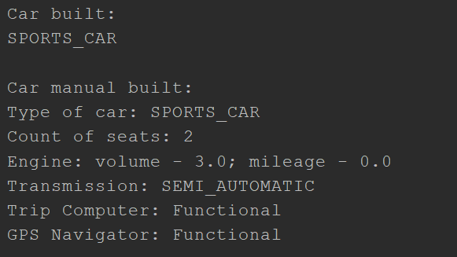

# Builder en JAVA

Builder es un patrón de diseño creacional que permite construir objetos complejos paso a paso. Al contrario que otros patrones creacionales, Builder no necesita que los productos tengan una interfaz común. Esto hace posible crear distintos productos utilizando el mismo proceso de construcción.

## Uso del patrón en Java

### Ejemplos de uso

El patrón Builder es muy conocido en el mundo de Java. Resulta especialmente útil cuando debes crear un objeto con muchas opciones posibles de configuración. El uso del patrón Builder está muy extendido en las principales bibliotecas Java:

- `java.lang.StringBuilder#append()` (unsynchronized)
- `java.lang.StringBuffer#append()` (synchronized)
- `java.nio.ByteBuffer#put()` también en CharBuffer, ShortBuffer, IntBuffer, LongBuffer, FloatBuffer y DoubleBuffer.
- `javax.swing.GroupLayout.Group#addComponent()`
- Todas las implementaciones `java.lang.Appendable`.

### Identificación

El patrón Builder se puede reconocer por una clase, que tiene un único método de creación y varios métodos para configurar el objeto resultante. A menudo, los métodos del Builder soportan el encadenamiento (por ejemplo, `algúnBuilder->establecerValorA(1)->establecerValorB(2)->crear()`).

## Fabricación de autos paso a paso

En este ejemplo, el patrón Builder permite la construcción paso a paso de distintos modelos de auto. El ejemplo muestra también cómo el patrón Builder crea productos de distinto tipo (manual del auto) utilizando los mismos pasos de construcción.

El Director controla el orden de construcción. Sabe qué pasos de construcción invocar para producir éste o aquel modelo de auto. Trabaja con los constructores únicamente a través de su interfaz común. Esto permite pasar distintos tipos de constructores al director.

El resultado final se extrae del objeto constructor porque el director no puede saber el tipo de producto resultante. Sólo el objeto del constructor sabe exactamente lo que construye.

### builders

`builders/Builder.java`: Interfaz común del constructor. La interfaz Builder define todas las posibles maneras de configurar un producto.

```java
package builders;

import cars.CarType;
import components.Engine;
import components.GPSNavigator;
import components.Transmission;
import components.TripComputer;

public interface Builder {
    void setCarType(CarType type);
    void setSeats(int seats);
    void setEngine(Engine engine);
    void setTransmission(Transmission transmission);
    void setTripComputer(TripComputer tripComputer);
    void setGPSNavigator(GPSNavigator gpsNavigator);
}
```

`builders/CarBuilder.java`: Constructor de Auto. Este es un constructor concreto que implementa pasos definidos en la interfaz común.

```java
package builders;

import builders.Builder;
import cars.Car;
import cars.CarType;
import components.Engine;
import components.GPSNavigator;
import components.Transmission;
import components.TripComputer;

public class CarBuilder implements Builder {
    private CarType type;
    private int seats;
    private Engine engine;
    private Transmission transmission;
    private TripComputer tripComputer;
    private GPSNavigator gpsNavigator;

    public void setCarType(CarType type) {
        this.type = type;
    }

    @Override
    public void setSeats(int seats) {
        this.seats = seats;
    }

    @Override
    public void setEngine(Engine engine) {
        this.engine = engine;
    }

    @Override
    public void setTransmission(Transmission transmission) {
        this.transmission = transmission;
    }

    @Override
    public void setTripComputer(TripComputer tripComputer) {
        this.tripComputer = tripComputer;
    }

    @Override
    public void setGPSNavigator(GPSNavigator gpsNavigator) {
        this.gpsNavigator = gpsNavigator;
    }

    public Car getResult() {
        return new Car(type, seats, engine, transmission, tripComputer, gpsNavigator);
    }
}
```

`builders/CarManualBuilder.java`: Constructor de manual de auto. A diferencia de otros patrones creacionales, Builder puede construir productos no relacionados, los cuales no tienen una interfaz común. En este caso, nosotros construimos un manual de usuario de un carro, usando los mismos pasos para construir un auto. Esto permite producir manuales para modelos de carros específicos, configurado con las diferentes características.

```java
package builders;

import builders.Builder;
import cars.CarType;
import cars.Manual;
import components.Engine;
import components.GPSNavigator;
import components.Transmission;
import components.TripComputer;

public class CarManualBuilder implements Builder {
    private CarType type;
    private int seats;
    private Engine engine;
    private Transmission transmission;
    private TripComputer tripComputer;
    private GPSNavigator gpsNavigator;
    
    @Override
    public void setCarType(CarType type) {
        this.type = type;
    }

    @Override
    public void setSeats(int seats) {
        this.seats = seats;
    }

    @Override
    public void setEngine(Engine engine) {
        this.engine = engine;
    }

    @Override
    public void setTransmission(Transmission transmission) {
        this.transmission = transmission;
    }

    @Override
    public void setTripComputer(TripComputer tripComputer) {
        this.tripComputer = tripComputer;
    }

    @Override
    public void setGPSNavigator(GPSNavigator gpsNavigator) {
        this.gpsNavigator = gpsNavigator;
    }

    public Manual getResult() {
        return new Manual(type, seats, engine, transmission, tripComputer, gpsNavigator);
    }
}
```

### cars

`cars/Car.java`: Producto auto.

```java
package cars;

import cars.CarType;
import components.Engine;
import components.GPSNavigator;
import components.Transmission;
import components.TripComputer;

public class Car {
    private final CarType carType;
    private final int seats;
    private final Engine engine;
    private final Transmission transmission;
    private final TripComputer tripComputer;
    private final GPSNavigator gpsNavigator;
    private double fuel = 0;

    public Car(CarType carType, int seats, Engine engine, Transmission transmission, TripComputer tripComputer, GPSNavigator gpsNavigator) {
        this.carType = carType;
        this.seats = seats;
        this.engine = engine;
        this.transmission = transmission;
        this.tripComputer = tripComputer;
        if (this.tripComputer != null) this.tripComputer.setCar(this);
        this.gpsNavigator = gpsNavigator;
    }

    public CarType getCarType() {
        return carType;
    }

    public double getFuel() {
        return fuel;
    }

    public void setFuel(double fuel) {
        this.fuel = fuel;
    }

    public int getSeats() {
        return seats;
    }

    public Engine getEngine() {
        return engine;
    }

    public Transmission getTransmission() {
        return transmission;
    }

    public TripComputer getTripComputer() {
        return tripComputer;
    }

    public GPSNavigator getGPSNavigator() {
        return gpsNavigator;
    }
}
```

`cars/Manual.java`: Producto manual. El manual del carro es otro producto. Tenga en cuenta que no tiene el mismo ancestro de carro, por lo que no están relacionados.

```java
package cars;

import components.Engine;
import components.GPSNavigator;
import components.Transmission;
import components.TripComputer;

public class Manual {
    private final CarType carType;
    private final int seats;
    private final Engine engine;
    private final Transmission transmission;
    private final TripComputer tripComputer;
    private final GPSNavigator gpsNavigator;

    public Manual(CarType carType, int seats, Engine engine, Transmission transmission, TripComputer tripComputer, GPSNavigator gpsNavigator) {
        this.carType = carType;
        this.seats = seats;
        this.engine = engine;
        this.transmission = transmission;
        this.tripComputer = tripComputer;
        this.gpsNavigator = gpsNavigator;
    }    
    
    public String print() {
        String info = "";
        info += "Type of car: " + carType + "\n";
        info += "Count of seats: " + seats + "\n";
        info += "Engine: volume - " + engine.getVolume() + "; mileage - " + engine.getMileage() + "\n";
        info += "Transmission: " + transmission + "\n";
        if (this.tripComputer != null) info += "Trip Computer: Functional" + "\n";
        else info += "Trip Computer: N/A" + "\n";
        if (this.gpsNavigator != null) info += "GPS Navigator: Functional" + "\n";
        else info += "GPS Navigator: N/A" + "\n";
        return info;
    }
}
```

`cars/CarType.java`

```java
package cars;

public enum CarType {
    CITY_CAR,
    SPORTS_CAR,
    SUV
}
```

### components

`components/Engine.java`: Característica de producto 1

```java
package components;

public class Engine {
    private final double volume;
    private double mileage;
    private boolean started;

    public Engine(double volume, double mileage) {
        this.volume = volume;
        this.mileage = mileage;
    }

    public void on() {
        started = true;
    }

    public void off() {
        started = false;
    }

    public boolean isStarted() {
        return started;
    }

    public void go(double mileage) {
        if (started ) this.mileage += mileage ;
        System.out.println("Cannot go(), you must start engine first");
    }

    public double getVolume() {
        return volume;
    }

    public double getMileage() {
        return mileage;
    }
}
```

`components/GPSNavigator.java`: Característica de producto 2.

```java
package components;

public class GPSNavigator {
    public String route;

    public GPSNavigator() {
        this.route = "221b, Baker Street, London to Scotland Yard, 8-10 Broadway, London";
    }

    public GPSNavigator(String manualRoute) {
        this.route = manualRoute;
    }

    public String getRoute() {
        return route;
    }
}
```

`components/Transmission.java`: Característica de producto 3.

```java
package components;

public enum Transmission {
    SINGLE_SPEED,
    MANUAL,
    AUTOMATIC,
    SEMI_AUTOMATIC
}
```

`components/TripComputer.java`: Característica de producto 4.

```java
package components;

import cars.Car;

public class TripComputer {
    private Car car;
    
    public void setCar(Car car) {
        this.car = car;
    }

    public void showFuelLevel() {
        System.out.println("Fuel level: " + car.getFuel());
    }

    public void showStatus() {
        if (this.car.getEngine().isStarted()) System.out.println("Car is started");
        System.out.println("Car is not started");
    }
}
```

### director

`director/Director.java`: El director controla los constructores. El director define el orden de los pasos de construcción. Este trabaja con un objeto constructor a través de una interfaz constructora común. Por lo tanto es posible qué no sepa que producto se está fabricando.

```java
package director;

import builders.Builder;
import cars.CarType;
import components.Engine;
import components.GPSNavigator;
import components.Transmission;
import components.TripComputer;

public class Director {
    
    public void constructSportsCar(Builder builder) {
        builder.setCarType(CarType.SPORTS_CAR);
        builder.setSeats(2);
        builder.setEngine(new Engine(3.0, 0));
        builder.setTransmission(Transmission.SEMI_AUTOMATIC);
        builder.setTripComputer(new TripComputer());
        builder.setGPSNavigator(new GPSNavigator());
    }
    
    public void constructCityCar(Builder builder) {
        builder.setCarType(CarType.CITY_CAR);
        builder.setSeats(2);
        builder.setEngine(new Engine(1.2, 0));
        builder.setTransmission(Transmission.AUTOMATIC);
        builder.setTripComputer(new TripComputer());
        builder.setGPSNavigator(new GPSNavigator());
    }
    
    public void constructSUV(Builder builder) {
        builder.setCarType(CarType.SUV);
        builder.setSeats(4);
        builder.setEngine(new Engine(2.5, 0));
        builder.setTransmission(Transmission.MANUAL);
        builder.setGPSNavigator(new GPSNavigator());
    }
}
```

### demo

`app/Demo.java`: Código cliente. Todas las cosas van juntas aquí. El director obtiene el objeto de construcción del cliente (código de la aplicación). Esto es porque la aplicación conoce mejor cual constructor se usa para obtener un producto especifico. El producto final es a menudo recuperado de un objeto constructor, ya que el Director no esta consciente y no depende de productos o constructores concretos.

```java
package app;

import builders.CarBuilder;
import builders.CarManualBuilder;
import cars.Car;
import cars.Manual;
import director.Director;

public class Demo {
    
    public static void main(String[] args) {
        Director director = new Director();
        
        CarBuilder builder = new CarBuilder();
        director.constructCityCar(builder);

        Car car = builder.getResult();
        System.out.println("Car built:\n" + car.getCarType());
        
        CarManualBuilder manualBuilder = new CarManualBuilder();
        
        director.constructSportsCar(manualBuilder);
        Manual carManual = manualBuilder.getResult();
        System.out.println("\nCar manual built:\n" + carManual.print());
    }
}
```

## Output


