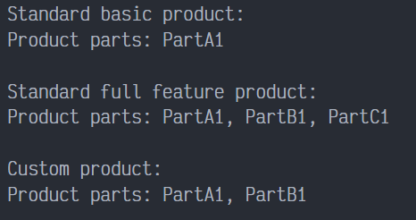
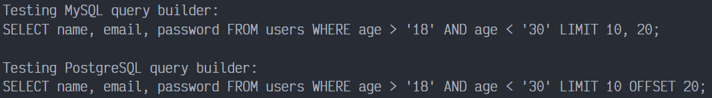

# Builder en PHP

Builder es un patrón de diseño creacional que permite construir objetos complejos paso a paso. Al contrario que otros patrones creacionales, Builder no necesita que los productos tengan una interfaz común. Esto hace posible crear distintos productos utilizando el mismo proceso de construcción.

## Uso del patrón en PHP

### Ejemplos de uso

El patrón Builder es muy conocido en el mundo PHP. Resulta especialmente útil cuando deber crear un objeto con muchas opciones posibles de configuración.

### Identificación

El patrón Builder se puede reconocer por una clase, que tienen un único método de creación y varios métodos para configurar el objeto resultante. A menudo, los métodos del Builder soportan el encadenamiento (por ejemplo, `algúnBuilder->establecerValorA(1)->establecerValorB(2)->crear()`)

## Ejemplo Conceptual

Este ejemplo ilustra la estructura del patrón de diseño Builder y se centra en las siguientes preguntas:

- ¿De qué clases se compone?
- ¿Qué papeles juegan esas clases?
- ¿De qué forma se relacionan los elementos del patrón?

Después de conocer la estructura del patrón, será más fácil comprender el siguiente ejemplo basado en un caso de uso real de PHP.

`index.php`: Ejemplo Conceptual.

La interfaz Builder especifica métodos para crear las diferentes partes de los objetos Producto.

```php
<?php

interface Builder
{
    public function producePartA(): void;
    public function producePartB(): void;
    public function producePartC(): void;
}
```

Las clases de Creadores Concretos siguen la interfaz Builder y proveen implementaciones especificas de los pasos de construcción. Tu programa puede tener muchas variantes de constructores, que se implementen de maneras diferentes.

```php
class ConcreteBuilder1 implements Builder
{
    private $product;
```

Una instancia de constructor reseteada puede contener un objeto Producto en balnco, el cual es usado en un montaje adicional.

```php
    public function __construct()
    {
        $this->reset();
    }

    public function reset(): void
    {
        $this->product = new Product1();
    }
```

Todos los pasos de producción trabajan con la instancia del mismo producto.

```php
    public function producePartA(): void
    {
        $this->product->parts[] = "PartA1";
    }

    public function producePartB(): void
    {
        $this->product->parts[] = "PartB1";
    }

    public function producePartC(): void
    {
        $this->product->parts[] = "PartC1";
    }
```

Se supone que los constructores concretos proveen sus propios métodos para recuperar resultados. Esto es porque varios tipos de constructores pueden crear productos diferentes por completo, que no siguen la misma interfaz. Por lo tanto tales métodos no pueden ser declarados en la interfaz Builder base (al menos en un lenguaje de programación de tipado estático). Tenga en cuenta que PHP es un lenguaje de tipado dinámico y este método puede estar en la interfaz base. Sin embargo, nosotros no lo declararemos allí por el bien de la claridad.

Usualmente, después de retornar el resultado final al cliente, una instancia de construcción se espera que este lista para producir otros productos. Esto es porque es una practica usual llamar el método reset al finalizar el cuerpo del método `getProduct()`. Sin embargo, este comportamiento no es obligatorio, y tu puedes crear tus constructores y esperar para hacer una llamada explicita al reset desde el código cliente después de eliminar el resultado previo.

```php
    public function getProduct(): Product1
    {
        $result = $this->product;
        $this->reset();
        return $result;
    }
}
```

Tiene sentido usar el patrón Builder solo cuando tus productos son bastantes complejos y requieres configuraciones extensas. A diferencia de otros patrones creacionales, los diferentes constructores concretos pueden producir productos no relacionados. En otras palabras, los resultados de varios constructores no podrían seguir siempre la misma interfaz.

```php
class Product1
{
    public $parts = [];

    public function listParts(): void
    {
        echo "Product parts: " . implode(', ', $this->parts) . "\n\n";
    }
}
```

El director es solo responsable de ejecutar los pasos de construcción en una secuencia particular. Esto es útil cuando cuando se producen productos de acuerdo a una orden especifica o una configuración. Estrictamente hablando, la clase director es opcional, desde el código cliente se puede controlar la construcción directamente.

```php
class Director
{
    private $builder;
```

El director trabaja con cualquier instancia de construcción que el código cliente le pasa. De esta manera, el código cliente puede alterar el el tipo final de los nuevos productos ensamblados.

```php
    public function setBuilder(Builder $builder): void
    {
        $this->builder = $builder;
    }
```

El director puede construir muchas variantes de productos  usando los mismos pasos de construcción.

```php
    public function buildMinimalViableProduct(): void
    {
        $this->builder->producePartA();
    }

    public function buildFullFeatureProduct(): void
    {
        $this->builder->producePartA();
        $this->builder->producePartB();
        $this->builder->producePartC();
    }
}
```

El código cliente crea un objeto constructor, pasándolo al director e instanciando el proceso de construcción. El resultado final es recuperado del objeto constructor.

```php
function clientCode(Director $director)
{
    $builder = new ConcreteBuilder1();
    $director->setBuilder($builder);

    echo "Standard basic product:\n";
    $director->buildMinimalViableProduct();
    $builder->getProduct()->listParts();

    echo "Standard full feature product:\n";
    $director->buildFullFeatureProduct();
    $builder->getProduct()->listParts();
```

Recuerda, el patrón Builder puede ser usado sin una clase Director.

```php
    echo "Custom product:\n";
    $builder->producePartA();
    $builder->producePartB();
    $builder->getProduct()->listParts();
}

$director = new Director();
clientCode($director);
```

### Output



## Ejemplo del mundo real

Una de las mejores aplicaciones del patrón Builder es un constructor de una consulta SQL. La interfaz del constructor define los pasos comunes necesarios para construir una consulta SQL genérica. Por otro lado, los constructores concretos, que se corresponden con distintos dialectos SQL, implementan estos pasos devolviendo partes de consultas SQL que se pueden ejecutar en un motor de bases de datos particular.

`index.php`: Ejemplo del mundo real.

La interfaz Builder declara un conjunto de métodos to construir una sentencia SQL. Todos los pasos de construcción son retornados desde el constructor de objetos actual, permitiéndome unir sentencias: `$builder->select(...)->where(...)`.

```php
<?php

interface SQLQueryBuilder
{
    public function select(string $table, array $fields): SQLQueryBuilder;
    public function where(string $field, string $value, string $operator = '='): SQLQueryBuilder;
    public function limit(int $start, int $offset): SQLQueryBuilder;
    //? +100 order SQL syntax methods...
    public function getSQL(): string;
}
```

Cada constructor concreto correspondo a dialectos específicos de SQL y pueden implementar los pasos de construcción con ligeras diferencias de otros. En este caso , este constructor concreto puede construir sentencias SQL compatibles con MySQL.

```php
class MysqlQueryBuilder implements SQLQueryBuilder
{
    protected $query;

    protected function reset(): void
    {
        $this->query = new \stdClass();
    }
```

Construir una sentencia base SELECT.

```php
    public function select(string $table, array $fields): SQLQueryBuilder
    {
        $this->reset();
        $this->query->base = "SELECT " . implode(", ", $fields) . " FROM " . $table;
        $this->query->type = "select";
        return $this;
    }
```

Añadir una condición WHERE.

```php
    public function where(string $field, string $value, string $operator = '='): SQLQueryBuilder
    {
        if (!in_array($this->query->type, ['select', 'update', 'delete'])) {
            throw new \Exception("WHERE can only be added to SELECT, UPDATE OR DELETE");
        }
        $this->query->where[] = "$field $operator '$value'";
        return $this;
    }
```

Añadir una restricción LIMIT.

```php
    public function limit(int $start, int $offset): SQLQueryBuilder
    {
        if (!in_array($this->query->type, ['select'])) {
            throw new \Exception("LIMIT can only be added to SELECT");
        }
        $this->query->limit = " LIMIT " . $start . ", " . $offset;
        return $this;
    }
```

Obtener la cadena final de la sentencia.

```php
    public function getSQL(): string
    {
        $query = $this->query;
        $sql = $query->base;
        if (!empty($query->where)) {
            $sql .= " WHERE " . implode(" AND ", $query->where);
        }
        if (isset($query->limit)){
            $sql .= $query->limit;
        }
        $sql .= ";";
        return $sql;
    }
}
```

Este creador concreto es compatible con PostgreSQL. Mientras Postgre is muy similar a MySQL, todavía tiene muchas diferencias. Para reutilizar el código común, nosotros extendemos del constructor de MySQL, pero se sobrescriben algunos pasos de construcción.

Entre otras cosas, PostgreSQL tiene unas ligeras diferencias en la sintaxis del LIMIT.

```php
class PostgresQueryBuilder extends MysqlQueryBuilder
{
    public function limit(int $start, int $offset): SQLQueryBuilder
    {
        parent::limit($start, $offset);
        $this->query->limit = " LIMIT " . $start . " OFFSET " . $offset;
        return $this;
    }
}
```

Tenga en cuenta que el código cliente usa un objeto constructor directamente. Designar una clase Constructora en este caso no es necesario, porque el código cliente necesita diferentes consultas casi siempre, y esto hace que la secuencia de los pasos de construcción no son fácilmente reusables.

Dado que todos nuestro creadores de consultas crean productos del mismo tipo, nosotros podemos interactuar con todos constructores usando su interfaz común. Después, si nosotros implementamos una nueva clase constructora, nosotros tener la disponibilidad de pasar su instancia al código cliente existente sin dañar la gracia de la interfaz de SQLQueryBuilder.

```php
function clientCode(SQLQueryBuilder $queryBuilder)
{
    // ...
    $query = $queryBuilder
        ->select("users", ["name", "email", "password"])
        ->where("age", 18, ">")
        ->where("age", 30, "<")
        ->limit(10, 20)
        ->getSQL();
    
    echo $query;
    // ...
}
```

La aplicación selecciona el tipo de constructor de sentencias apropiado dependiendo de la configuración o del entorno actual.

```php
/**
* if ($_ENV['database_type'] == 'postgres') {
*     $builder = new PostgresQueryBuilder();
* } else {
*     $builder = new MysqlQueryBuilder();
* }
* clientCode($builder);
*/


echo "Testing MySQL query builder:\n";
clientCode(new MysqlQueryBuilder());

echo "\n\n";

echo "Testing PostgreSQL query builder:\n";
clientCode(new PostgresQueryBuilder());
```

### Output


