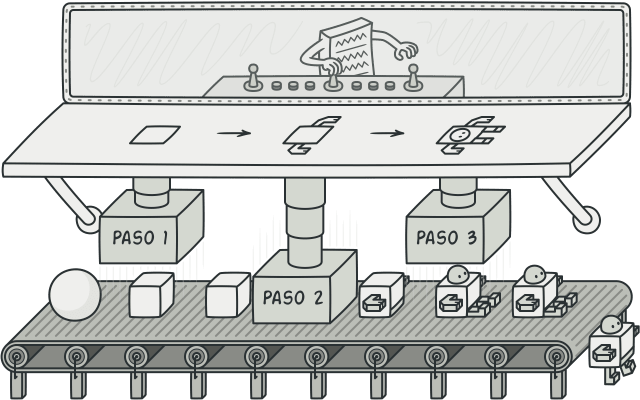
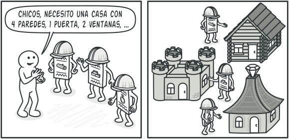

# Builder

## Propósito

Builder es un patrón de diseño creacional que nos permite construir objetos complejos paso a paso. El patrón nos permite producir distintos tipos y representaciones de un objeto empleando el mismo código de construcción.



## Problema

Imagina un objeto complejo que requiere una inicialización laboriosa, paso a paso, de muchos campos y objetos anidados. Normalmente, este código de inicialización esta sepultado dentro de un monstruoso constructor con una gran cantidad de parámetros. O peor aún: disperso por todo el código cliente. Crear una subclase por cada configuración posible de un objeto puede complicar demasiado el programa.


Por ejemplo, pensemos en cómo crear un objeto `Casa`. Para construir una casa sencilla, debemos construir 4 paredes y un piso, así como instalar una puerta, colocar un par de ventanas y ponerle un tejado. Pero, ¿qué pasa si quieres una casa más grande y luminosa, con un jardín y otros extras (como sistema de calefacción, instalación de fontanería y cableado eléctrico)?

La solución más sencilla es extender la clase base `Casa` y crear un grupo de subclases que cubren todas las combinaciones posibles de los parámetros. Pero, en cualquier caso, acabarás con una cantidad considerable de subclases. Cualquier parámetro nuevo, como el estilo del porche, exigirá que incrementes esta jerarquía aún más.

Existe otra posibilidad que no implica generar subclases. Puedes crear un enorme constructor dentro de la clase base `Casa` con todos los parámetros posibles para controlar el objeto casa. Aunque es cierto que esta solución elimina la necesidad de las subclases, genera otro problema. Un constructor con un montón de parámetros tiene su inconveniente: no todos los parámetros son necesarios todo el tiempo.


En la mayoría de los casos, gran parte de los parámetros no se utilizará, lo que provocará que **las llamadas al constructor sean bastantes tediosas**. Por ejemplo, solo una pequeña parte de las casas tiene piscina, por lo que los parámetros relacionados con piscinas serán inútiles en nueve de cada diez casos.

## Solución

El patrón Builder sugiere que saques el código de construcción del objeto de su propia clase y lo coloques dentro de objetos independientes llamados *constructores*. El patrón Builder te permite construir objetos complejos paso a paso. El patrón Builder no permite a otros objetos acceder al producto mientras se construye.


El patrón organiza la construcción de objetos en una serie de pasos (`construirParedes`, `construirPuertas`, etc). Para crear un objeto, se ejecuta una serie de estos pasos en un objeto constructor. Lo importante es que no necesitas invocar todos los pasos. Puedes invocar sólo aquellos que sean necesarios para producir una configuración particular de un objeto.

Puede ser que algunos pasos de la construcción necesiten una implementación diferente cuando tengamos que construir distintas representaciones del producto. Por ejemplo, las paredes de una cabaña pueden ser de madera, pero las paredes de un castillo tienen que ser de piedra.

En este caso, podemos crear varias clases constructoras distintas que implementen la misma serie de pasos de construcción, pero de forma diferente. Entonces podemos utilizar estos constructores en el proceso de construcción (por ejemplo, una serie ordenada de llamadas a los pasos de construcción) para producir distintos tipos de objetos. Los distintos constructores ejecutan la misma tarea de formas distintas.



Por ejemplo, imagina un constructor que construye todo de madera y vidrio, otro que construye todo con piedra y hierro, y un tercero que utiliza oro y diamantes. Al invocar la misma serie de pasos, obtenemos una casa normal del primer constructor, un pequeño castillo del segundo y un palacio del tercero. Sin embargo, esto sólo funcionaría si el código cliente que invoca los pasos de construcción es capaz de interactuar con los constructores mediante una interfaz común.

### Clase directora

Puedes ir más lejos y extraer una serie de llamadas a los pasos del constructor que utilizas para construir un producto y ponerlas en una clase independiente llamada ***directora***. La clase directora define el orden en el que se deben ejecutar los pasos de construcción, mientras que el constructor proporciona la implementación de dichos pasos. La clase directora sabe qué pasos de construcción ejecutar para lograr un producto que funcione.


No es estrictamente necesario tener una clase directora en el programa, ya que se pueden invocar los pasos de construcción en un orden específico directamente desde el código cliente. El cliente sólo necesita asociar un objeto constructor con una clase directora, utilizarla para iniciar la construcción, y obtener el resultado del objeto constructor.

Además, la clase directora esconde por completo los detalles de la construcción del producto al código cliente. El cliente sólo necesita asociar un objeto constructor con una clase directora, utilizarla para iniciar la construcción, y obtener el resultado del objeto constructor.

## Estructura


1. La interfaz ***Constructora*** declara pasos de construcción de producto que todos los tipos de objetos constructores tienen en común.
2. Los ***Constructores Concretos*** ofrecen distintas implementaciones de los pasos de construcción. Los constructores concretos pueden crear productos que no siguen la interfaz común.
3. Los ***Productos*** son los objetos resultantes. Los productos construidos por distintos objetos constructores no tienen que pertenecer a la misma jerarquía de clases o interfaz.
4. La clase ***Directora*** define el orden en el que se invocarán los pasos de construcción, por lo que puedes crear y reutilizar configuraciones específicas de los productos.
5. El ***Cliente*** debe asociar uno de los objetos constructores con la clase directora. Normalmente, se hace una sola vez mediante los parámetros del constructor para el resto de la construcción. No obstante, existe una solución alternativa para cuando el cliente pasa el objeto constructor al método de producción de la clase directora. En este caso, pueden utilizar un constructor diferente cada vez que produzcas algo con la clase directora.

## Pseudocódigo

Este ejemplo del patrón Builder ilustra cómo se puede reutilizar el mismo código de construcción de objetos a la hora de construir distintos tipos de productos, como automóviles, y crear los correspondientes manuales para esos automóviles. Es un ejemplo de una construcción paso a paso de automóviles y de los manuales de usuario para esos modelos de automóvil.


Un automóvil es un objeto complejo que puede construirse de mil maneras diferentes. En lugar de saturar la clase `Automóvil` con un constructor enorme, extrajimos el código de ensamblaje del automóvil y lo pusimos en una clase constructora de automóviles independiente. Esta clase tiene un grupo de métodos ára configurar las distintas partes de un automóvil.

Si el código cliente necesita ensamblar un modelo de automóvil con ajustes especiales, puede trabajar directamente con el objeto constructor. Por otro lado, el cliente puede delegar el ensamblaje a la clase directora, que sabe cómo utilizar un objeto constructor para construir varios de los modelos más populares de automóviles.

Puede que te sorprenda, pero todo automóvil necesita un manual (en serio, ¿quién los lee?). El manual explica cada característica del automóvil, de modo que los detalles del manual varían de un modelo a otro. Por eso tiene lógica reutilizar un proceso de construcción existente para automóviles reales y sus respectivos manuales. Por supuesto, elaborar un manual no es lo mismo que fabricar un automóvil, por lo que debemos incluir otra clase constructora especializada en elaborar manuales. Esta clase implementa los mismo métodos de construcción que su hermana constructora de automóviles, pero, en lugar de fabricar piezas del automóvil, las describe. Al pasar estos constructores al mismo objeto director, podemos construir tanto un automóvil como un manual.

La última parte consiste en buscar el objeto resultante. Un automóvil de metal y un manual de papel, aunque estén relacionados, son objetos muy diferentes. No podemos colocar un método para buscar resultados en la clase directora sin acoplarla a clases de productos concreto. Por lo tanto, obtenemos el resultado de la construcción del constructor que realizó el trabajo.

### Puesta en código

```nim
class Car is

class Manual is


interface Builder is
    method reset()
    method setSeats(...)
    method setEngine(...)
    method setTripComputer(...)
    method setGPS(...)


class CarBuilder implements Builder is
    private field car: Car

    constructor CarBuilder() is
        this.reset()
    
    method reset() is
        this.car = new Car()
    
    method setSeats(...) is
    
    method setEngine(...) is

    method setTripComputer(...) is

    method setGPS(...) is

    method getProduct(): Car is
        product = this.car
        this.reset()
        return product


class CarManualBuilder implements Builder is
    private field manual: Manual

    constructor CarManualBuilder() is
        this.reset()
    
    method reset() is
        this.manual = new Manual()
    
    method setSeats(...) is
    
    method setEngine(...) is

    method setTripComputer(...) is

    method setGPS(...) is

    method getProduct(): Manual is


class Director is
    private field builder: Builder

    method setBuilder(builder: Builder)
        this.builder = builder
    
    method constructSportsCar(builder: Builder) is
        builder.reset()
        builder.setSeats(2)
        builder.setEngine(new SportEngine())
        builder.setTripComputer(true)
        builder.setGPS(true)
    
    method constructSUV(builder: Builder) is


class Application is
    method makeCar() is
        director = new Director()

        CarBuilder builder = new CarBuilder()
        director.constructSportsCar(builder)
        Car car = builder.getProduct()

        CarManualBuilder builder = new CarManualBuilder()
        director.constructSportsCar(builder)
        Manual manual = builder.getProduct()
```

### Explicación

El uso del patrón Builder sólo tiene sentido cuando tus productos son bastantes complejos y requieren una configuración extensiva. Los dos siguientes productos están relacionados, aunque no tienen una interfaz común.

Un coche puede tener un GPS, una computadora de navegación y cierto número de asientos. Los distintos modelos de coches (deportivo, SUV, descapotable) pueden tener distintas características instaladas o habilitadas.

```nim
class Car is
```

Cada coche debe contar con un manual de usuario que se corresponda con la configuración del coche y explique todas sus características.

```nim
class Manual is
```

La interfaz constructora especifica métodos para crear las distintas partes de los objetos del producto.

```nim
interface Builder is
    method reset()
    method setSeats(...)
    method setEngine(...)
    method setTripComputer(...)
    method setGPS(...)
```

Las clases constructoras concretas siguen la interfaz constructora y proporcionan implementaciones específicas de los pasos de construcción. Tu programa puede tener multitud de variaciones de objetos constructores, cada una de ellas implementada de forma diferente.

```nim
class CarBuilder implements Builder is
    private field car: Car
```

Una nueva instancia de la clase constructora debe contener un objeto de producto en blanco que utiliza en el montaje posterior.

```nim
    constructor CarBuilder() is
        this.reset()
```

El método reset despeja el objeto en construcción.

```nim
    method reset() is
        this.car = new Car()
```

Todos los pasos de producción funcionan con la misma instancia de producto.

Esta función establece la cantidad de asientos del coche.

```nim
    method setSeats(...) is
```

Instala un motor específico.

```nim
    method setEngine(...) is
```

Instala una computadora de navegación.

```nim
    method setTripComputer(...) is
```

Instala un GPS.

```nim
    method setGPS(...) is
```

Los constructores concretos deben proporcionar sus propios métodos para obtener resultados. Esto se debe a que varios tipos de objetos constructores pueden crear productos completamente diferentes de los cuales no todos siguen la misma interfaz. Por lo tanto, dichos métodos no pueden declararse en la interfaz constructora (al menos no en un lenguaje de programación de tipado estático).

Normalmente, tras devolver el resultado final al cliente, una instancia constructora debe estar lista para empezar a generar otro producto. Ese es el motivo por el que es práctica común invocar el método reset al final del cuerpo del método `getProduct()`. Sin embargo este comportamiento no es obligatorio y puedes hacer que tu objeto constructor espere una llamada reset explicita del código cliente antes de desechar el resultado anterior.

```nim
    method getProduct(): Car is
        product = this.car
        this.reset()
        return product
```

Al contrario que otros patrones creacionales, Builder te permite construir productos que no siguen una interfaz común.

```nim
class CarManualBuilder implements Builder is
    private field manual: Manual

    constructor CarManualBuilder() is
        this.reset()
    
    method reset() is
        this.manual = new Manual()
```

Documenta las características del asiento del coche.

```nim
    method setSeats(...) is
```

Añade instrucciones del motor.

```nim
    method setEngine(...) is
```

Añade instrucciones de la computadora de navegación.

```nim
    method setTripComputer(...) is
```

Añade instrucciones del GPS.

```nim
    method setGPS(...) is
```

Devuelve el manual y rearma el constructor.

```nim
    method getProduct(): Manual is
```

El director sólo es responsable de ejecutar los pasos de construcción en una secuencia particular. Resulta útil cuando se crean productos de acuerdo con un orden o configuración específicos. En sentido estricto, la clase directora es opcional, ya que el cliente puede controlar directamente los objetos constructores.

```nim
class Director is
    private field builder: Builder
```

El director funciona con cualquier instancia de constructor que le pase el código cliente. De esta forma, el código cliente puede alterar el tipo final del producto recién montado.

```nim
    method setBuilder(builder: Builder)
        this.builder = builder
```

El director puede construir multitud de variaciones de producto utilizando los mismos pasos de construcción.

```nim
    method constructSportsCar(builder: Builder) is
        builder.reset()
        builder.setSeats(2)
        builder.setEngine(new SportEngine())
        builder.setTripComputer(true)
        builder.setGPS(true)
    
    method constructSUV(builder: Builder) is
```

El código cliente crea un objeto constructor, lo pasa al director y después inicia el proceso de construcción. El resultado final se extrae del objeto constructor.

```nim
class Application is
    method makeCar() is
        director = new Director()

        CarBuilder builder = new CarBuilder()
        director.constructSportsCar(builder)
        Car car = builder.getProduct()

        CarManualBuilder builder = new CarManualBuilder()
        director.constructSportsCar(builder)
```

El producto final a menudo se extrae de un objeto constructor, ya que el director no conoce y no depende de constructores y productos concretos.

```nim
        Manual manual = builder.getProduct()
```

## Aplicabilidad

- Utiliza el patrón Builder para evitar un "*constructor telescópico*".
  
  Digamos que tenemos un constructor con diez parámetros opcionales. Invocar a semejante bestia es poco práctico, por lo que sobrecargamos el constructor y creamos varias versiones más cortas con menos parámetros. Estos constructores siguen recorriendo al principal, pasando algunos valores por defecto a cualquier parámetro omitido.

  ```java
  class Pizza {
      Pizza(int size) {...}
      Pizza(int size, boolean cheese) {...}
      Pizza(int size, boolean cheese, boolean pepperoni) {...}
      // ...
  }
  ```

  Crear un monstruo semejante sólo es posible en lenguajes que soportan la sobrecarga de métodos, como C# o Java.

  El patrón Builder permite construir objetos paso a paso, utilizando tan solo aquellos pasos que realmente necesitamos. Una vez implementado el patrón, ya no hará falta apiñar decenas de parámetros dentro de los constructores.

- Utiliza el patrón Builder cuando quieras que el código sea capaz de crear distintas representaciones de ciertos productos (por ejemplo, casas de piedra y madera).
  
  El patrón Builder se puede aplicar cuando la construcción de varias representaciones de un producto requiera de pasos similares que sólo varian en los detalles.

  La interfaz constructora base define todos los pasos de construcción posibles, mientras que los constructores concretos implementan estos pasos para construir representaciones particulares del producto. Entre tanto, la clase directora guía el orden de la construcción.

- Utiliza el patrón Builder para construir árboles con el patrón Composite u otros objetos complejos.
  
  El patrón Builder te permite construir productos paso a paso. Podrás aplazar la ejecución de ciertos pasos sin descomponer el producto final. Pueden incluso invocar pasos de forma recursiva, lo cual resulta útil cuando necesitas construir un árbol de objetos.

  Un constructor no expone el producto incompleto mientras ejecuta los pasos de construcción. Esto evita que el código cliente extraiga un resultado incompleto.

## Cómo implementarlo

1. Asegurate de poder definir claramente los pasos comunes de construcción para todas las representaciones disponibles del producto. De lo contrario, no podrás proceder a implementar el patrón.
2. Declara estos pasos en la interfaz constructora base.
3. Crea una clase constructora concreta para cada una de las representaciones de producto e implementa sus pasos de construcción. No olvides implementar un método para extraer el resultado de la construcción. La razón por la que este método no se puede declarar dentro de la interfaz constructora es que varios constructores pueden construir productos sin ina interfaz común. Por lo tanto, no sabemos cuál será el tipo de retorno para un método como éste. No obstante, si trabajas con producto de una única jerarquía, el método de extracción puede añadirse sin problemas a la interfaz base.
4. Piensa en crear una clase directora. Puede encapsular varias formas de construir un producto utilizando el mismo objeto constructor.
5. El código cliente crea tanto el objeto constructor como el director. Antes de que empiece la construcción, el cliente debe pasar un objeto constructor al director. Normalmente, el cliente debe pasar un objeto constructor al director. Normalmente, el cliente hace esto sólo una vez, mediante los parámetros del constructor del director. El director utiliza el objeto constructor para el resto de la construcción. Existe una manera alternativa, en la que el objeto constructor se pasa directamente al método de construcción del director.
6. El resultado de la construcción tan solo se puede obtener directamente del director si todos los productos siguen la misma interfaz. De lo contrario, el cliente deberá extraer el resultado del constructor.

## Pros y Contras

|Pros|Contras|
|--|--|
|Puedes construir objetos paso a paso, aplazar paso de la construcción o ejecutar pasos de forma recursiva.|La complejidad general del código aumenta, ya que el patrón exige la creación de varias clases nuevas|
|Puedes reutilizar el mismo código de construcción al construir varias representaciones de productos||
|*Principio de responsabilidad única*: Puedes aislar un código de construcción complejo de la lógica de negocio del producto||

## Relaciones con otros patrones

- Muchos diseños empiezan utilizando el Factory Method (menos complicado y más personalizable mediante las subclases) y evolucionan hacia Abstract Factory, Prototype o Builder (más flexibles, pero más complicados).
- Builder se enfoca en construir objetos complejos, paso a paso. Abstract Factory se especializa en crear familias de objetos relacionados. Abstract Factory devuelve el producto inmediatamente, mientras que Builder te permite ejecutar algunos pasos adicionales de construcción antes de extraer el producto.
- Puedes utilizar Builder al crear árboles Composite complejos porque puedes programar sus pasos de construcción para que funcionen de forma recursiva.
- Pueden combinar Builder con Bridge: la clase directora juega el papel de la abstracción mientras que diferentes constructoras actúan como implementaciones.
- Los patrones Abstract Factory, Builder y Prototype pueden todos ellos implementarse como Singleton.
