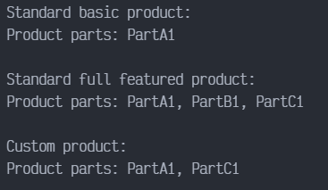

# Builder en TYPESCRIPT

Builder es un patrón de diseño creacional que permite construir objetos complejos paso a paso. Al contrario de otros patrones creacionales, Builder no necesita que los productos tengan una interfaz común. Esto hace posible crear distintos productos utilizando el mismo proceso de construcción.

## Uso del patrón en TypeScript

### Ejemplos de uso

El patrón Builder es muy conocido en el mundo TypeScript. Resulta especialmente útil cuando debes crear un objeto con muchas opciones posibles de configuración.

### Identificación

El patrón Builder se puede reconocer por la clase, que tienen un único método de creación y varios métodos para configurar el objeto resultante. A menudo, los métodos del Builder soportan el encadenamiento (por ejemplo, `algúnBuilder.establecerValorA(1).establecerValorB(2).crear()`).

## Ejemplo Conceptual

Este ejemplo ilustra la estructura del patrón de diseño Builder. Se centra en responder las siguientes preguntas:

- ¿De qué clases se compone?
- ¿Qué papeles juegan esas clases?
- ¿De qué forma se relacionan los elementos del patrón?

`index.ts`: Ejemplo conceptual.

La interfaz Builder especifica los métodos para la creación de diferentes partes de los objetos Producto.

```typescript
interface Builder {
    producePartA(): void;
    producePartB(): void;
    producePartC(): void;
}
```

Las clases de Constructores Concretos siguen la interfaz Builder y proveen implementaciones especificas de los pasos de construcción. Tu programa puede tener varias variantes de los Constructores, implementados de manera diferente.

Una instancia de constructor 'fresco' debe contener un objeto producto en blanco, el cual es usado en un montaje adicional.

```typescript
class ConcreteBuilder1 implements Builder {
    private product: Product1;

    constructor() {
        this.reset();
    }

    public reset(): void {
        this.product = new Product1();
    }
```

Todos los pasos de producción trabajan con la misma instancia de producto.

```typescript
    public producePartA(): void {
        this.product.parts.push('PartA1');
    }

    public producePartB(): void {
        this.product.parts.push('PartB1');
    }

    public producePartC(): void {
        this.product.parts.push('PartC1');
    }
```

Se supone que los constructores concretos proveen sus propios métodos para recuperar resultados. Esto es porque varios tipos de constructores pueden crear productos diferentes por completo, que no siguen la misma interfaz. Por lo tanto tales métodos no pueden ser declarados en la interfaz Builder base (al menos en un lenguaje de programación de tipado estático). Tenga en cuenta que PHP es un lenguaje de tipado dinámico y este método puede estar en la interfaz base. Sin embargo, nosotros no lo declararemos allí por el bien de la claridad.

Usualmente, después de retornar el resultado final al cliente, una instancia de construcción se espera que este lista para producir otros productos. Esto es porque es una practica usual llamar el método reset al finalizar el cuerpo del método getProduct(). Sin embargo, este comportamiento no es obligatorio, y tu puedes crear tus constructores y esperar para hacer una llamada explicita al reset desde el código cliente después de eliminar el resultado previo.

```typescript
    public getProduct(): Product1 {
        const result = this.product;
        this.reset();
        return result;
    }
}
```

Tiene sentido usar el patrón Builder solo cuando tus productos son bastantes complejos y requieres configuraciones extensas. A diferencia de otros patrones creacionales, los diferentes constructores concretos pueden producir productos no relacionados. En otras palabras, los resultados de varios constructores no podrían seguir siempre la misma interfaz.

```typescript
class Product1 {
    public parts: string[] = [];

    public listParts(): void {
        console.log(`Product parts: ${this.parts.join(', ')}\n`);
    }
}
```

El director es solo responsable de ejecutar los pasos de construcción en una secuencia particular. Esto es útil cuando cuando se producen productos de acuerdo a una orden especifica o una configuración. Estrictamente hablando, la clase director es opcional, desde el código cliente se puede controlar la construcción directamente.

```typescript
class Director {
    private builder: Builder;
```

El director trabaja con cualquier instancia de construcción que el código cliente le pasa. De esta manera, el código cliente puede alterar el el tipo final de los nuevos productos ensamblados.

```typescript
    public setBuilder(builder: Builder): void {
        this.builder = builder;
    }
```

El director puede construir muchas variantes de productos usando los mismos pasos de construcción.

```typescript
    public buildMinimalViableProduct(): void {
        this.builder.producePartA();
    }

    public buildFullFeaturedProduct(): void {
        this.builder.producePartA();
        this.builder.producePartB();
        this.builder.producePartC();
    }
}
```

El código cliente crea un objeto constructor, pasándolo al director e instanciando el proceso de construcción. El resultado final es recuperado del objeto constructor.

```typescript
function clientCode(director: Director) {
    const builder = new ConcreteBuilder1();
    director.setBuilder(builder);

    console.log('Standard basic product:');
    director.buildMinimalViableProduct();
    builder.getProduct().listParts();

    console.log('Standard full featured product:');
    director.buildFullFeaturedProduct();
    builder.getProduct().listParts();
```

Recuerda, el patrón Builder puede ser usado sin una clase Director.

```typescript
    console.log('Custom product:')
    builder.producePartA();
    builder.producePartC();
    builder.getProduct().listParts();
}


const director = new Director();
clientCode(director);
```

### Output


