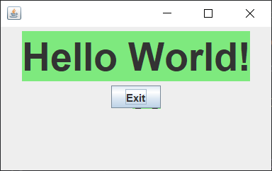

# Factory Method en JAVA

Factory Method es un patrón de diseño creacional que resuelve el problema de crear objetos de producto sin especificar sus clases concretas. El patrón Factory Method define un método que debe utilizarse para crear objetos, en lugar de una llamada directa al constructor (operador `new`). Las subclases pueden sobrescribir este método para cambiar las clases de los objetos que se crearán.

## Uso del patrón en Java

### Ejemplos de uso

El patrón Factory Method se utiliza mucho en el código Java. Resulta muy útil cuando necesitas proporcionar un alto nivel de flexibilidad a tu código. El patrón está presente en las principales bibliotecas de Java:

- `java.util.Calendar#getInstance()`
- `java.util.ResourceBundle#getBundle()`
- `java.text.NumberFormat#getInstance()`
- `java.nio.charset.Charset#forName()`
- `java.net.URLStreamHandlerFactory#createURLStreamHandler(String)`. Devuelve distintos objetos singleton, dependiendo de un protocolo.
- `java.util.EnumSet#of()`
- `javax.xml.bind.JAXBContext#createMarshaller()` y otros similares.

### Identificación

Los métodos fábrica pueden ser reconocidos por métodos de creación, que crean objetos a partir de clases concretas, pero los devuelven como objetos del tipo abstracto o interfaz.

## Producción de elementos GUI multiplataforma

En este ejemplo, Buttons juega el papel de producto y los diálogos actúan como creadores. Los distintos tipos de diálogos requieren sus propios tipos de elementos. Por eso creamos una subclase para cada tipo de diálogo y sobrescribimos sus métodos fábrica. Ahora, cada tipo de diálogo instanciará clases de botón. El diálogo base trabaja con productos utilizando su interfaz común, por eso su código sigue siendo funcional tras todos los cambios.

### Buttons

`buttons/Button.java` actuá como *Interfaz Común de producto*.

```java
package buttons;

public interface Button {
    void render();
    void onClick();
}
```

`buttons/HtmlButton.java` funciona como un *Producto Concreto*.

```java
package buttons;

public class HtmlButton implements Button {

    @Override
    public void render() {
        System.out.println("<button>Test Button</button>");        
        onClick();
    }

    @Override
    public void onClick() {
        System.out.println("Click! Button says - 'Hello World!'");
    }
    
}
```

`buttons/WindowsButton.java` funciona como otro *Producto Concreto*.

```java
package buttons;

import java.awt.FlowLayout;
import java.awt.event.ActionEvent;
import java.awt.event.ActionListener;

import javax.swing.JButton;
import javax.swing.JFrame;
import javax.swing.JLabel;
import javax.swing.JPanel;
import javax.swing.SwingConstants;
import javax.swing.plaf.ColorUIResource;
import javax.swing.plaf.FontUIResource;


public class WindowsButton implements Button {

    JPanel panel = new JPanel();
    JFrame frame = new JFrame();
    JButton button;

    @Override
    public void render() {
        frame.setDefaultCloseOperation(JFrame.EXIT_ON_CLOSE);
        JLabel label = new JLabel("Hello World!");
        label.setOpaque(true);
        label.setBackground(new ColorUIResource(235, 233, 126));
        label.setFont(new FontUIResource("Dialog", FontUIResource.BOLD, 44));
        label.setHorizontalAlignment(SwingConstants.CENTER);
        panel.setLayout(new FlowLayout(FlowLayout.CENTER));
        frame.getContentPane().add(panel);
        panel.add(label);
        onClick();
        panel.add(button);
        panel.add(button);
        frame.setSize(320, 200);
        frame.setVisible(true);
        onClick();
    }

    @Override
    public void onClick() {
        button = new JButton("Exit");
        button.addActionListener((ActionListener) new ActionListener() {
            @Override
            public void actionPerformed(ActionEvent e) {
                frame.setVisible(false);
                System.exit(0);
            }
        });
    }
    
}
```

### Factory

`factory/Dialog.java` es un *Creador Base*. Nótese que "factory" is meramente un rol para la clase. Debe tener alguna lógica empresarial central que requiera la creación de diferentes productos.

Las subclases sobrescribirán el método `createButton()` con el fin de crear botones específicos.

```java
package factory;

import buttons.Button;

public abstract class Dialog {
    
    public void renderWindow() {
        Button okButton = createButton();
        okButton.render();
    }

    public abstract Button createButton();
}
```

`factory/HtmlDialog.java` es un *Creador Concreto*.

```java
package factory;

import buttons.Button;
import buttons.HtmlButton;

public class HtmlDialog extends Dialog {
    
    @Override
    public Button createButton() {
        return new HtmlButton();
    }
}
```

`factory/WindowsDialog.java` es otro *Creador Concreto*

```java
package factory;

import buttons.Button;
import buttons.WindowsButton;

public class WindowsDialog extends Dialog{
    
    @Override
    public Button createButton() {
        return new WindowsButton();
    }
}
```

### Demo

`demo/Demo.java` es la clase en la que ira todo lo que se puede ejecutar. La función `configure()` permite que se escoja la función fábrica según la configuración u opciones del entorno. Todo el código del cliente debe funcionar con fábricas y productos a través de interfaces abstractas. De esta forma, no le importa con que fábrica trabaja y que tipo de producto devuelve, allí trabaja el método `runBusinessLogic()` 

```java
package demo;

import factory.Dialog;
import factory.HtmlDialog;
import factory.WindowsDialog;

public class Demo {

    private static Dialog dialog;

    public static void main(String[] args) {
        configure();
        runBusinessLogic();
    }

    static void configure() {
        if (System.getProperty("os.name").equals("Windows 10")) {
            dialog = new WindowsDialog();
        } else {
            dialog = new HtmlDialog();
        }
    }

    static void runBusinessLogic() {
        dialog.renderWindow();
    }
}
```

### Output Demo

- Resultados de la ejecución según HtmlDialog  
    
- Resultados de la ejecución según WindowsDialog  
    
