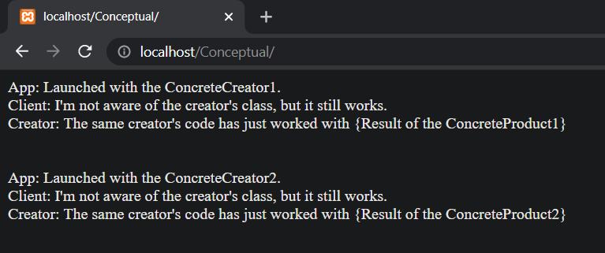
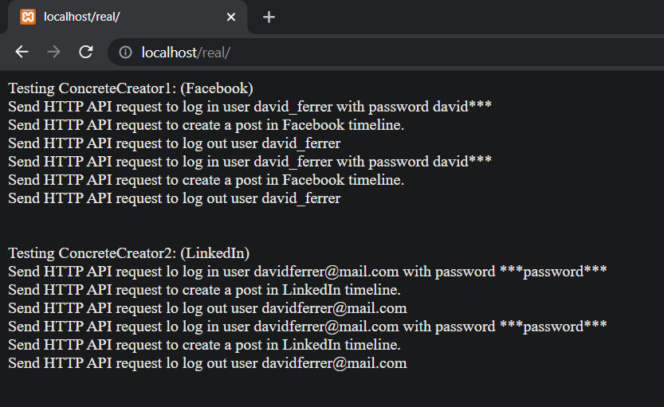

# Factory Method en PHP

Factory Method es un patrón de diseño creacional que resuelve el problema de crear objetos de producto sin especificar sus clases concretas. El patrón Factory Method define un método que debe utilizarse para crear objetos, en lugar de una llamada directa al constructor (operador new). Las subclases puede sobrescribir este método para cambiar las clases de los objetos que se crearán.

## Uso del patrón en PHP

### Ejemplos de uso

El patrón Factory Method se utiliza mucho en el código PHP. Resulta muy útil cuando necesitas proporcionar un alto nivel de flexibilidad a tu código.

### Identificación

Los métodos fábrica pueden ser reconocidos por métodos de creación, que se crean objetos de clases concretas, pero los devuelven como objetos del tipo abstracto o interfaz.

## Ejemplo Conceptual

Este ejemplo ilustra la estructura del patrón Factory Method y se centra en las siguientes preguntas:

- ¿De qué clases se compone?
- ¿Qúe papeles juegan esas clases?
- ¿De qué forma se relacionan los elementos del patrón?

Después de conocer la estructura del patrón, será más fácil comprender el siguiente ejemplo basado en un caso de uso real de PHP.

### Conceptual/index.php

El archivo `index.php` contiene el ejemplo conceptual.

La clase `Creator` declara el método fábrica que se supone, debe retornar un objeto de una clase `Product`. Las subclases de `Creator` usualmente proveen la implementación de dicho método.

```php
<?php

abstract class Creator
{
```

Tenga en cuenta que el `Creator` también puede proveer una implementación por defecto del método fábrica.

```php
    abstract public function factoryMethod(): Product;
```

También tenga en cuenta que, a pesar de su nombre, la responsabilidad primaria de `Creator` no es la creación de productos. Usualmente, este cierta lógica empresarial central, que se basa en los objetos `Product`, los cuales son devueltos por el método fábrica. Las subclases pueden cambiar indirectamente la lógica de negocios sobrescribiendo el método fábrica y retornando un tipo diferente de producto.

```php
    public function someOperation(): string
    {
        // Call the factory method to create a Product object.
        $product = $this->factoryMethod();
        // Now, use the product
        $result = "Creator: The same creator's code has just worked with " . $product->operation();
        return $result;
    }
}
```

Los creadores concretos sobrescriben el método fábrica in orden de cambiar los tipos de productos resultantes. Tenga en cuenta que la solicitud del método todavía usa el tipo de producto abstracto, aunque el producto concreto es realmente devuelto por el método. De esta manera, el `Creator` puede permanecer independiente de las clases de productos concretos.

```php
class ConcreteCreator1 extends Creator
{
    public function factoryMethod(): Product
    {
        return new ConcreteProduct1();
    }
}


class ConcreteCreator2 extends Creator
{
    public function factoryMethod(): Product
    {
        return new ConcreteProduct2();
    }
}
```

La interfaz de `Product` declara las operaciones que todos los productos concretos deben implementar.

```php
interface Product
{
    public function operation(): string;
}
```

Los productos concretos proveen varias implementaciones de la interfaz `Product`.

```php
class ConcreteProduct1 implements Product
{
    public function operation(): string
    {
        return "{Result of the ConcreteProduct1}";
    }
}


class ConcreteProduct2 implements Product
{
    public function operation(): string
    {
        return "{Result of the ConcreteProduct2}";
    }
}
```

El código cliente trabaja con una instancia de un creador concreto, aunque a través de su interfaz base. Mientras el cliente se mantenga trabajando con el creador a través de la interfaz base, puede pasarle cualquier subclase de cualquier creador.

```php
function clientCode(Creator $creator)
{
    // TODO: ...
    echo "Client: I'm not aware of the creator's class, but it still works.<br>" . $creator->someOperation();
    // TODO: ...
}
```

La aplicación selecciona un tipo de creador, dependiendo de la configuración o del entorno.

```php
echo "App: Launched with the ConcreteCreator1.<br>";
clientCode(new ConcreteCreator1());
echo "<br><br><br>";

echo "App: Launched with the ConcreteCreator2.<br>";
clientCode(new ConcreteCreator2());
```

### Output

Resultado de la ejecución:



## Ejemplo del mundo real

En este ejemplo, el patrón Factory Method proporciona una interfaz para crear conectores en redes sociales, que pueden utilizarse para iniciar sesión en la red, crear publicaciones y, potencialmente, realizar otras actividades; y todo ello sin acoplar el código cliente a clases especificas de la red social particular.

### Real/index.php

El archivo `index.php` contiene un ejemplo del mundo real.

El creador declara un método fábrica que puede ser usado como una substitución de las llamadas directas al constructor de los productos, por ejemplo:

- Antes: `$p = new FacebookConnector();`
- Después: `$p = $this->getSocialNetwork;`

Esto permite cambiar el tipo de producto que esta siendo creado por las subclases de `SocialNetworkPoster`.

```php
<?php

abstract class SocialNetworkPoster
{
```

El siguiente es el método de fábrica actual. Debe notarse que este retorna el conector abstracto. Esto permite que las subclases retornen cualquier conector concreto sin romper el contrato con las superclases.

```php
    abstract public function getSocialNetwork(): SocialNetworkConnector;
```

Cuando el método fábrica es usado dentro de la lógica de negocios del Creador, las subclases pueden alterar indirectamente la lógica para retornar diferentes tipos de conectores del método fábrica. Lo primero que hace es llamar el método fábrica para crear un objeto Producto, y luego lo puede usar como desee.

```php
    public function post($content): void
    {
        $network = $this->getSocialNetwork();
        $network->logIn();
        $network->createPost($content);
        $network->logout();
    }
}
```

Este creador concreto soporta Facebook. Recuerde que esta clase también hereda el método POST de las clases padre. Los creadores Concretos son las clases que el cliente actualmente usa.

```php
class FacebookPoster extends SocialNetworkPoster {
    private $login, $password;

    public function __construct(string $login, string $password) {
        $this->login = $login;
        $this->password = $password;
    }

    public function getSocialNetwork(): SocialNetworkConnector
    {
        return new FacebookConnector($this->login, $this->password);
    }
}
```

Este es el creador concreto que soporta LinkedIn.

```php
class LinkedInPoster extends SocialNetworkPoster {
    private $email, $password;

    public function __construct(string $email, string $password) 
    {
        $this->email = $email;
        $this->password = $password;
    }

    public function getSocialNetwork(): SocialNetworkConnector
    {
        return new LinkedInConnector($this->email, $this->password);
    }
}
```

La interfaz del producto declara el comportamiento de varios tipos de productos.

```php
interface SocialNetworkConnector {
    public function logIn(): void;
    public function logOut(): void;
    public function createPost($content): void;
}
```

Este producto concreto "implementa" la Facebook API.

```php
class FacebookConnector implements SocialNetworkConnector {
    private $login, $password;

    public function __construct(string $login, string $password)
    {
        $this->login = $login;
        $this->password = $password;
    }

    public function logIn(): void {
        echo "Send HTTP API request to log in user $this->login with password $this->password<br>";
    }

    public function logOut(): void {
        echo "Send HTTP API request to log out user $this->login<br>";
    }

    public function createPost($content): void {
        echo "Send HTTP API request to create a post in Facebook timeline.<br>";
    }
}
```

Este producto concreto "implementa" la LinkedIn API.

```php
class LinkedInConnector implements SocialNetworkConnector {
    private $email, $password;

    public function __construct(string $email, string $password)
    {
        $this->email = $email;
        $this->password = $password;
    }

    public function logIn(): void {
        echo "Send HTTP API request lo log in user $this->email with password $this->password<br>";
    }

    public function logOut(): void {
        echo "Send HTTP API request lo log out user $this->email<br>";
    }

    public function createPost($content): void {
        echo "Send HTTP API request to create a post in LinkedIn timeline.<br>";
    }
}
```

El código cliente puede trabajar con cualquier subclase de `SocialNetworkPoster` ya que no depende de clases concretas.

```php
function clientCode(SocialNetworkPoster $creator) {
    $creator->post("Hello world!");
    $creator->post("I had a large hamburger this morning!");
}
```

Durante la fase de inicialización, la aplicación puede decidir con cual red social trabajar, creando un objeto de subclases apropiadas, y pasarlos al código cliente.

```php
echo "Testing ConcreteCreator1: (Facebook)<br>";
clientCode(new FacebookPoster("david_ferrer", "david***"));
echo "<br><br>";

echo "Testing ConcreteCreator2: (LinkedIn)<br>";
clientCode(new LinkedInPoster("davidferrer@mail.com", "***password***"));
```

### Output

Resultado de la ejecución.


