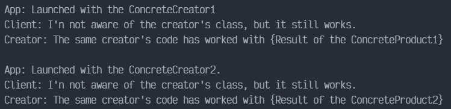

# Factory Method en PYTHON

Factory Method es un patrón de diseño creacional que resuelve el problema de crear objetos de producto sin especificar sus clases concretas. El patrón Factory Method define un método que debe utilizarse para crear objetos, en lugar de una llamada directa al constructor (operador new). Las subclases pueden sobrescribir este método para cambiar las clases de los objetos que se crearán.

## Uso del patrón en Python

### Ejemplos de uso

El patrón Factory Method se utiliza mucho en el código Python. Resulta muy útil cuando necesitas proporcionar un alto nivel de flexibilidad a tu código.

### Identificación

Los métodos fábrica pueden ser reconocidos por métodos de creación, que crean objetos de clases concretas, pero los devuelven como objetos del tipo abstracto o interfaz.

## Ejemplo Conceptual

Este ejemplo ilustra la estructura del patrón de diseño Factory Method. Se centra en responder las siguientes preguntas:

- ¿De qué clases se compone?
- ¿Qué papeles juegan esas clases?
- ¿De qué forma se relacionan los elementos del patrón?

### main.py

```python
from __future__ import annotations
from abc import ABC, abstractmethod
```

La clase creadora declara el método fábrica que debe retornar un objeto de una clase Producto. Las subclases del Creador, usualmente proveen la implementación del método. Nótese que el Creador puede proveer alguna implementación por defecto de método fábrica.

```python
class Creator(ABC):
    @abstractmethod
    def factory_method(self):
        pass
```

También es importante resaltar que, a pesar de su nombre, la responsabilidad primaria del Creador, no es la de crear productos. Usualmente, este contiene alguna lógica de negocios centrar que se bas en los objetos producto retornados por el el factory method. Las subclases pueden cambiar indirectamente la lógica de negocios sobrescribiendo el método y retornando un tipo diferente de producto.

En este método, lo primero que se hace es llamar el método fábrica para crear un objeto producto, para luego ser usado.

```python
    def some_operation(self) -> str:
        product = self.factory_method()
        result = f"Creator: The same creator's code has worked with {product.operation()}"
        return result
```

Los creadores concretos sobrescriben el método fábrica con el fin de cambiar los tipos de productos resultantes. Tenga en cuenta que la forma del método todavía usa el tipo de producto abstracto, aun cuando el producto concreto es actualmente retornado por el método. De esta manera, el creador puede mantenerse independiente de las clases de productos concretos.

```python
class ConcreteCreator1(Creator):
    def factory_method(self) -> Product:
        return ConcreteProduct1()


class ConcreteCreator2(Creator):
    def factory_method(self) -> Product:
        return ConcreteProduct2()
```

La interfaz Producto, declara las operaciones que todos los productos concretos deben implementar.

```python
class Product(ABC):
    @abstractmethod
    def operation(self) -> str:
        pass
```

Los productos concretos proveen varias implementaciones de la interfaz Producto.

```python
class ConcreteProduct1(Product):
    def operation(self) -> str:
        return "{Result of the ConcreteProduct1}"


class ConcreteProduct2(Product):
    def operation(self) -> str:
        return "{Result of the ConcreteProduct2}"
```

El código cliente trabaja con una instancia de un creador concreto, aunque a través de la interfaz base. Mientras el cliente trabaje con el creador via interfaz base, se le puede pasar cualquier tipo de subclase del creador.

```python
def client_code(creator: Creator) -> None:
    print(f"Client: I'n not aware of the creator's class, but it still works.\n" f"{creator.some_operation()}", end="")


if __name__ == "__main__":
    print("App: Launched with the ConcreteCreator1")
    client_code(ConcreteCreator1())
    print("\n")

    print("App: Launched with the ConcreteCreator2.")
    client_code(ConcreteCreator2())
```

### Output

Resultado de la ejecución.

