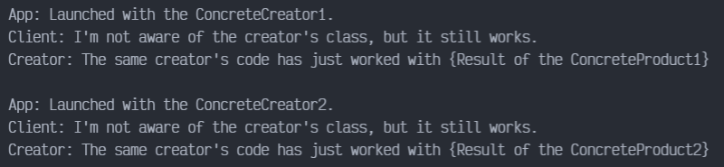

# Factory Method en TYPESCRIPT

Factory Method es un patrón de diseño creacional que resuelve el problema de crear objetos de producto sin especificar sus clases concretas. El patrón factory method define un método que debe utilizarse para crear objetos, en lugar de una llamada directa al constructor (operador new). Las subclases pueden sobrescribir este método para cambiar las clases de los objetos que se crearán.

## Uso del patrón en TypeScript

### Ejemplos de uso

El patrón Factory Method se utiliza mucho en el código TypeScript. Resulta muy útil cuando necesitas proporcionar un alto nivel de flexibilidad a tu código.

### Identificación

Los métodos fábrica pueden ser reconocidos por métodos de creación, que crean objetos de clases concretas, pero los devuelven como objetos de tipo abstracto o interfaz.

## Ejemplo Conceptual

Este ejemplo ilustra la estructura del patrón de diseño Factory Method, y se centra en las siguientes preguntas:

- ¿De qué clases se compone?
- ¿Qué papeles juegan esas clases?
- ¿De qué forma se relacionan los elementos del patrón?

### index.ts

El siguiente es un ejemplo conceptual del patrón Factory Method en TS.

La clase Creador declara el método fábrica que debe retornar un objeto de una clase Producto. Las subclases del Creador, usualmente proveen la implementación del método. Tenga en cuenta que el Creador puede proveer alguna implementación por defecto del método fábrica.

```typescript
abstract class Creator {
    public abstract factoryMethod(): Product;
```

También se debe resaltar que, aunque su nombre lo diga, la responsabilidad primaria del Creador no es la de crear objetos. Usualmente, estos contienen alguna lógica de negocios central que se pasa en los objetos producto, retornados por el método fábrica. Las subclases pueden indirectamente, cambiar la lógica de negocios al sobrescribir el método fábrica y retornando un tipo diferente de producto.

Dentro del método, lo primero que se hace es llamar el método fábrica para crear un objeto Product, para luego ser usado.

```typescript
    public someOperation(): string {
        const product = this.factoryMethod()
        return "Creator: The same creator's code has just worked with ${product.operation()}";
    }
}
```

Los creadores concretos sobrescriben el método fábrica, con el fin de cambiar los tipos de productos devueltos. Tenga en cuenta que la firma de cada método todavía usa el tipo de producto abstracto, aun cuando el producto concreto es actualmente retornado por el método. De esta manera, el Creador puede mantenerse independiente de las clases de productos concretos.

```typescript
class ConcreteCreator1 extends Creator {
    public factoryMethod(): Product {
        return new ConcreteProduct1();
    }
}


class ConcreteCreator2 extends Creator {
    public factoryMethod(): Product {
        return new ConcreteProduct2();
    }
}
```

La interfaz de Producto declara las operaciones que todos los productos concretos deben implementar.

```typescript
interface Product {
    operation(): string;
}
```

Los productos concretos proveen varias implementaciones de la interfaz Producto.

```typescript
class ConcreteProduct1 implements Product {
    operation(): string {
        return "{Result of the ConcreteProduct1}";
    }
}


class ConcreteProduct2 implements Product {
    operation(): string {
        return "{Result of the ConcreteProduct2}";
    }
}
```

El código cliente trabaja con una instancia de un creador concreto, aunque a través de la interfaz base. Mientras el cliente trabaje con el creador via interfaz base, se le puede pasar cualquier subclase del creador.

```typescript
function clientCode(creator: Creator) {
    console.log("Client: I'm not aware of the creator's class, but it still works.");
    console.log(creator.someOperation());
}
```

La aplicación eligen el creador dependiendo el tipo de configuración, o del entorno.

```typescript
console.log('App: Launched with the ConcreteCreator1');
clientCode(new ConcreteCreator1());
console.log('\n');

console.log('App: Launched with the ConcreteCreator2');
clientCode(new ConcreteCreator2());
```

### Output

Resultado de la ejecución, con los comandos:

`npm i -g typescript`
`tsc index.ts | node index.js`

