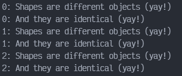
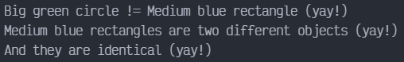

# Prototype en JAVA

Prototype es un patrón de diseño creacional que permite la clonación de objetos, incluso los complejos, sin acoplarse a sus clases específicas. Todas las clases prototipo deben tener una interfaz común que haga posible copiar objetos incluso si sus clases concretas son desconocidas, ya que los objetos de la misma clase pueden acceder a los campos privados de los demás.

## Uso del patrón en Java

### Ejemplos de uso

El patrón Prototype está disponible en Java lista para usarse con una interfaz `Cloneable`. Cualquier clase puede implementar esta interfaz para hacerse clonable. Cualquier clase puede implementar esta interfaz para hacerse clonable.

- `java.lang.Object#clone()` (la clase debe implementar la interfaz `java.lang.Cloneable`)

### Identificación

El prototipo puede reconocerse fácilmente por un método `clone` o `copy`, etc.

## Copiar formas gráficas

Vamos a ver cómo se puede implementar el patrón Prototype sin la interfaz estándar `Cloneable`.

### shapes

Lista de formas.

`shapes/Shape.java`. Interfaz común de las formas.

```java
package shapes;

import java.util.Objects;

public abstract class Shape {

    public int x;
    public int y;
    public String color;

    public Shape() {}
    
    public Shape(Shape target) {
        if (target != null) {
            this.x = target.x;
            this.y = target.y;
            this.color = target.color;
        }
    }

    public abstract Shape clone();

    @Override
    public boolean equals(Object obj2) {
        if (!(obj2 instanceof Shape)) return false;
        Shape shape2 = (Shape) obj2;
        return shape2.x == x && shape2.y == y && Objects.equals(shape2.color, color);
    }
}
```

`shapes/Circle.java`. Forma simple

```java
package shapes;

public class Circle extends Shape {

    public int radius;

    public Circle() {}

    public Circle(Circle target) {
        super(target);
        if (target != null) {
            this.radius = target.radius;
        }
    }

    @Override
    public Shape clone() {
        return new Circle(this);
    }

    @Override
    public boolean equals(Object obj2) {
        if (!(obj2 instanceof Circle) || !super.equals(obj2)) return false;
        Circle shape2 = (Circle) obj2;
        return shape2.radius == radius;
    }
}
```

`shapes/Rectangle.java`. Otra forma

```java
package shapes;

public class Rectangle extends Shape {

    public int width;
    public int height;

    public Rectangle() {}

    public Rectangle(Rectangle target) {
        super(target);
        if (target != null) {
            this.width = target.width;
            this.height = target.height;
        }
    }

    @Override
    public Shape clone() {
        return new Rectangle(this);
    }
    
    @Override
    public boolean equals(Object obj2) {
        if (!(obj2 instanceof Rectangle) || !super.equals(obj2)) return false;
        Rectangle shape2 = (Rectangle) obj2;
        return shape2.width == width && shape2.height == height;
    }
}
```

`Demo.java`. Ejemplo de clonación.

```java
package shapes;

import java.util.ArrayList;
import java.util.List;

public class Demo {

    public static void main(String[] args) {
        List<Shape> shapes = new ArrayList<>();
        List<Shape> shapesCopy = new ArrayList<>();

        Circle circle = new Circle();
        circle.x = 10;
        circle.y = 20;
        circle.radius = 15;
        circle.color = "red";
        shapes.add(circle);

        Circle anotherCircle = (Circle) circle.clone();
        shapes.add(anotherCircle);

        Rectangle rectangle = new Rectangle();
        rectangle.x = 10;
        rectangle.y = 20;
        rectangle.color = "blue";
        shapes.add(rectangle);

        cloneAndCompare(shapes, shapesCopy);
    }
    
    private static void cloneAndCompare(List<Shape> shapes, List<Shape> shapesCopy) {
        shapes.forEach(shape -> {
            shapesCopy.add(shape.clone());
        });

        for (int index=0; index < shapes.size(); index++) {
            if (shapes.get(index) != shapesCopy.get(index)) {
                System.out.println(index + ": Shapes are different objects (yay!)");
                if (shapes.get(index).equals(shapesCopy.get(index))) {
                    System.out.println(index + ": And they are identical (yay!)");
                } else {
                    System.out.println(index + ": But they are not identical (booo!)");
                }
            } else {
                System.out.println(index + ": Shape Objects are the same (booo!)");
            }
        }
    }
}
```

#### Output



#### Registro del prototipo

Puedes implementar un registro centralizado del prototipo (o fábrica), que contendría un grupo de objetos prototipo predefinidos. De este modo, podrías extraer nuevos objetos de la fábrica sin pasar su nombre u otros parámetros. La fábrica buscará un prototipo adecuado, lo clonará y te devolverá una copia.

### cache

`cache/BundledShapeCache.java`. Fábrica de prototipos.

```java
package cache;

import java.util.HashMap;
import java.util.Map;

import shapes.Circle;
import shapes.Rectangle;
import shapes.Shape;

public class BundledShapeCache {

    private Map<String, Shape> cache = new HashMap<>();

    public BundledShapeCache() {
        Circle circle = new Circle();
        circle.x = 5;
        circle.y = 7;
        circle.radius = 45;
        circle.color = "Green";

        Rectangle rectangle = new Rectangle();
        rectangle.x = 6;
        rectangle.y = 9;
        rectangle.width = 8;
        rectangle.height = 10;
        rectangle.color = "Blue";

        cache.put("Big green circle", circle);
        cache.put("Medium blue rectangle", rectangle);
    }
    
    public Shape put(String key, Shape shape) {
        cache.put(key, shape);
        return shape;
    }

    public Shape get(String key) {
        return cache.get(key).clone();
    }
}
```

`Demo.java`. Ejemplo de clonación

```java
package cache;

import shapes.Shape;

public class Demo {
    
    public static void main(String[] args) {
        BundledShapeCache cache = new BundledShapeCache();

        Shape shape1 = cache.get("Big green circle");
        Shape shape2 = cache.get("Medium blue rectangle");
        Shape shape3 = cache.get("Medium blue rectangle");

        if (shape1 != shape2 && !shape1.equals(shape2)) {
            System.out.println("Big green circle != Medium blue rectangle (yay!)");
        } else {
            System.out.println("Big green circle == Medium blue rectangle (booo!)");
        }

        if (shape2 != shape3) {
            System.out.println("Medium blue rectangles are two different objects (yay!)");
            if (shape2.equals(shape3)) {
                System.out.println("And they are identical (yay!)");
            } else {
                System.out.println("But they are not identical (booo!)");
            }
        } else {
            System.out.println("Rectangle objects are the same (booo!)");
        }
    }
}
```

#### Output


