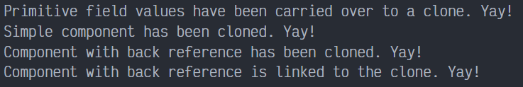
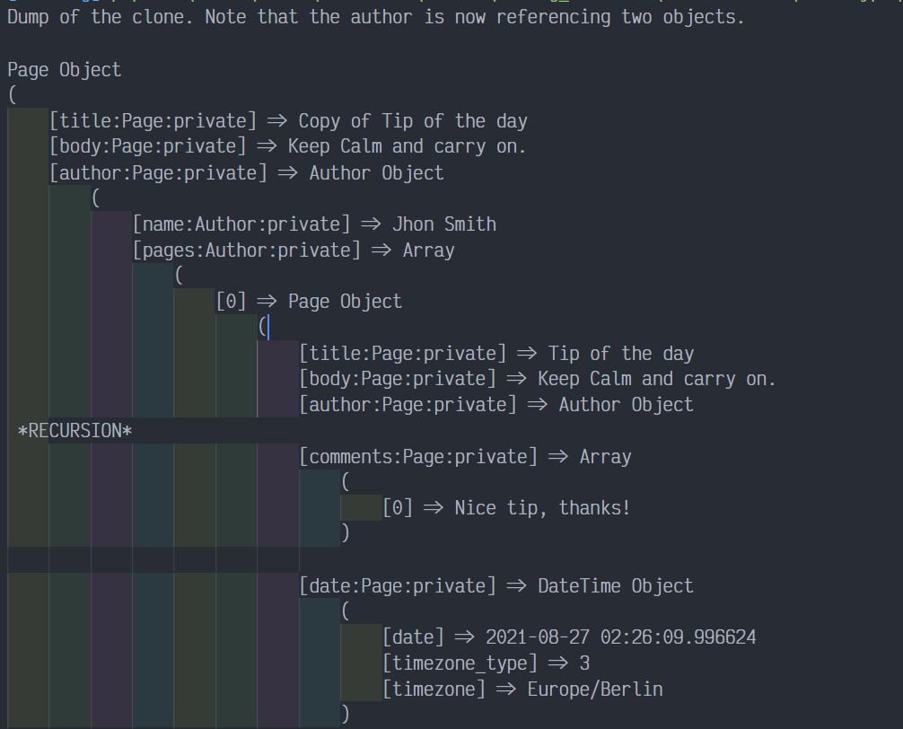
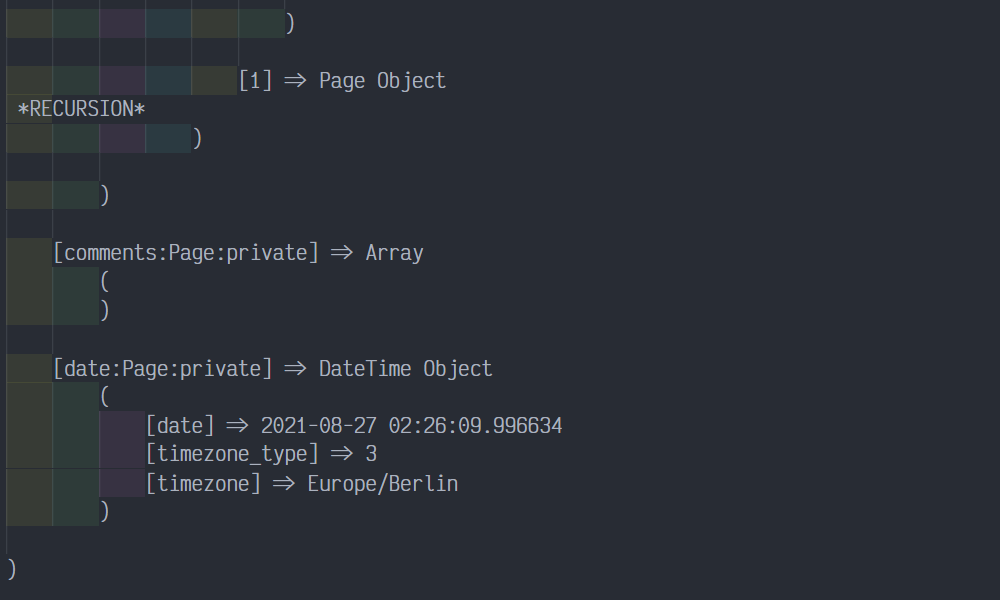

# Prototype en PHP

Prototype es un patrón de diseño creacional que permite la clonación de objetos, incluso los complejos, sin acoplarse a sus clases específicas. Todas las clases prototipo deben tener una interfaz común que haga posible copiar objetos incluso si sus clases concretas son desconocidas. Los objetos prototipo pueden producir copias completas, ya que los objetos de la misma clase pueden acceder a los campos privados de los demás.

## Uso del patrón en PHP

### Ejemplos de uso

El patrón Prototype está disponible en PHP listo para usarse. Puedes utilizar la palabra clave `clone` para crear una copia exacta de un objeto. Para añadir soporte de clonación a una clase, debes implementar un método `__clone`.

### Identificación

El prototype puede reconocerse fácilmente por un método `clone` o `copy`, etc.

## Ejemplo Conceptual

Este ejemplo ilustra la estructura del patrón de diseño Prototype y se centra en las siguientes preguntas:

- ¿De qué clases se compone?
- ¿Qué papeles juegan esas clases?
- ¿De qué forma se relacionan los elementos del patrón?

Después de conocer la estructura del patrón, será más fácil comprender el siguiente ejemplo basado en un caso de uso real de PHP.

`index.php`. Ejemplo conceptual.

La clase ejemplo tiene la habilidad de clonar. Vamos a ver como los valores con los diferentes tipos van a ser clonados.

```php
<?php

class Prototype
{
    public $primitive;
    public $component;
    public $circularReference;
```

PHP tiene un soporte de clonación prefabricado. Tu puedes clonar un objeto sin definir cualquier método especial, siempre y cuando tenga métodos de tipo primitivo. Los campos contienen objetos que retienen sus referencias en objetos clonados. Por lo tanto, en algunos casos, tu podrías querer clonar aquellos objetos referenciados también. Tu puedes hacer eso en un método especial `__clone()`.

Clonar un objeto que tiene un objeto anidado con una backreference requiere un tratamiento especial. Después de que la clonación ha terminado, el objeto anidado debería apuntar al objeto clonado, instanciando el objeto original.

```php
    public function __clone()
    {
        $this->component = clone $this->component;
        $this->circularReference = clone $this->circularReference;
        $this->circularReference->prototype = $this;
    }
}


class ComponentWithBackReference
{
    public $prototype;
```

Note que el constructor no debe ejecutarse durante la clonación. Si tu tienes una lógica compleja dentro del constructor, tu puedes necesitar que se ejecute en el método `__clone()` también.

```php
    public function __construct(Prototype $prototype)
    {
        $this->prototype = $prototype;
    }
}
```

Código cliente.

```php
function clientCode() 
{
    $p1 = new Prototype();
    $p1->primitive = 245;
    $p1->component = new \DateTime();
    $p1->circularReference = new ComponentWithBackReference($p1);

    $p2 = clone $p1;
    if ($p1->primitive === $p2->primitive) {
        echo "Primitive field values have been carried over to a clone. Yay!\n";
    } else {
        echo "Primitive field values have not been copied. Booo!\n";
    }

    if ($p1->component === $p2->component) {
        echo "Simple component has not been cloned. Booo!\n";
    } else {
        echo "Simple component has been cloned. Yay!\n";
    }

    if ($p1->circularReference === $p2->circularReference) {
        echo "Component with back reference has not been cloned. Booo!\n";
    } else {
        echo "Component with back reference has been cloned. Yay!\n";
    }

    if ($p1->circularReference->prototype === $p2->circularReference->prototype) {
        echo "Component with back reference is linked to original object. Booo!\n";
    } else {
        echo "Component with back reference is linked to the clone. Yay!\n";
    }
}

clientCode();
```

### Output Conceptual

Resultado de la ejecución.



## Ejemplo del mundo Real

El patrón Prototype proporciona una forma cómoda de replicar objetos existentes en lugar de intentar reconstruirlos copiando directamente todos sus campos. La via directa no solo se acopla a las clases de los objetos clonados, sino que además no te permite copiar los contenidos de los campos privados. El patrón Prototype te permite realizar la clonación dentro del contexto de la clase clonada, donde el acceso a los campos privados de la clase no está restringido.

Este ejemplo te muestra cómo clonar un objeto Page (Página) complejo utilizando el patrón Prototype. La clase Page tiene muchos campos privados, que se trasladan al objeto clonado gracias al patrón Prototype.

`index.php`. Ejemplo del mundo real.

La clase Page es la clase Prototype.

```php
<?php

class Page
{
    private $title;
    private $body;
    /*
     * @var Author
     */
    private $author;
    private $comments = [];
    /* 
     * @var \DateTime 
     */
    private $date;
    // +100 private fields

    public function __construct(string $title, string $body, Author $author)
    {
        $this->title = $title;
        $this->body = $body;
        $this->author = $author;
        $this->author->addToPage($this);
        $this->date = new \DateTime();
    }

    public function addComment(string $comment): void
    {
        $this->comments[] = $comment;
    }
```

Tu puedes controlar cuales datos llevas al objeto clonado. Por ejemplo, cuando una página es clonada: 

- La copia obtiene un nuevo titulo "Copiado de ..."
- El author de la página permanece igual. Por lo tanto nosotros dejamos la referencia del objeto existente mientras añadimos la página clonada a la lista de las páginas del author.
- Nosotros no traspasamos los comentarios de la página vieja.
- Nosotros también adjuntamos un nuevo objeto de fecha a la página.

```php
    public function __clone()
    {
        $this->title = "Copy of " . $this->title;
        $this->author->addToPage($this);
        $this->comments = [];
        $this->date = new \DateTime();
    }
}


class Author
{
    private $name;
    /* 
     * @var Page[]
     */
    private $pages = [];

    public function __construct(string $name)
    {
        $this->name = $name;
    }

    public function addToPage(Page $page): void
    {
        $this->pages[] = $page;
    }
}
```

El código cliente.

```php
function clientCode()
{
    $author = new Author("Jhon Smith");
    $page = new Page("Tip of the day", "Keep Calm and carry on.", $author);
    //...
    $page->addComment("Nice tip, thanks!");
    //...
    $draft = clone $page;
    echo "Dump of the clone. Note that the author is now referencing two objects.\n\n";
    print_r($draft);
}


clientCode();
```

### Output Real

Resultados de la ejecución.



