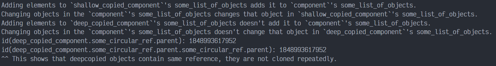

# Prototype en PYTHON

Prototype es un patrón de diseño creacional que permite la clonación de objetos, incluso los complejos, sin acoplarse a sus clases específicas. Todas las clases prototipo deben tener una interfaz común que haga posible copiar objetos incluso si sus clases concretas son desconocidas. Los objetos prototipo pueden producir copias completas, ya que los objetos de la misma clase pueden acceder a los campos privados de los demás.

## Uso del patrón en Python

### Ejemplos de uso

El patrón Prototype está disponible en Python listo para usarse con una interfaz `Cloneable`.

### Identificación

El prototipo puede reconocerse fácilmente por un método `clone` o `copy`, etc.

## Ejemplo Conceptual

Este ejemplo ilustra la estructura del patrón de diseño Prototype. Se centra en responder las siguientes preguntas:

- ¿De qué clases se compone?
- ¿Qué papeles juegan esas clases?
- ¿De qué forma se relacionan los elementos del patrón?

`main.py`. Ejemplo conceptual.

```python
import copy


class SelfReferencingEntity:
    def __init__(self):
        self.parent = None

    def set_parent(self, parent):
        self.parent = parent
```

Python provee de una interfaz propia de Prototype a través de las funciones `copy.copy` y `copy.deepcopy`. Y cualquier clase que quiera implementarlo, debe sobrescribir la implementación de las funciones miembro `__copy__` y `__deepcopy__`.

```python
class SomeComponent:
    def __init__(self, some_int, some_list_of_objects, some_circular_ref):
        self.some_int = some_int
        self.some_list_of_objects = some_list_of_objects
        self.some_circular_ref = some_circular_ref
```

Esta función crea un copia poco profunda. Este método será llamado cuando alguien llame `copy.copy` con este objeto y el valor devuelto es retornado como una copia poco profunda. Lo primero es permitirle crear copias de objetos anidados. Entonces, clonamos el objeto en sí, usando los clones preparados de los objetos anidados.

```python
    def __copy__(self):
        some_list_of_objects = copy.copy(self.some_list_of_objects)
        some_circular_ref = copy.copy(self.some_circular_ref)
        new = self.__class__(self.some_int, some_list_of_objects, some_circular_ref)
        new.__dict__.update(self.__dict__)
        return new
```

Creamos una copia profunda. Este método será llamado cuando alguien llame a `copy.deepcopy` con este objeto y el valor devuelto es retornado como la nueva copia profunda. ¿Qué es el uso del argumento `memo`? Memo es el diccionario que es usado por la librería `deepcopy` para prevenir infinitas copias recursivas en la instanciación de referencias circulares. Este se pasa a todas las llamadas de `deepcopy` para hacer que la implementación de `__deepcopy__` se prevenga de recursiones infinitas.

Lo primero, es crear copias de objetos anidados. Y luego los clones de este objeto son usados para preparar clones de los objetos anidados.

```python
    def __deepcopy__(self, memo={}):
        some_list_of_objects = copy.deepcopy(self.some_list_of_objects, memo)
        some_circular_ref = copy.deepcopy(self.some_circular_ref, memo)
        new = self.__class__(self.some_int, some_list_of_objects, some_circular_ref)
        new.__dict__ = copy.deepcopy(self.__dict__, memo)
        return new
```

Código cliente.

```python
if __name__ == "__main__":
    list_of_objects = [1, {1, 2, 3}, [1, 2, 3]]
    circular_ref = SelfReferencingEntity()
    component = SomeComponent(23, list_of_objects, circular_ref)
    circular_ref.set_parent(component)

    shallow_copied_component = copy.copy(component)
```

Cambiamos la lista en shallow_copied_component y miramos si esto cambio en el componente.

```python
    shallow_copied_component.some_list_of_objects.append("another object")
    if component.some_list_of_objects[-1] == "another object":
        print(
            "Adding elements to `shallow_copied_component`'s "
            "some_list_of_objects adds it to `component`'s "
            "some_list_of_objects."
        )
    else:
        print(
            "Adding elements to `shallow_copied_component`'s "
            "some_list_of_objects doesn't add it to `component`'s "
            "some_list_of_objects."
        )
```

Cambiamos el conjunto en la lista de objetos.

```python
    component.some_list_of_objects[1].add(4)
    if 4 in shallow_copied_component.some_list_of_objects[1]:
        print(
            "Changing objects in the `component`'s some_list_of_objects "
            "changes that object in `shallow_copied_component`'s "
            "some_list_of_objects."
        )
    else:
        print(
            "Changing objects in the `component`'s some_list_of_objects "
            "doesn't change that object in `shallow_copied_component`'s "
            "some_list_of_objects."
        )

    deep_copied_component = copy.deepcopy(component)
```

Cambiamos la lista en deep_copied_component y miramos si cambia el componente.

```python
    deep_copied_component.some_list_of_objects.append("one more object")
    if component.some_list_of_objects[-1] == "one more object":
        print(
            "Adding elements to `deep_copied_component`'s "
            "some_list_of_objects adds it to `component`'s "
            "some_list_of_objects."
        )
    else:
        print(
            "Adding elements to `deep_copied_component`'s "
            "some_list_of_objects doesn't add it to `component`'s "
            "some_list_of_objects."
        )
```

Cambiamos el conjunto en la lista de objetos.

```python
    component.some_list_of_objects[1].add(10)
    if 10 in deep_copied_component.some_list_of_objects[1]:
        print(
            "Changing objects in the `component`'s some_list_of_objects "
            "changes that object in `deep_copied_component`'s "
            "some_list_of_objects."
        )
    else:
        print(
            "Changing objects in the `component`'s some_list_of_objects "
            "doesn't change that object in `deep_copied_component`'s "
            "some_list_of_objects."
        )

    print(
        f"id(deep_copied_component.some_circular_ref.parent): "
        f"{id(deep_copied_component.some_circular_ref.parent)}"
    )
    print(
        f"id(deep_copied_component.some_circular_ref.parent.some_circular_ref.parent): "
        f"{id(deep_copied_component.some_circular_ref.parent.some_circular_ref.parent)}"
    )
    print(
        "^^ This shows that deepcopied objects contain same reference, they "
        "are not cloned repeatedly."
    )
```

### Output


