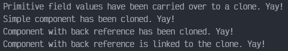

# Prototype en TYPESCRIPT

Prototype es un patrón de diseño creacional que permite la clonación de objetos, incluso los complejos, sin acoplarse a sus clases específicas. Todas las clases prototipo deben tener una interfaz común que haga posible copiar objetos incluso si sus clases concretas son desconocidas. Los objetos prototipo pueden producir copias completas, ya que los objetos de la misma clase pueden acceder a los campos privados de los demás.

## Uso del patrón en TypeScript

### Ejemplos de uso

El patrón Prototype está disponible en TypeScript listo para usarse con una interfaz `Cloneable`.

### Identificación

El prototipo puede reconocerse fácilmente por un método `clone` o `copy`, etc.

## Ejemplo Conceptual

Este ejemplo ilustra la estructura del patrón de diseño Prototype y se centra en las siguientes preguntas:

- ¿De qué clases se compone?
- ¿Qué papeles juegan esas clases?
- ¿De qué forma se relacionan los elementos del patrón?

`index.ts`. Ejemplo conceptual

Esta clase de ejemplo tiene la habilidad de clonar. Vamos a ver como los valores de los campos con diferentes tipos van a ser clonados

```ts
class Prototype {
    public primitive: any;
    public component: object;
    public circularReference: ComponentWithBackReference;

    public clone(): this {
        const clone = Object.create(this);
        clone.component = Object.create(this.component);
```

Clonar un objeto que tienen un objeto anidado con backreference, requiere de un tratamiento especial. Después de que la clonación es completada, el objeto anidado debe apuntar al objeto clonado, instanciando el objeto original. El operado Spread puede ser muy útil para esto casos.

```ts
        clone.circularReference = {
            ...this.circularReference,
            prototype: { ...this },
        };
        return clone;
    }
}


class ComponentWithBackReference {
    public prototype;

    constructor(prototype: Prototype) {
        this.prototype = prototype;
    }
}
```

Código cliente.

```ts
function clientCode() {
    const p1 = new Prototype();
    p1.primitive = 245;
    p1.component = new Date();
    p1.circularReference = new ComponentWithBackReference(p1);

    const p2 = p1.clone();

    if (p1.primitive === p2.primitive) {
        console.log('Primitive field values have been carried over to a clone. Yay!');
    } else {
        console.log('Primitive field values have not been copied. Booo!');
    }

    if (p1.component === p2.component) {
        console.log('Simple component has not been cloned. Booo!');
    } else {
        console.log('Simple component has been cloned. Yay!');
    }

    if (p1.circularReference === p2.circularReference) {
        console.log('Component with back reference has not been cloned. Booo!');
    } else {
        console.log('Component with back reference has been cloned. Yay!');
    }

    if (p1.circularReference.prototype === p2.circularReference.prototype) {
        console.log('Component with back reference is linked to original object. Booo!');
    } else {
        console.log('Component with back reference is linked to the clone. Yay!');
    }
}


clientCode();
```

### Output


