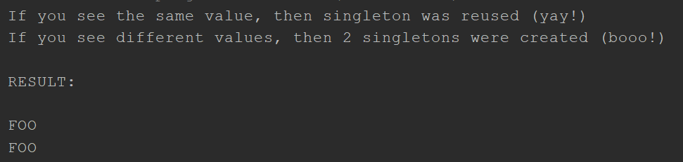
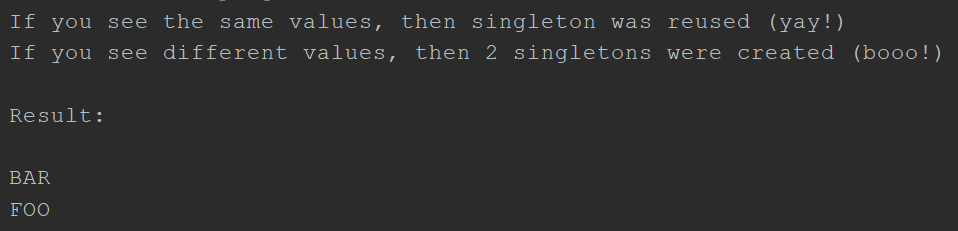
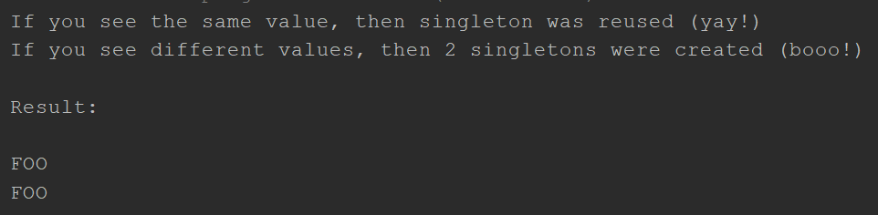

# Singleton en JAVA

Singleton es un patrón de diseño creacional que garantiza que tan solo exista un objeto de su tipo y proporciona un único punto de acceso a él para cualquier otro código. El patrón tienen prácticamente los mismos pros y contras que las variables globales. Aunque son muy útiles, rompen la modularidad de tu código.

No se puede utilizar una clase que dependa del Singleton en otro contexto. Tendrás que llevar también la clase Singleton. La mayoría de las veces, esta limitación aparece durante la creación de pruebas de unidad.

## Uso del patrón en Java

### Ejemplos de Uso

Muchos desarrolladores consideran el patrón Singleton un antipatrón. Por este motivo, su uso está en declive en el código Java. A pesar de ello, existen muchos ejemplos del patrón Singleton en las principales bibliotecas de Java:

- `java.lang.Runtime#getRuntime()`
- `java.awt.Desktop#getDesktop()`
- `java.lang.System#getSecurityManager()`

### Identificación

El patrón Singleton se puede reconocer por un método de creación estático, que devuelve el mismo objeto guardado en caché.

## Singleton Ingenuo (hilo único)

Es muy fácil implementar un Singleton descuidado. Tan solo necesitas esconder el constructor e implementar un método de creación estático.

`Singleton.java`. Singleton

En este código se emula una inicialización lenta.

```java
package singletonIngenuoSingleThread;

public class Singleton {
    private static Singleton instance;
    public String value;

    private Singleton(String value) {
        try {
            Thread.sleep(1000);
        } catch (InterruptedException e) {
            e.printStackTrace();
        }
        this.value = value;
    }

    public static Singleton getInstance(String value) {
        if (instance == null) {
            instance = new Singleton(value);
        }
        return instance;
    }
}
```

`DemoSingleThread.java`. Código cliente

```java
package singletonIngenuoSingleThread;

public class DemoSingleThread {
    public static void main(String[] args) {
        System.out.println(
            "If you see the same value, then singleton was reused (yay!) \n" +
            "If you see different values, then 2 singletons were created (booo!) \n\n" +
            "RESULT: \n"
        );

        Singleton singleton = Singleton.getInstance("FOO");
        Singleton anotherSingleton = Singleton.getInstance("BAR");
        System.out.println(singleton.value);
        System.out.println(anotherSingleton.value);
    }
}
```

### Output Demo Single Thread

Resultado de la ejecución.



## Singleton Ingenuo (multihilo)

La misma clase se comporta de forma incorrecta en un entorno de múltiples hilos. Los múltiples hilos pueden llamar al método de creación de forma simultánea y obtener varias instancias de la clase Singleton.

`Singleton.java`. Singleton, este script es el mismo de la sección anterior, con el fin de ver el comportamiento erroneo.

`DemoMultiThread.java`. Código cliente para un multihilo.

```java
package singletonIngenuoMultiThread;

import singletonIngenuoMultiThread.Singleton;

public class DemoMultiThread {
    public static void main(String[] args) {
        System.out.println(
            "If you see the same values, then singleton was reused (yay!) \n" + 
            "If you see different values, then 2 singletons were created (booo!) \n\n" +
            "Result: \n"
        );

        Thread threadFoo = new Thread(new ThreadFoo());
        Thread threadBar = new Thread(new ThreadBar());
        threadFoo.start();
        threadBar.start();
    }

    static class ThreadFoo implements Runnable {
        @Override
        public void run() {
            Singleton singleton = Singleton.getInstance("FOO");
            System.out.println(singleton.value);
        }
    }

    static class ThreadBar implements Runnable {
        @Override
        public void run() {
            Singleton singleton = Singleton.getInstance("BAR");
            System.out.println(singleton.value);
        }
    }
}
```

### Output Demo Multi Thread



## Singleton con seguridad de los hilos y carga diferida

Para arreglar el problema, debes sincronizar hilos durante la primera creación del objeto Singleton.

`Singleton.java`. Singleton.

```java
package singletonSeguridadHilosCargaDiferida;


public class Singleton {
```

El campo `instance` debe ser declarado volatile para que el bloqueo de verificación doble funcione correctamente.

```java
    private static volatile Singleton instance;
    public String value;

    private Singleton(String value) {
        this.value = value;
    }

    public static Singleton getInstance(String value) {
```

El enfoque que toman aquí, es llamar el bloqueo de doble verificación (DCL). Esto existe para prevenir la condición de carrera entre los multiples hilos que intentan conseguir la instancia Singleton al tiempo, creando instancias separadas como resultado.

Puede parecer que la variable `result` aquí es totalmente inútil. Hay, sin embargo, una consideración muy importante que implementa un bloqueo de doble verificación en Java, que es resuelto al introducir esta variable local.

Puedes leer más información sobre incidencia de [DCL en Java](https://refactoring.guru/java-dcl-issue).

```java
        Singleton result = instance;
        if (result != null) {
            return result;
        }
        synchronized (Singleton.class) {
            if (instance == null) {
                instance = new Singleton(value);
            }
            return instance;
        }
    }
}
```

`DemoMultiThread.java` Código cliente, hace uso del mismo código cliente de la sección anterior.

### Output Demo Seguridad Multi Thread y Carga Diferida



## Más Ejemplos

Existen variedades aún más especiales del patron Singleton en Java. Consulta este articulo para saber más:

[Buenas prácticas del patrón de diseño Singleton en Java con ejemplos](https://www.journaldev.com/1377/java-singleton-design-pattern-best-practices-examples)
