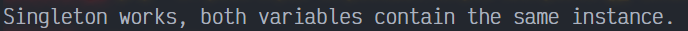
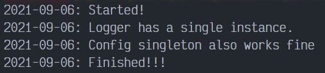

# Singleton en PHP

Singleton es un patrón de diseño creacional que garantiza que tan solo exista un objeto de su tipo y proporciona un único punto de acceso a él para cualquier otro código. El patrón tiene prácticamente los mismos pros y contras que las variables globales. Aunque son muy útiles, rompen la modularidad de tu código.

No se puede utilizar una clase que dependa del Singleton en otro contexto. Tendrás que llevar también la clase Singleton. La mayoría de ñas veces, esta limitación aparece durante la creación de pruebas de unidad.

## Uso del patrón en PHP

### Ejemplos de uso

Muchos desarrolladores consideran el patron Singleton un antipatrón. Por este motivo, su uso está en declive en el código PHP.

### Identificación

El patrón Singleton se puede reconocer por un método de creación estático, que devuelve el mismo objeto guardado en caché.

## Ejemplo Conceptual

Este ejemplo ilustra la estructura del patrón de diseño Singleton y se centra en las siguientes preguntas:

- ¿De qué clases se compone?
- ¿Qué papeles juegan esas clases?
- ¿De qué forma se relacionan los elementos del patrón?

Después de conocer la estructura del patrón, será más fácil comprender el siguiente ejemplo basado en un caso de uso real de PHP.

`index.php`. Ejemplo Conceptual

La clase Singleton define el método `getInstance()` que sirve como una alternativa al constructor y permite el acceso de los clientes a la misma instancia una y otra vez.

```php
<?php

class Singleton 
{
```

La instancia Singleton es almacenada en un campo estático. El campo es un array, porque nosotros le permitimos a nuestro Singleton tener subclases. Casa ítem en este array va a ser una instancia de una subclase de Singleton especifico. Más adelante podremos ver su funcionamiento.

```php
    private static $instances = [];
```

El constructor del Singleton siempre debe ser privado para prevenir una llamada de construcción directa mediante el operador `new`.

```php
    protected function __construct() {}
```

Los Singleton no se pueden clonar.

```php
    protected function __clone() {}
```

Los Singleton no deben restaurarse desde strings.

```php
    public function __wakeup()
    {
        throw new Exception("Can't unserialize a singleton.");
    }
```

Este es un método estático que controla el acceso a la instancia Singleton. En la primera ejecución, este crea un objeto y plazas singleton dentro del campo estático. En la siguiente ejecución, este retorna al cliente el objeto existente que esta almacenado en el campo estático. La implementación le permite a tu subclase de la clase Singleton mantener solo una instancia de cada subclase alrededor.

```php
    public static function getInstance(): Singleton
    {
        $cls = static::class;
        if (!isset(self::$instances[$cls])) {
            self::$instances[$cls] = new static();
        }
        return self::$instances[$cls];
    }
```

Finalmente, cualquier singleton debe definir un tipo de lógica empresarial, con la cual se puede ejecutar en esta instancia.

```php
    public function someBusinessLogic() {}
}
```

El código cliente.

```php
function clientCode()
{
    $s1 = Singleton::getInstance();
    $s2 = Singleton::getInstance();
    if ($s1 === $s2) {
        echo "Singleton works, both variables contain the same instance.";
    } else {
        echo "Singleton failed, variables contain different instances.";
    }
}

clientCode();
```

### Output Conceptual



## Ejemplo del mundo real

El patrón Singleton es famoso por limitar la reutilización de código y complicar las pruebas de unidad. No obstante, sigue resultando muy útil en algunos casos. En particular, viene bien cuando debes controlar recursos compartidos. Por ejemplo, un objeto de registro global debe controlar el acceso a un archivo de registro. Otro buen ejemplo: un almacenamiento compartido de la configuración de tiempo de ejecución.

`index.php`. Ejemplo en el mundo real.

Si tu necesitas soportar varios tipos de Singletons en tu app, tu puedes definir las caracteristicas básicas del Singleton en una clase base, mientras movemos la actual lógica de negocios (como el logging) a las subclases.

```php
<?php

class Singleton
{
```

La instancia actual del Singleton siempre permite residir dentro de un campo estatico. En este caso, el campo estatico es un array, donde cada subclase del almacenamiento del Singleton es nuestra instancia.

```php
    private static $instances = [];
```

El constructor del Singleton no debe ser público. Sin embargo, tampoco puede ser privado si queremos permitir la subclasificación.

```php
    protected function __construct() {}
```

La clonación y la unserialización no son permitidos para los singleton.

```php
    protected function __clone() {}

    public function __wakeup()
    {
        throw new \Exception("Cannot unserialize singleton");
    }
```

Este método se usa para instanciar el Singleton. Tenga en cuenta que aquí estamos usando la palabra privada `static` en lugar del actual nombre de la clase. En este contexto, la palabra `static` significa "El nombre de la clase actual". Este detalle es importante porque cuando el método es llamado en la subclase, nosotros queremos una instancia de la subclase que se crea aqui.

```php
    public static function getInstance()
    {
        $subclass = static::class;
        if (!isset(self::$instances[$subclass])) {
            self::$instances[$subclass] = new static();
        }
        return self::$instances[$subclass];
    }
}
```

La clase Logging es la más conocida y elogiada en el uso del patrón Singleton. En la mayoria de los casos, tu necesitas un solo objeto logging que escriba a un solo archivo log (recurso de control compartido). Tu también necesitas una manera conveniente para acceder a la instancia de cualquier contexto de tu aplicación (punto de acceso global)

```php
class Logger extends Singleton
{
```

Un recurso de puntero de archivo del archivo log.

```php
    private $fileHandle;
```

Desde el constructor del Singleton es llamado solo una vez, solo un recurso de archivo es abierto todas las veces. Tenga en cuenta que por el motivo de la simplicidad, nosotros abrimos la instancia de transmisión de consola del actual archivo.

```php
    protected function __construct()
    {
        $this->fileHandle = fopen('php://stdout', 'w');
    }
```

Se escribe una entrada de log del archivo abierto.

```php
    public function writeLog(string $message): void
    {
        $date = date('Y-m-d');
        fwrite($this->fileHandle, "$date: $message\n");
    }
```

Solo un atajo útil para reducir la cantidad de código necesario para el log de mensajes desde el código cliente.

```php
    public static function log(string $message): void
    {
        $logger = static::getInstance();
        $logger->writeLog($message);
    }
}
```

Aplicando el patron Singleton al almacenamiento de configuración, también es una practica común. A menudo tu necesitas acceder a la configuración de la aplicación desde diferentes lugares del programa. Singleton te da esa conformidad.

```php
class Config extends Singleton
{
    private $hashmap = [];

    public function getValue(string $key): string
    {
        return $this->hashmap[$key];
    }

    public function setValue(string $key, string $value): void
    {
        $this->hashmap[$key] = $value;
    }
}
```

Código Cliente.

```php
Logger::log("Started!");
```

Comparación de los valores del singleton Logger.

```php
$l1 = Logger::getInstance();
$l2 = Logger::getInstance();
if ($l1 === $l2) {
    Logger::log("Logger has a single instance.");
} else {
    Logger::log("Loggers are different.");
}
```

Mira como el singleton de Data guarda la data...

```php
$config1 = Config::getInstance();
$login = "test_login";
$password = "test_password";
$config1->setValue("login", $login);
$config1->setValue("password", $password);
```

... Y como lo recupera.

```php
$config2 = Config::getInstance();
if ($login == $config2->getValue("login") && $password == $config2->getValue("password")) {
    Logger::log("Config singleton also works fine");
}

Logger::log("Finished!!!");
```

### Output Ejemplo Real


