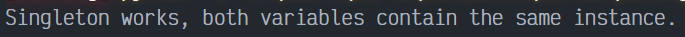
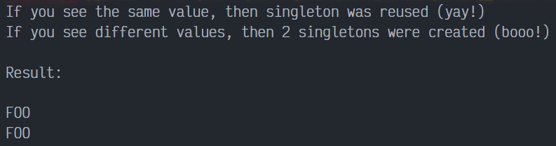

# Singleton en Python

Singleton es un patrón de diseño creacional que garantiza que tan solo exista un objeto de su tipo y proporciona un único punto de acceso a él para cualquier otro código. El patron tiene prácticamente los mismos pros y contras que las variables globales. Aunque son muy útiles, rompen la modularidad de tu código.

No se puede utilizar una clase que dependa del Singleton en otro contexto. Tendrás que llevar también la clase Singleton. La mayoria de las veces, esta limitación aparece durante la creación de pruebas de unidad.

## Uso del patrón en Python

### Ejemplos de Uso

Muchos desarrolladores consideran el patrón Singleton un antipatrón. Por este motivo, su uso está en declive en el código Python.

### Identificación

El patron Singleton se puede reconocer por un método de creación estático, que devuelve el mismo objeto guardado en caché.

## Singleton Ingenuo

Es muy fácil implementar un Singleton descuidado. Tan solo necesitas esconder el constructor e implementar un método de creación estático. La misma clase se comporta de forma incorrecta en un entorno multihilo. Los múltiples hilos pueden llamar al método de creación de forma simultánea y obtener varias instancias de la clase Singleton.

`main.py`. Ejemplo Conceptual.

La clase Singleton puede ser implementada de diferentes maneras en Python. Algunos posibles métodos incluidos: base class, decorator, metaclass. Nosotros usaremos la metaclass porque es la mejor opción para es proposito.

```python
class SingletonMeta(type):
    _instances = {}
```

Los posibles cambios del valor del argumento `__init__` no afectan la instancia retornada.

```python
    def __call__(cls, *args, **kwargs):
        if cls not in cls._instances:
            instance = super().__call__(*args, **kwargs)
            cls._instances[cls] = instance
        return cls._instances[cls]
```

Finalmente, cualquier singleton debe definir una lógica de negocio, la cual se puede ejecutar en esta instancia.

```python
class Singleton(metaclass=SingletonMeta):
    def some_bussines_logic(self):
        pass
```

Código cliente.

```python
if __name__ == "__main__":
    s1 = Singleton()
    s2 = Singleton()

    if id(s1) == id(s2):
        print('Singleton works, both variables contain the same instance.')
    else:
        print('Singleton failed, variables contain diferent instances.')
```

### Output Singleton Ingenuo



## Singleton con seguridad en los hilos

Para arreglar el problema, debes sincronizar hilos durante la primera creación del objeto Singleton.

`main.py`. Ejemplo conceptual.

```python
from threading import Lock, Thread
```

Esta es una implementación segura para subprocesos de Singleton.

```python
class SingletonMeta(type):
    _instances = {}
    _lock: Lock = Lock()
```

Ahora nosotros tenemos un objeto bloqueado que sera usado para sincronizar hilos durante el primer acceso del Singleton.

Los posibles cambios del valor del argumento `__init__` no afectan la instancia retornada. Ahora, imagine que el programa acaba de lanzarse. Dado que todavía no hay una instancia de Singleton, varios subprocesos pueden pasar simultáneamente el condicional anterior y llegar a este punto casi al mismo tiempo. El primero de ellos adquirirá bloqueo y continuará, mientras que el resto esperará aquí.

El primer hilo en adquirir el bloqueo, alcanza este condicional, entra y crea la instancia de Singleton. Una vez que sale del bloque de bloqueo, un hilo que podría haber estado esperando la liberación del bloqueo puede ingresar a esta sección. Pero dado que el campo Singleton ya está inicializado, el hilo no creará un nuevo objeto.

```python
    def __call__(cls, *args, **kwargs):
        with cls._lock:
            if cls not in cls._instances:
                instance = super().__call__(*args, **kwargs)
                cls._instances[cls] = instance
        return cls._instances[cls]


class Singleton(metaclass=SingletonMeta):
```

Usaremos esta propiedad para probar que nuestro Singleton realmente funciona.

```python
    value: str = None

    def __init__(self, value: str) -> None:
        self.value = value
```

Finalmente, cualquier singleton debe definir alguna lógica empresarial, que se puede ejecutar en su instancia.

```python
    def some_bussines_logic(self):
        pass


def test_singleton(value: str) -> None:
    singleton = Singleton(value)
    print(singleton.value)
```

Código Cliente.

```python
if __name__ == "__main__":
    print(
        'If you see the same value, then singleton was reused (yay!)\n'
        'If you see different values, then 2 singletons were created (booo!)\n\n'
        'Result:\n'
    )
    process1 = Thread(target=test_singleton, args=('FOO',))
    process2 = Thread(target=test_singleton, args=('BAR',))
    process1.start()
    process2.start()
```

### Output Singleton Multihilos


