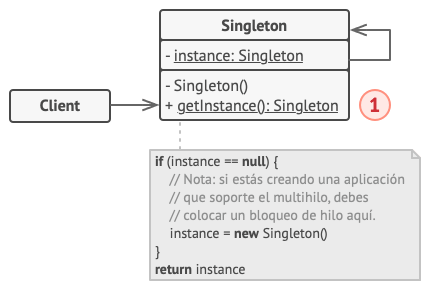

# Singleton

Singleton (también llamado Instancia única), es un patrón de diseño creacional que nos permite asegurarnos de que una clase tenga una única instancia, a la vez que proporciona un punto de acceso global a dicha instancia.


## Problema

El patrón Singleton resuelve 2 problemas al mismo tiempo, vulnerando el ***Principio de Responsabilidad Única***:

1. **Garantizar que una clase tenga una única instancia**. ¿Por qué querría alguien controlar cuántas instancias tiene una clase? El motivo más habitual es controlar el acceso a algún recurso compartido, por ejemplo, una base de datos o un archivo.

   Funciona así: Imagina que has creado un objeto y al cabo de un tiempo decides crear otro nuevo. En lugar de recibir un objeto nuevo, obtendrás el que ya habías creado.

   Ten en cuenta que este comportamiento es imposible de implementar con un constructor normal, ya que una llamada al constructor siempre **debe** devolver un nuevo objeto por diseño. Puede ser que los clientes ni siquiera se den cuenta de que trabajan con el mismo objeto todo el tiempo.

   

2. **Proporcionar un punto de acceso global a dicha instancia**. ¿Recuerdas esas variables globales que utilizaste para almacenar objetos esenciales? Aunque son muy útiles, también son poco seguras, ya que cualquier código podría sobrescribir el contenido de esas variables y descomponer la aplicación.

   Al igual que una variable global, el patrón Singleton nos permite acceder a un objeto desde cualquier parte del programa. No obstante, también evita que otro código sobrescriba esa instancia.

   Este problema tiene otra cara: no queremos que el código que resuelve el primer problema se encuentre disperso por todo el programa. Es mucho más conveniente tenerlo dentro de una clase, sobre todo si el resto del código ya depende de ella.

Hoy en día, el patrón Singleton se ha popularizado tanto que la gente suele llamar Singleton a cualquier patrón, incluso si solo resuelve uno de los problemas antes mencionados.

## Solución

Todas las implementaciones del patrón Singleton tienen estos dos pasos en común:

- Hacer privado el constructor por defecto para evitar que otros objetos utilicen el operado `new` con la clase Singleton.
- Crear un método de creación estático que actúe como constructor. Tras bambalinas, este método invoca al constructor privado para crear un objeto y lo guarda en un campo estático. Las siguientes llamadas a este método devuelven el objeto almacenado en caché.

Si tu código tienen acceso a la clase Singleton, podrá invocar su método estático. De esta manera, cada vez que se invoque este método, siempre se devolverá el mismo objeto.

## Analogía en el mundo real

El gobierno es un ejemplo excelente del patrón Singleton. Un país solo puede tener un gobierno oficial. Independientemente de las identidades personales de los individuos que forman el gobierno, el título "Gobierno de X" es un punto de acceso global que identifica al grupo de personas a cargo.

## Estructura



1. La clase Singleton declara el método estático `obtenerInstancia` que devuelve la misma instancia de su propia clase. El constructor del Singleton debe ocultarse del código cliente. La llamada al método `obtenerInstancia` debe ser la única manera de obtener el objeto del Singleton.

## Pseudocódigo

En este ejemplo, la clase de conexión de la base de datos actúa como Singleton. Esta clase no tiene un constructor público, por lo que la única manera de obtener su objeto, es invocando el método `obtenerInstancia`. Este método almacena en caché el primer objeto creado y lo devuelve en todas las llamadas siguientes.

### Código

```nim
class Database is
    private static field instance: Database
    private constructor Database() is
        //...
    
    public static method getInstance() is
        if (Database.instance == null) then
            acquireThreadLock() and then
                if (Database.instance == null) then
                    Database.instance = new Database()
        return Database.instance

    public method query(sql) is


class Application is
    method main() is
        Database foo = Database.getInstance()
        foo.query("Select ...")
        Database bar = Database.getInstance()
        bar.query("Select ...")
```

### Explicación del código

La clase Database define el método `obtenerInstancia` que permite a los clientes acceder a la misma instancia de una conexión de la base de datos a través del programa. El campo para almacenar la instancia singleton debe declararse estático.

```nim
class Database is
    private static field instance: Database
```

El constructor del singleton siempre debe ser privado para evitar llamadas de construcción directas con el operado `new`. Dentro del constructor, algún código de inicialización, como la propia conexión al servidor de una base de datos.

```nim
    private constructor Database() is
        //...
```

El método estático que controla el acceso a la instancia singleton.

```nim
    public static method getInstance() is
        if (Database.instance == null) then
            acquireThreadLock() and then
```

Garantiza que la instancia aún no se ha inicializado por otro hilo mientras ésta ha estado esperando el desbloqueo.

```nim
                if (Database.instance == null) then
                    Database.instance = new Database()
        return Database.instance
```

Por último, cualquier singleton debe definir cierta lógica de negocio que pueda ejecutarse en sus instancia. Por ejemplo, todas las consultas a la base de datos de una aplicación pasan por este método. Por lo tanto, aquí puedes colocar lógica de regularización (throttling) o de envío a la memoria caché.

```nim
    public method query(sql) is
```

La variable `bar` contendrá el mismo objeto que la variable `foo`.

```nim
class Application is
    method main() is
        Database foo = Database.getInstance()
        foo.query("Select ...")
        Database bar = Database.getInstance()
        bar.query("Select ...")
```

## Aplicabilidad

- Utiliza el patrón Singleton cuando una clase de tu programa tan solo deba tener una instancia disponible para todos los clientes; por ejemplo, un único objeto de base de datos compartido por distintas partes del programa.

  El patrón Singleton deshabilita el resto de las maneras de crear objetos de una clase, excepto el método especial de creación. Este método crea un nuevo objeto, o bien devuelve uno existente si ya ha sido creado.

- Utiliza el patrón Singleton cuando necesites un control más estricto de las variables globales.

  Al contrario que las variables globales, el patrón Singleton garantiza que haya una única instancia de una clase. A excepción de la propia clase Singleton, nada puede sustituir la instancia en caché.

  Ten en cuenta que siempre podrás ajustar esta limitación y permitir la creación de cierto número de instancias Singleton. La única parte del código que requiere cambios es el cuerpo del método `getInstance`.

## Como implementarlo

1. Añade un campo estático privado a la clase para almacenar la instancia Singleton.
2. Declara un método de creación estático público para obtener la instancia Singleton.
3. Implementa una inicialización diferida dentro del método estático. Debe crear un nuevo objeto en su primera llamada y colocarlo dentro del campo estático. El método deberá devolver siempre esa instancia en todas las llamadas siguientes.
4. Declara el constructor de clase como privado. El método estático de la clase seguirá siendo capaz de invocar al constructor, pero no a los otros objetos.
5. Repasa el código cliente y sustituye todas las llamadas directas al constructor de la instancia Singleton por llamadas a su método de creación estático.

## Pros y Contras

|Pros|Contras|
|--|--|
|Puedes tener la certeza de que una clase tiene una única instancia.|Vulnera el *Principio de responsabilidad única*. El patrón resuelve dos problemas al mismo tiempo|
|Obtienes un punto de acceso global a dicha instancia|El patrón Singleton puede enmascarar un mal diseño, por ejemplo, cuando los componentes del programa saben demasiado los unos sobre los otros|
|El objeto Singleton solo se inicializa cuando se require por primera vez|El patrón requiere de un tratamiento especial en un entorno con múltiples hilos de ejecución, para que varios hilos no creen un objeto Singleton varias veces.|
||Puede resultar complicado realizar la prueba unitaria del código cliente del Singleton porque muchos *frameworks* de prueba dependen de la herencia a la hora de crear objetos simulados (mock objects). Debido a que la clase Singleton es privada y en la mayoría de los lenguajes resulta imposible sobrescribir métodos estáticos, tendrás que pensar en una manera original de simular el Singleton. O simplemente, no escribas las pruebas. O no utilices el patrón Singleton|

## Relaciones con otros patrones

- Una clase fachada a menudo puede transformarse en una Singleton, ya que un único objeto fachada es suficiente en la mayoría de los casos.
- Flyweight podría asemejarse a Singleton si de algún modo pudieras reducir todos los estado compartidos de los objetos a un único objeto flyweight. Pero existen dos diferencias fundamentales entre estos patrones:
  1. Solo debe haber una instancia Singleton, mientras que una clase Flyweight puede tener varias instancias con distintos estados intrínsecos.
  2. El objeto Singleton puede ser mutable. Los objetos Flyweight son inmutables.
- Los patrones Abstract Factory, Builder y Prototype pueden todos ellos implementarse como Singleton.
