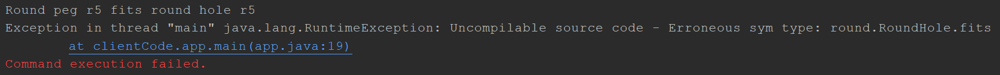
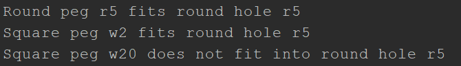

# Adapter en JAVA

Adapter es un patrón de diseño estructural que permite colaborar a objetos incompatibles. El patrón Adapter actúa como envoltorio entre 2 objetos. Atrapa las llamadas a un objeto y las transforma a un formato y una interfaz reconocible para el segundo objeto.

## Uso del patrón en Java

### Ejemplos de uso

El patrón Adapter es muy común en el código Java. Se utiliza muy a menudo en sistemas basados en algún código heredado (*legacy*). En estos casos, los adaptadores crean código heredado con clases modernas.

Hay algunos adaptadores estándar en las principales bibliotecas de Java:

- `java.util.Arrays#asList()`
- `java.util.Collections#list()`
- `java.util.Collections#enumeration()`
- `java.io.InputStreamReader(InputStream)` devuelve un objeto `Reader`.
- `java.io.OutputStreamWriter(OutputStream)` devuelve un objeto `Writer`
- `javax.xml.bind.annotation.adapters.XmlAdapter#marshall()` y `unmarshall()`.

### Identificación

Adapter es reconocible por un constructor que toma una instancia de distinto tipo de clase abstracta/interfaz. Cuando el adaptador recibe una llamada a uno de los métodos, convierte los parámetros al formato adecuado y después dirige la llamada a uno o varios métodos del objeto envuelto.

## Encajar piezas cuadradas en agujeros redondos

Este sencillo ejemplo muestra el modo en que un Adapter puede hacer que objetos incompatibles trabajen juntos.

### `round`

`round/RoundHole.java`: Agujeros redondos

```java
package round;

public class RoundHole {
    private double radius;

    public RoundHole(double radius) {
        this.radius = radius;
    }

    public double getRadius() {
        return radius;
    }

    public boolean fits(RoundPeg peg) {
        boolean result;
        result = (this.getRadius() >= peg.getRadius());
        return result;
    }
}
```

`round/RoundPeg.java`: Piezas redondas.

Las piezas redondas son compatibles con los hoyos redondos.

```java
package round;

public class RoundPeg {
    private double radius;

    public RoundPeg() {}
    
    public RoundPeg(double radius) {
        this.radius = radius;
    }

    public double getRadius() {
        return radius;
    }
}
```

### `square`

`square/SquarePeg.java`: Piezas cuadradas.

Las piezas cuadradas no son compatibles con Hoyos Redondos, estos fueron implementados previamente por el equipo de desarrollo. Pero nosotros tenemos que integrarlos dentro de nuestro programa.

```java
package square;

public class SquarePeg {
    private double width;

    public SquarePeg(double width) {
        this.width = width;
    }

    public double getWidth() {
        return width;
    }

    public double getSquare() {
        double result = Math.pow(this.width, 2);
        return result;
    }
}
```

### `adapters`

`adapters/SquarePegAdapter.java`: Adaptador de piezas cuadradas para agujeros redondos.

Los adaptadores permiten adecua la pieza cuadrada dentro de hoyos redondos.

```java
package adapters;

import square.SquarePeg;
import round.RoundPeg;

public class SquarePegAdapter extends RoundPeg {
    private main.java.square.SquarePeg peg;

    public SquarePegAdapter(SquarePeg peg) {
        this.peg = peg;
    }
```

Calcula el radio minimo de un circulo, los cuales pueden adecuar sus piezas.

```java
    @Override
    public double getRadius() {
        double result = (Math.sqrt(Math.pow((peg.getWidth() / 2), 2) * 2));
        return result;
    }
}
```

`App.java`: Código Cliente.

```java
package clientCode;

import adapters.SquarePegAdapter;
import round.RoundHole;
import round.RoundPeg;
import square.SquarePeg;

public class app {
    public static void main(String[] args) {
```

Redondo encaja con redondo, no hay sorpresas.

```java
        RoundHole hole = new RoundHole(5);
        RoundPeg rpeg = new RoundPeg(5);
        if (hole.fits(rpeg)) {
            System.out.println("Round peg r5 fits round hole r5");
        }

        SquarePeg smallSqPeg = new SquarePeg(2);
        SquarePeg largeSqPeg = new SquarePeg(20);
```

Esto no compila.

```java
        hole.fits(smallSqPeg); 
```

El adaptador soluciona el problema

```java
        SquarePegAdapter smallSqPegAdapter = new SquarePegAdapter(smallSqPeg);
        SquarePegAdapter largeSqPegAdapter = new SquarePegAdapter(largeSqPeg);
        if (hole.fits(smallSqPegAdapter)) {
            System.out.println("Square peg w2 fits round hole r5");
        }
        if (!hole.fits(largeSqPegAdapter)) {
            System.out.println("Square peg w20 does not fit into round hole r5");
        }
    }
}
```

### Output

Resultado de la ejecución de objetos incompatibles:



Resultado de la ejecución con un adaptador:

