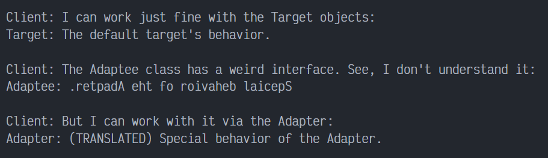

# Adapter en PHP

Adapter es un patrón de diseño estructural que permite colaborar a objetos incompatibles. El patrón Adapter actúa como envoltorio  entre dos objetos. Atrapa las llamadas a un objeto y las transforma a un formato y una interfaz reconocible para el segundo objeto.

## Uso del patrón en PHP

### Ejemplos de uso

El patrón Adapter es muy común en el código PHP. Se utiliza muy a menudo en sistemas basados en algún código heredado. En estos casos, los adaptadores crean código heredado en clases modernas.

### Identificación

Adapter es reconocible por un constructor que toma una instancia de distinto tipo de clase abstracta/interfaz. Cuando el adaptador recibe una llamada a uno de sus métodos, convierte los parámetros al formato adecuado y después dirige la llamada a uno o varios métodos del objeto envuelto.

## Ejemplo Conceptual

Este ejemplo ilustra la estructura del patrón de diseño Adapter y se centra en las siguientes preguntas:

- ¿De qué clases se compone?
- ¿Qué papeles juegan esas clases?
- ¿De qué forma se relacionan los elementos del patrón?

Después de conocer la estructura del patrón, será más facil comprender el siguiente ejemplo basado en un caso de uso real de PHP.

`index.php`: Ejemplo conceptual.

La clase Target define el dominio especifico de la interfaz que va a usar el código cliente.

```php
<?php

class Target
{
    public function request(): string
    {
        return "Target: The default target's behavior.";
    }
}
```

La clase Adaptee contiene algún tipo de comportamiento, pero esta interfaz es incompatible con el código cliente existente. El adaptee necesita alguna adaptación de que el código cliente lo pueda usar.

```php
class Adaptee
{
    public function specificRequest(): string
    {
        return ".retpadA eht fo roivaheb laicepS";
    }
}
```

El Adaptador hace que la interfaces de Adaptee sea compatible con la interfaz Target.

```php
class Adapter extends Target
{
    private $adaptee;

    public function __construct(Adaptee $adaptee)
    {
        $this->adaptee = $adaptee;
    }

    public function request(): string
    {
        return "Adapter: (TRANSLATED) " . strrev($this->adaptee->specificRequest());
    }
}
```

El código cliente soporta todas las clases que siguen la interfaz Target.

```php
function clientCode(Target $target)
{
    echo $target->request();
}


echo "Client: I can work just fine with the Target objects:\n";
$target = new Target();
clientCode($target);
echo "\n\n";

$adaptee = new Adaptee();
echo "Client: The Adaptee class has a weird interface. See, I don't understand it:\n";
echo "Adaptee: " . $adaptee->specificRequest();
echo "\n\n";

echo "Client: But I can work with it via the Adapter:\n";
$adapter = new Adapter($adaptee);
clientCode($adapter);
```

### Output Conceptual



## Ejemplo del mundo real

El patrón ADapter te permite utilizar clases de terceros o heredadas incluso aunque sean incompatibles con el grueso de tu código. Por ejemplo, en lugar de rescribir la interfaz de notificación de tu aplicación para que soporte todos los servicios de terceros, como Slack, Facebook, SMS u otros, puedes crear un grupo de envoltorios especiales que adaptan las llamadas desde tu aplicación a una interfaz y formato requerido por cada una de las clases de terceros.

`index.php` Ejemplo del mundo real:

La interfaz Target representa la interfaz que las clases de tu aplicación deben seguir.

```php
<?php

interface Notification
{
    public function send(string $title, string $message);
}
```

Aqui esta un ejemplo de una clase existente que sigue la interfaz objetivo. La verdad es que muchas aplicaciones reales no tienen una interfaz claramente definida. Si tu estas en esa onda, lo mejor es que extienda el adaptador desde una de las clases existentes en tu aplicación. Si esto es incómodo (por ejemplo. SlackNotification no se siente como una superclase de EmailNotification), entonces el primer paso sería extraer una interfaz.

```php
class EmailNotifiaction implements Notification
{
    private $adminEmail;

    public function __construct(string $adminEmail)
    {
        $this->adminEmail = $adminEmail;
    }

    public function send(string $title, string $message): void
    {
        mail($this->adminEmail, $title, $message);
        echo "Sent email with title: '$title' to '{$this->adminEmail}' that says '$message'.";
    }
}
```

La clase a adaptar es incompatible con la interfaz objetivo. Tu no puedes solo ir y cambiar el código de la clase que sigue la interfaz objetivo, desde el código que puede ser provisto por una librería de terceros.

```php
class SlackApi
{
    private $login;
    private $apiKey;

    public function __construct(string $login, string $apiKey)
    {
        $this->login = $login;
        $this->apiKey = $apiKey;
    }

    public function logIn(): void
    {
        echo "Logged in to a slack account '{$this->login}'.\n";
    }

    public function sendMessage(string $chatId, string $message): void
    {
        echo "Posted following message into the '$chatId' chat: '$message'.\n";
    }
}
```

La clase adaptador es una clase que une la interfaz Target y la clase a adaptar. En este caso, esto le permite a la aplicación enviar notificaciones usando Slack API.

```php
class SlackNotification implements Notification
{
    private $slack;
    private $chatId;

    public function __construct(SlackApi $slack, string $chatId)
    {
        $this->slack = $slack;
        $this->chatId = $chatId;
    }
```

Un adaptador no solo es capaz de adaptar interfaces, pues también puede convertir la data que llega al formato requerido por la clase a adaptar.

```php
    public function send(string $title, string $message)
    {
        $slackMessage = "#" . $title . "# " . strip_tags($message);
        $this->slack->logIn();
        $this->slack->sendMessage($this->chatId, $slackMessage);
    }
}
```

El código cliente puede trabajar con cualquier clase que siga la interfaz clase.

```php
function clientCode(Notification $notification)
{
    echo $notification->send(
        "Website is down!",
        "<strong atyle='color:red; font-size:50px;'>Alert!</strong> " .
        "Our website is not responding. Call admins and bring it up!"
    );
}


echo "Client Code is designed correctly and works with email notifications:\n";
$notification = new EmailNotifiaction("developer@example.com");
clientCode($notification);
echo "\n\n";

echo "The same Client Code can work with other classes via adapter:\n";
$slackApi = new SlackApi("example.com", "XXXXXXXX");
$notification = new SlackNotification($slackApi, "Example.com Developers");
clientCode($notification);
```
