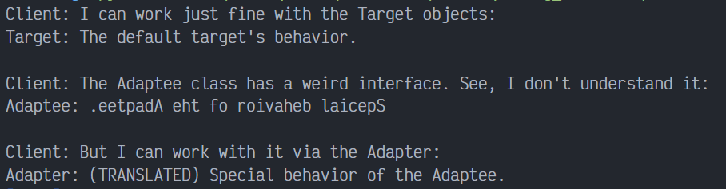

# Adapter en Python

Adapter es un patrón de diseño estructural que permite colaborar a objetos incompatibles. El patrón Adapter actúa como envoltorio entre dos objetos. Atrapa las llamadas a un objeto y las transforma a un formato y una interfaz reconocible para el segundo objeto.

## Uso del patrón en Python

### Ejemplos de uso

El patrón Adapter es muy común en el código Python. Se utiliza muy a menudo en sistemas basados en algún código heredado. En estos casos, los adaptadores crean código heredado con clases modernas.

### Identificación

Adapter es reconocible por un constructor que toma una instancia de distinto tipo de clase abstracta/interfaz. Cuando el adaptador recibe una llamada a uno de sus métodos, convierte los parámetros al formato adecuado y después dirige la llamada a uno o varios métodos del objeto envuelto.

## Ejemplo conceptual

Este ejemplo ilustra la estructura del patrón de diseño Adapter. Se centra en responder las siguientes preguntas:

- ¿De qué clases se compone?
- ¿Qué papeles juegan esas clases?
- ¿De qué forma se relacionan los elementos del patrón?

`main.py`. Ejemplo Conceptual

La clase Target define el dominio especifico de la interfaz usada por el código cliente.

```python
class Target: 
    def request(self) -> str:
        return "Target: The default target's behavior."
```

La clase Adaptable contiene algun tipo de comportamiento, pero esta interfaz es incompatible con el código cliente existente. El Adaptee necesita alguna adaptación antes de que el código cliente lo pueda usar.

```python
class Adaptee:
    def specific_request(self) -> str:
        return ".eetpadA eht fo roivaheb laicepS"
```

El Adaptador hace que la interfaz Adaptee sea compatible con la interfaz via múltiple herencia.

```python
class Adapter(Target, Adaptee):
    def request(self) -> str:
        return f"Adapter: (TRANSLATED) {self.specific_request()[::-1]}"
```

El Código Cliente soporta todas las clases que siguen la herencia del Target.

```python
def client_code(target: "Target") -> None:
    print(target.request(), end="")


if __name__ == "__main__":
    print("Client: I can work just fine with the Target objects:")
    target = Target()
    client_code(target)
    print("\n")

    adaptee = Adaptee()
    print(
        "Client: The Adaptee class has a weird interface. "
        "See, I don't understand it:"
    )
    print(f"Adaptee: {adaptee.specific_request()}", end="\n\n")

    print("Client: But I can work with it via the Adapter:")
    adapter = Adapter()
    client_code(adapter)
```

### Output


