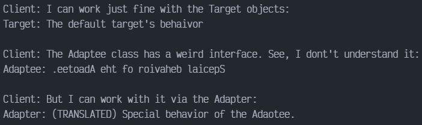

# Adapter en TypeScript

Adapter es un patrón de diseño estructural que permite colaborar a objetos incompatibles. El patrón Adapter actúa como envoltorio entre dos objetos. Atrapa las llamadas a un objeto y las transforma a un formato y una interfaz para el segundo objeto.

## Uso del patrón en TypeScript

### Ejemplos de Uso

El patrón Adapter es muy común en el código TypeScript. Se utiliza muy a menudo en sistemas basados en algún código heredado. En estos casos, los adaptadores crean código heredado con clases modernas.

### Identificación

Adapter es reconocible por un constructor que toma una instancia de distinto tipo de clase abstracta-interfaz. Cuando el adaptador recibe una llamada a uno de sus métodos, convierte los parámetros al formato adecuado y después dirige la llamada a uno o varios métodos del objeto envuelto.

## Ejemplo Conceptual

Este ejemplo ilustra la estructura del patrón de diseño Adapter y se centra en las siguientes preguntas:

- ¿De qué clases se compone?
- ¿Qué papeles juegan esas clases?
- ¿De qué forma se relacionan los elementos del patrón?

`index.ts`. Ejemplo Conceptual

La clase Target define el dominio especifico de la interfaz usada por el código cliente.

```ts
class Target {
    public request(): string {
        return 'Target: The default target\'s behaivor';
    }
}
```

La clase Adaptable contiene algún comportamiento, pero esta interfaz es incompatible con el código cliente existente. El Adaptee necesita alguna adaptación antes de que el código cliente lo pueda usar.

```ts
class Adaptee {
    public specificRequest(): string {
        return '.eetpadA eht fo roivaheb laicepS';
    }
}
```

El adaptador hace que la interfaz Adaptee sea compatible con el la interfaz Target.

```ts
class Adapter extends Target {
    private adaptee: Adaptee;

    constructor(adaptee: Adaptee) {
        super();
        this.adaptee = adaptee;
    }

    public request(): string {
        const result = this.adaptee.specificRequest().split('').reverse().join('');
        return `Adapter: (TRANSLATED) ${result}`;
    }
}
```

El código cliente soporta todas las clases que la siguen la interfaz Target.

```ts
const clientCode = (target: Target) => {
    console.log(target.request());
}

console.log('Client: I can work just fine with the Target objects:');
const target = new Target();
clientCode(target);

console.log('');

const adaptee = new Adaptee();
console.log('Client: The Adaptee class has a weird interface. See, I dont\'t understand it:');
console.log(`Adaptee: ${adaptee.specificRequest()}`);

console.log('');

console.log('Client: But I can work with it via the Adapter:');
const adapter = new Adapter(adaptee);
clientCode(adapter);
```

### Output


