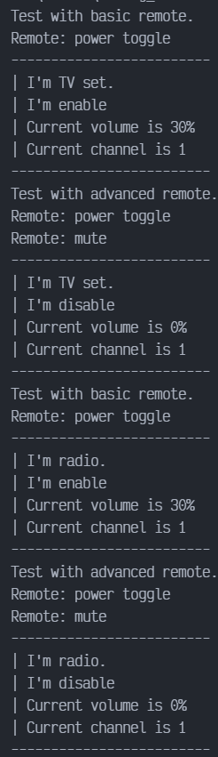

# Bridge en JAVA

Bridge es un patrón de diseño estructural que divide la lógica de negocio o una clase de negocio o una clase muy grande en jerarquías de clases separadas que se pueden desarrollar independientemente. Una de estas jerarquías (a menudo denominada Abstracción) obtendrá una referencia a un objeto de la segunda jerarquía (Implementación). La abstracción podrá delegar algunas (en ocasiones, la mayoría) de sus llamadas al objeto de las implementaciones. Como todas las implementaciones tendrán una interfaz común, serán intercambiables dentro de la abstracción.

## Uso del patrón en Java

### Ejemplos de uso

El patrón Bridge es de especial utilidad a la hora de tratar con aplicaciones multiplataforma, soportar varios tipos de servidores de bases de datos, o trabajar con varios proveedores de API de un cierto tipo (por ejemplo, plataformas en la nube, redes sociales, etc.).

### Identificación

El patrón Bridge se puede reconocer por una distinción clara entre alguna entidad controladora y varias plataformas diferentes de las que depende.

## Bridge (puente) entre dispositivos y controles remotos

Este ejemplo muestra la separación entre las clases de los remotos y los dispositivos que controlan.

Los remotos actúan como abstracciones y los dispositivos con sus implementaciones. Gracias a las interfaces coomunes, los mismos remotos pueden funcionar con distintos dispositivos y viceversa.

El patrón Bridge permite cambiar o incluso crear nuevas clases sin tocar el código de la jerarquía opuesta.

### devices

`devices/Device.java`: Interfaz común de todos los dispositivos.

```java
package devices;

public interface Device {
    boolean isEnable();
    void enable();
    void disable();
    int getVolume();
    void setVolume(int percent);
    int getChannel();
    void setChannel(int channel);
    void printStatus();
}
```

`devices/Radios.java`: Radio.

```java
package devices;

public class Radio implements Device {
    private boolean on = false;
    private int volume = 30;
    private int channel = 1;

    @Override
    public boolean isEnable() {
        return on;
    }

    @Override
    public void enable() {
        on = true;
    }

    @Override
    public void disable() {
        on = false;
    }

    @Override
    public int getVolume() {
        return volume;
    }

    @Override
    public void setVolume(int percent) {
        if (percent > 100) {
            this.volume = 100;
        } else if (percent < 0) {
            this.volume = 0;
        } else {
            this.volume = percent;
        }
    }

    @Override
    public int getChannel() {
        return channel;
    }

    @Override
    public void setChannel(int channel) {
        this.channel = channel;
    }

    @Override
    public void printStatus() {
        System.out.println("-------------------------");
        System.out.println("| I'm radio.");
        System.out.println("| I'm " + (on ? "enable" : "disable"));
        System.out.println("| Current volume is " + volume + "%");
        System.out.println("| Current channel is " + channel);
        System.out.println("-------------------------");
    }
    
}
```

`device/Tv.java`: TV.

```java
package devices;

public class Tv implements Device {
    private boolean on = false;
    private int volume = 30;
    private int channel = 1;

    @Override
    public boolean isEnable() {
        return on;
    }

    @Override
    public void enable() {
        on = true;
    }

    @Override
    public void disable() {
        on = false;
    }

    @Override
    public int getVolume() {
        return volume;
    }

    @Override
    public void setVolume(int percent) {
        if (percent > 100) {
            this.volume = 100;
        } else if (percent < 0) {
            this.volume = 0;
        } else  {
            this.volume = percent;
        }
    }

    @Override
    public int getChannel() {
        return channel;
    }

    @Override
    public void setChannel(int channel) {
        this.channel = channel;
    }

    @Override
    public void printStatus() {
        System.out.println("-------------------------");
        System.out.println("| I'm TV set.");
        System.out.println("| I'm " + (on ? "enable" : "disable"));
        System.out.println("| Current volume is " + volume + "%");
        System.out.println("| Current channel is " + channel);
        System.out.println("-------------------------");
    }
}
```

### remotes

`remotes/Remote.java`: Interfaz común de todos los remotos.

```java
package remotes;

public interface Remote {
    void power();
    void volumeDown();
    void volumeUp();
    void channelDown();
    void channelUp();
}
```

`remotes/BasicRemote.java`: Control remoto básico.

```java
package remotes;

import devices.Device;

public class BasicRemote implements Remote {
    protected Device device;

    public BasicRemote() {}

    public BasicRemote(Device device) {
        this.device = device;
    }

    @Override
    public void power() {
        System.out.println("Remote: power toggle");
        if (device.isEnable()) {
            device.disable();
        } else {
            device.enable();
        }
    }

    @Override
    public void volumeDown() {
        System.out.println("Remote: volume down");
        device.setVolume(device.getVolume() - 10);
    }

    @Override
    public void volumeUp() {
        System.out.println("Remote: volume up");
        device.setVolume(device.getVolume() + 10);
    }

    @Override
    public void channelDown() {
        System.out.println("Remote: channel down");
        device.setChannel(device.getChannel() - 1);
    }

    @Override
    public void channelUp() {
        System.out.println("Remote: channel up");
        device.setChannel(device.getChannel() + 1);
    }
}
```

`remotes/AdvanceRemote.java`: Control remoto avanzado

```java
package remotes;

import devices.Device;

public class AdvancedRemote extends BasicRemote {
    public AdvancedRemote(Device device) {
        super.device = device;
    }

    public void mute() {
        System.out.println("Remote: mute");
        device.setVolume(0);
    }
}
```

### Demo

`Demo.java`: Código cliente.

```java
package demo;

import devices.Device;
import devices.Tv;
import remotes.AdvancedRemote;
import remotes.BasicRemote;
import devices.Radio;

public class Demo {
    public static void main(String[] args) {
        testDevice(new Tv());
        testDevice(new Radio());
    }

    public static void testDevice(Device device) {
        System.out.println("Test with basic remote.");
        BasicRemote basicRemote = new BasicRemote(device);
        basicRemote.power();
        device.printStatus();

        System.out.println("Test with advanced remote.");
        AdvancedRemote advancedRemote = new AdvancedRemote(device);
        advancedRemote.power();
        advancedRemote.mute();
        device.printStatus();
    }
}
```

### Output


