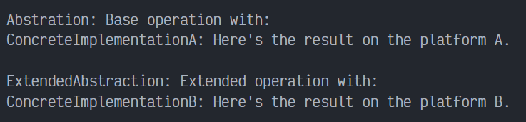
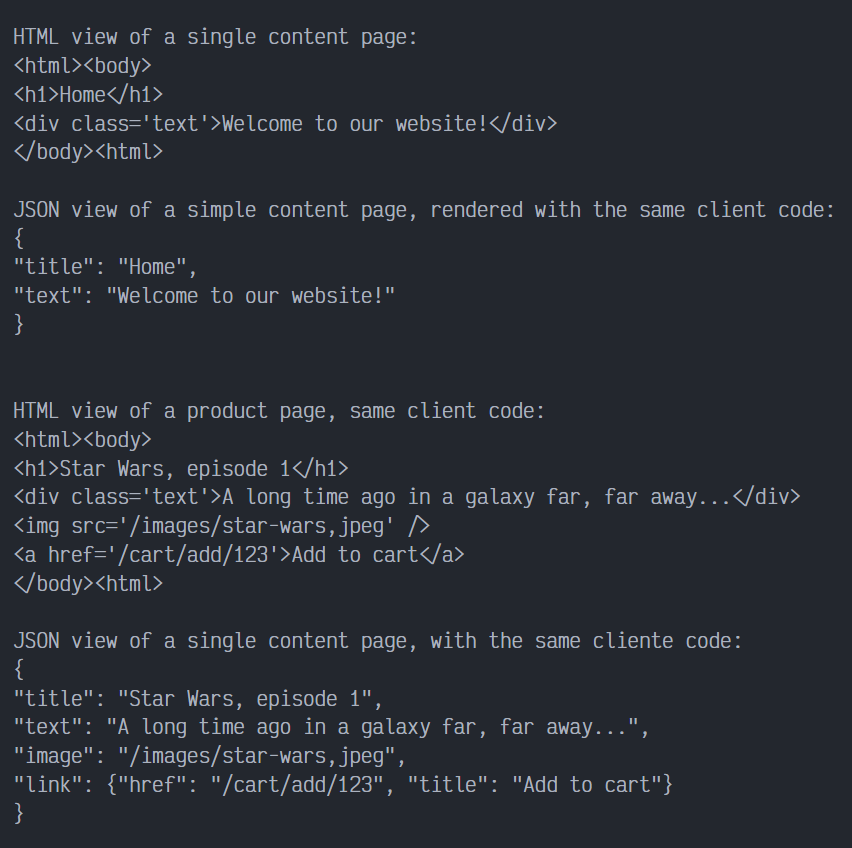

# Bridge en PHP

Bridge es un patrón de diseño estructural que divide la lógica de negocio o una clase muy grande en jerarquías de clases separadas que se pueden desarrollar independientemente. Una de estas jerarquías (a menudo denominada Abstracción) obtendrá una referencia a un objeto de la segunda jerarquía (Implementación). La abstracción podrá delegar algunas (en ocasiones, la mayoría) de sus llamadas al objeto de las implementaciones. Como todas las implementaciones tendrán una interfaz común, serán intercambiables dentro de la abstracción.

## Uso del patrón en PHP

### Ejemplos de uso

El patrón Bridge es de especial utilidad para soportar varios tipos de servidores de bases de datos o trabajar con varios proveedores de API de cierto tipo (por ejemplo, plataformas en la nube, redes sociales, etc.).

### Identificación

El patrón Bridge se puede reconocer por una distinción clara entre alguna entidad controladora y varias plataformas diferentes en las que se basa.

## Ejemplo Conceptual

Este ejemplo ilustra la estructura del patrón de diseño Bridge y se centra en las siguientes preguntas:

- ¿De qué clases se compone?
- ¿Qué papeles juegan esas clases?
- ¿De qué forma se relacionan los elementos del patrón?

Después de conocer la estructura del patrón, será más fácil comprender el siguiente ejemplo basado en un caso de uso real de PHP.

`index.php`. Ejemplo conceptual:

La abstracción define la interface para la parte de control de 2 jerarquías de clases. Este mantiene una referencia hacía un objeto de la herencia de Implementation y delegar todo el trabajo real a ese objeto.

```php
<?php

class Abstraction
{
    protected $implementation;

    public function __construct(Implementation $implementation)
    {
        $this->implementation = $implementation;
    }

    public function operation(): string
    {
        return "Abstration: Base operation with:\n" . $this->implementation->operationImplementation();
    }
}
```

Tu puedes extender la abstracción sin cambiar las clases de implementación.

```php
class ExtendedAbstraction extends Abstraction
{
    public function operation(): string
    {
        return "ExtendedAbstraction: Extended operation with:\n" . $this->implementation->operationImplementation();
    }
}
```

La Implementación define la interfaz a implementar por todas las clases. No tiene que coincidir con la interfaz de Abstracción. En efecto, las dos interfaces pueden ser completamente diferentes. Tradicionalmente, la interfaz de Implementación provee solo operaciones primitivas, mientras que la Abstracción define operaciones de alto nivel basadas en estas operaciones primitivas.

```php
interface Implementation
{
    public function operationImplementation(): string;
}
```

Cada implementación concreta corresponde a una plataforma específica e implementa la interfaz de implementación usada por la API de la plataforma.

```php
class ConcreteImplementationA implements Implementation
{
    public function operationImplementation(): string
    {
        return "ConcreteImplementationA: Here's the result on the platform A.\n";
    }
}


class ConcreteImplementationB implements Implementation
{
    public function operationImplementation(): string
    {
        return "ConcreteImplementationB: Here's the result on the platform B.\n";
    }
}
```

Excepto por la fase de implementación, donde un objeto de Abstracción obtiene un enlace con un objeto específico de implementación, el código cliente debería depender solo de una clase de abstracción. De esta manera el código cliente puede soportar cualquier combinación de abstracción-implementación.

```php
function clientCode(Abstraction $abstraction)
{
    echo $abstraction->operation();
}
```

El código cliente debe estar disponible para trabajar con cualquier combinación preconfigurada de abstracción-implementación.

```php
$implementation = new ConcreteImplementationA();
$abstraction = new Abstraction($implementation);
clientCode($abstraction);

echo "\n";

$implementation = new ConcreteImplementationB();
$abstraction = new ExtendedAbstraction($implementation);
clientCode($abstraction);
```

### Output



## Ejemplo del mundo real

En este ejemplo, la jerarquía `Page` actúa Abstracción, y la jerarquía `Renderer` actúa como Implementación. Los objetos de la clase `Page` pueden ensamblar páginas web de un tipo particular utilizando elementos básicos proporcionados por un objeto `Renderer` adjunto a esa página. Al estar ambas jerarquías de clases separadas, puedes añadir una nueva clase `Renderer` sin cambiar ninguna de las clases `Page` y viceversa.

`index.php`. Ejemplo del mundo real.

La clase de Abstracción: La abstracción es usualmente inicializada con uno de los objeto de implementación. El patrón Bridte permite reemplazar los alcances de la implementación dinamicamente. El comportamiento de `view` solo puede ser provista por las clases de Abstracción Concretas.

```php
<?php

abstract class Page
{
    protected $renderer;

    public function __construct(Renderer $renderer)
    {
        $this->renderer = $renderer;
    }

    public function changeRenderer(Renderer $renderer): void
    {
        $this->renderer = $renderer;
    }

    abstract public function view(): string;
}
```

Esta abstracción concreta representa una página simple.

```php
class SimplePage extends Page
{
    protected $title;
    protected $content;

    public function __construct(Renderer $renderer, string $title, string $content)
    {
        parent::__construct($renderer);
        $this->title = $title;
        $this->content = $content;
    }

    public function view(): string
    {
        return $this->renderer->renderParts([
            $this->renderer->renderHeader(),
            $this->renderer->renderTitle($this->title),
            $this->renderer->renderTextBlock($this->content),
            $this->renderer->renderFooter()
        ]);
    }
}
```

Esta abstracción concreta representa una página más compleja.

```php
class ProductPage extends Page
{
    protected $product;

    public function __construct(Renderer $renderer, Product $product)
    {
        parent::__construct($renderer);
        $this->product = $product;
    }

    public function view(): string
    {
        return $this->renderer->renderParts([
            $this->renderer->renderHeader(),
            $this->renderer->renderTitle($this->product->getTitle()),
            $this->renderer->renderTextBlock($this->product->getDescription()),
            $this->renderer->renderImage($this->product->getImage()),
            $this->renderer->renderLink("/cart/add/" . $this->product->getId(), "Add to cart"),
            $this->renderer->renderFooter()
        ]);
    }
}
```

Una clase de ayuda para la clase de ProductPage.

```php
class Product
{
    private $id, $title, $description, $image, $price;

    public function __construct(string $id, string $title, string $description, string $image, float $price)
    {
        $this->id = $id;
        $this->title = $title;
        $this->description = $description;
        $this->image = $image;
        $this->price = $price;
    }

    public function getId(): string { return $this->id; }
    public function getTitle(): string { return $this->title; }
    public function getDescription(): string { return $this->description; }
    public function getImage(): string { return $this->image; }
    public function getPrice(): string { return $this->price; }
}
```

La Implementación declara un conjunto de métodos "real", "under-the-hood" y "platform". En este caso, la implementación lista métodos de renderizado que pueden ser usados en la composición de cualquier página web. Diferentes Abstracciones puede usar diferentes métodos de la implementación.

```php
interface Renderer
{
    public function renderTitle(string $title): string;
    public function renderTextBlock(string $text): string;
    public function renderImage(string $url): string;
    public function renderLink(string $url, string $title): string;
    public function renderHeader(): string;
    public function renderFooter(): string;
    public function renderParts(array $parts): string;
}
```

Esta implementación en concreto renderiza una página como HTML.

```php
class HTMLRenderer implements Renderer {
    public function renderTitle(string $title): string
    {
        return "<h1>$title</h1>";
    }

    public function renderTextBlock(string $text): string
    {
        return "<div class='text'>$text</div>";
    }

    public function renderImage(string $url): string
    {
        return "";
    }

    public function renderLink(string $url, string $title): string
    {
        return "<a href='$url'>$title</a>";
    }

    public function renderHeader(): string
    {
        return "<html><body>";
    }

    public function renderFooter(): string
    {
        return "</body><html>";
    }

    public function renderParts(array $parts): string
    {
        return implode("\n", $parts);
    }
}
```

Esta implementación concreta renderiza una página web como cadenas de JSON.

```php
class JsonRenderer implements Renderer
{
    public function renderTitle(string $title): string
    {
        return '"title": "' . $title . '"';
    }

    public function renderTextBlock(string $text): string
    {
        return '"text": "' . $text . '"';
    }

    public function renderImage(string $url): string
    {
        return '"image": "' . $url . '"';
    }

    public function renderLink(string $url, string $title): string
    {
        return '"link": {"href": "' . $url . '", "title": "' . $title . '"}';
    }

    public function renderHeader(): string
    {
        return '';
    }

    public function renderFooter(): string
    {
        return '';
    }

    public function renderParts(array $parts): string
    {
        return "{\n" . implode(",\n", array_filter($parts)) . "\n}";
    }
}
```

El código cliente usualmente lidia con los objetos de Abstracción.

```php
function clientCode(Page $page)
{
    //...
    echo $page->view();
    //...
}
```

El código cliente puede ser ejecutado con cualquier combinación de preconfiguración de Abstracción-Implementación.

```php
$HTMLRenderer = new HTMLRenderer();
$JSONRenderer = new JsonRenderer();


echo "\n\n";
$page = new SimplePage($HTMLRenderer, 'Home', 'Welcome to our website!');
echo "HTML view of a single content page:\n";
clientCode($page);
echo "\n\n";
```

La abstracción puede cambiar la implementación asociada en tiempo de ejecución si se necesita.

```php
$page->changeRenderer($JSONRenderer);
echo "JSON view of a simple content page, rendered with the same client code:\n";
clientCode($page);
echo "\n\n\n";

$product= new Product(
    '123', 
    'Star Wars, episode 1', 
    'A long time ago in a galaxy far, far away...', 
    '/images/star-wars,jpeg', 
    39.95
);

$page = new ProductPage($HTMLRenderer, $product);
echo "HTML view of a product page, same client code:\n";
clientCode($page);
echo "\n\n";

$page->changeRenderer($JSONRenderer);
echo "JSON view of a single content page, with the same cliente code:\n";
clientCode($page);
echo "\n\n";
```

### Output Real


