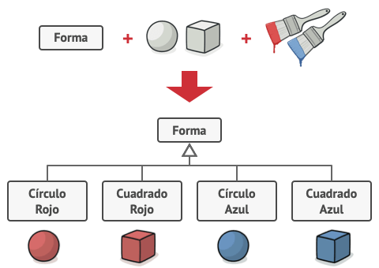
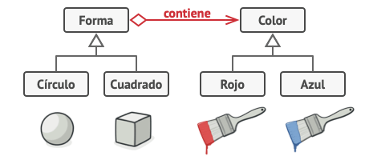
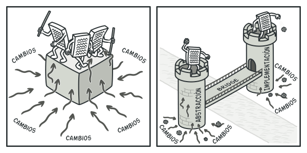
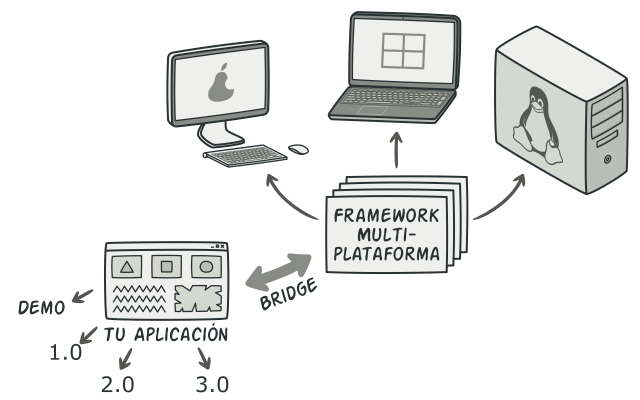
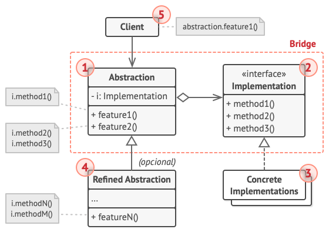
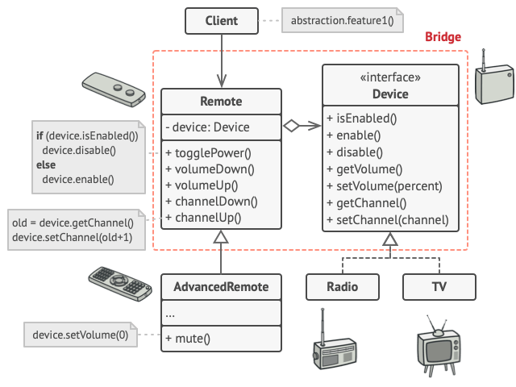

# Bridge

## Propósito

Bridge (también llamado Puente), es un patrón de diseño estructural que te permite dividir una clase grande, o un grupo de clases estrechamente relacionadas, en dos jerarquías separadas (abstracción e implementación) que pueden desarrollarse independientemente la una de la otra.


## Problema

¿*Abstracción*? ¿*Implementación*? ¿Asusta? Mantengamos la calma y veamos un ejemplo sencillo. Digamos que tienes una clase geométrica `Forma` con un par de subclases: `Circulo` y `Cuadrado`. Deseas extender esta jerarquía de clase para que incorpore colores, por lo que planeas crear las subclases de forma `Rojo` y `Azul`. Sin embargo, como ya tienes dos subclases, tienes que crear cuatro combinaciones de clase, como `CirculoAzul` y `CuadradoRojo`. El número de combinaciones de clase crece en progresión geométrica.



Añadir nuevos tipos de forma y color a la jerarquía hará que ésta crezca exponencialmente. Por ejemplo, para añadir una forma de triángulo deberás introducir dos subclases, una para cada color. Y, después, para añadir un nuevo color habrá que crear tres subclases, una para cada tipo de forma. Cuanto más avancemos, peor será.

## Solución

Este problema se presenta porque intentamos extender las clases de forma en dos dimensiones independientes: por forma y por color. Es un problema muy habitual en la herencia de clases.

El patrón Bridge intenta resolver este problema pasando de la herencia a la composición del objeto. Esto quiere decir que se extrae una de las dimensiones a una jerarquía de clases separada, de modo que las clases originales referencian un objeto de la nueva jerarquía, en lugar de tener todo su estado y sus funcionalidades dentro de una clase. Puedes evitar la explosión de una jerarquía de clase transformándola en varias jerarquías relacionadas.



Con esta solución, podemos extraer el código relacionado con el color y colocarlo dentro de su propia clase, con dos subclases: `Rojo` y `Azul`. La clase `Forma` obtiene entonces un campo de referencia que apunta a uno de los objetos de color. Ahora la forma puede delegar cualquier trabajo relacionado con el color al objeto de color vinculado. Esa referencia actuará como un puente entre las clases `Forma` y `Color`. En adelante, añadir nuevos colores no exigirá cambiar la jerarquía de forma y viceversa.

### Abstracción e implementación

El libro de ***Gang of Four*** (GoF) introduce los términos *Abstracción* e *Implementación* como parte de la definición del patrón Bridge. En mi opinión, los términos suenan demasiado académicos y provocan que el patrón parezca más complicado de lo que es en realidad. Una vez leído el sencillo ejemplo con las formas y los colores, vamos a descifrar el significado que esconden las temibles palabras del libro de esta banda de cuatro.

La *Abstracción* (también llamada *interfaz*) es una capa de control de alto nivel para una entidad. Esta capa no tienen que hacer ningún trabajo real por su cuenta, sino que debe delegar el trabajo a la capa de *implementación* (también llamada *plataforma*).

Ten en cuenta que no estamos hablando de las *interfaces* o las *clases abstractas* de tu lenguaje de programación. Sos cosas diferentes. Cuando hablamos de aplicación reales, la abstracción puede representarse por una interfaz gráfica de usuario (GUI), y la implementación puede ser el código del sistema operativo subyacente (API) a la que la capa GUI llama en respuesta a las interacciones del usuario.

En terminos generales, puedes extender esa aplicación en dos direcciones independientes:

- Tener varias GUI diferentes (por ejemplo, personalizadas para cliente regulares o administradores).
- Soportar varias API diferentes (por ejemplo, para poder lanzar la aplicación con Window, Linux y macOS).

En el peor de loc casos, esta aplicación podría asemejarse a un plato gigante de espagueti, en el que cientos de condicionales conectan distintos tipos de GUI con varias API por todo el código. Realizar incluso un cambio sencillo es una base de código monolítica es bastante dificil porque debes comprender todo el asunto muy bien. Es mucho más sencillo realizar cambios en módulos más pequeños y bien definidos.



Puedes poner orden en este caos metiendo el código relacionado con combinaciones específicas interfaz-plataforma dentro de clases independientes. Sin embargo, pronto descubrirás que hay *muchas* de estas clases. La jerarquía de clase crecerá exponencialmente porque añadir una nueva GUI o soportar una API diferente exigirá que se creen más y más clases.

Intentemos resolver este problema con el patrón Bridge, que nos sugiere que dividamos las clases en dos jerarquías:

- Abstracción: La capa GUI de la aplicación
- Implementación: Las API de los sistemas operativos.

Una d  las formas de estructurar una aplicación multiplataforma:



El objeto de la abstracción controla la apariencia de la aplicación, delegando el trabajo real al objeto de la implementación vinculado. Las distintas implementaciones son intercambiables siempre y cuando sigan una interfaz común, permitiendo a la misma GUI funcionar con Windows y Linux.

En consecuencia, puedes cambiar las clases de la GUI sin tocar las clases relacionadas con la API. Además, añadir soporte para otro sistema operativo sólo requiere crear una subclase en la jerarquía de implementación.

## Estructura



1. La **Abstracción** ofrece lógica de control de alto nivel. Depende de que el objeto de la implementación haga el trabajo de bajo nivel.
2. La **Implementació** declara la interfaz común a todas las implementaciones concretas. Una abstracción sólo se puede comunicar con un objeto de implementación a través de los métodos que se declaran aquí. La abstracción puede enumerar los mismos métodos que la implementación, pero normalmente la abstracción declara funcionalidades complejas que dependen de una amplia variedad de operaciones primitivas declaradas por la implementación.
3. Las **Implementaciones Concretas** contienen código específico de plataforma.
4. Las **Abstracciones Refinadas** proporcionan variantes de lógica de control. Como sus padres, trabajan con distintas implementaciones a través de la interfaz general de implementación.
5. Normalmente, el **Cliente** sólo está interesado en trabajar con la abstracción. No obstante, el cliente tiene que vincular el objeto de la abstracción con uno de los objetos de la implementación.

## Pseudocódigo

Este ejemplo ilustra cómo puede ayudar el patrón **Bridge** a dividir el código monolitico de una aplicación que gestiona dispositivos y sus controles remotos. Las clases `Dispositivo` actúan como implementación, mientras que las clases `Remoto` actúan como abstracción. La jerarquía de clase original se divide en dos partes: dispositivos y controles remotos.



La clase base de control remoto declara un campo de referencia que la vincula con un objeto de dispositivo. Todos los controles remotos funcionan con los dispositivos a través de la interfaz general de dispositivos, que permite al mismo remoto soportar varios tipos de dispositivos.

Puedes desarrollar las clases de control remoto independientemente de las clases de dispositivo.Lo único necesario es crear una nueva subclase de control remoto. Por ejemplo, puede ser que un control remoto básico cuente tan solo con dos botones, pero puedes extenderlo añadiéndole funciones, como una batería adicional o pantalla táctil.

El código cliente vincula el tipo deseado de control remoto con un objeto específico de dispositivo a través del constructor del control remoto.

### Código

```nim
class RemoteControl is
    protected field device: Device
    constructor RemoteControl(device: Device) is
        this.device = Device
    method togglePower() is
        if (device.isEnabled()) then
            device.disable()
        else
            device.enable()
    method volumeDown() is
        device.setVolume(device.getVolume() - 10)
    method volumeUp() is
        device.setVolume(device.getVolume() + 10)
    method channelDown() is
        device.setChannel(device.getChannel() - 1)
    method channelUp() is
        device.setChannel(device.getChannel() + 1)


class AdvancedRemoteControl extends RemoteControl is
    method mute() is
        device.setVolume(0)


interface Device is
    method isEnabled()
    method enable()
    method disable()
    method getVolume()
    method setVolume(percent)
    method getChannel()
    method setChannel(channel)


class Tv implements Device is
    //...

class Radio implements Device is
    //...

tv = new Tv()
remote = new RemoteControl(tv)
remote.togglePower()

radio = new Radio()
remote = new AdvancedRemoteControl(radio)
```

### Explicación del código

La **abstracción** define la interfaz para la parte de control de las dos jerarquías de clase. Mantiene una referencia a un objeto de la jerarquía de "implementación" y delega todo el trabajo real a este objeto.

```nim
class RemoteControl is
    protected field device: Device
    constructor RemoteControl(device: Device) is
        this.device = Device
    method togglePower() is
        if (device.isEnabled()) then
            device.disable()
        else
            device.enable()
    method volumeDown() is
        device.setVolume(device.getVolume() - 10)
    method volumeUp() is
        device.setVolume(device.getVolume() + 10)
    method channelDown() is
        device.setChannel(device.getChannel() - 1)
    method channelUp() is
        device.setChannel(device.getChannel() + 1)
```

Puedes extender clases de la jerarquía de abstracción independientemente de las clases de dispositivo.

```nim
class AdvancedRemoteControl extends RemoteControl is
    method mute() is
        device.setVolume(0)
```

La interfaz de "implementación" declara métodos comunes a todas las clases concretas de implementación. No tiene por qué coincidir con la interfaz de la abstracción. De hecho, las dos interfaces pueden ser completamente diferentes. Normalmente, la interfaz de implementación únicamente proporciona operaciones primitivas, mientras que la abstracción define operaciones de más alto nivel con base en las primitivas.

```nim
interface Device is
    method isEnabled()
    method enable()
    method disable()
    method getVolume()
    method setVolume(percent)
    method getChannel()
    method setChannel(channel)
```

Todos los dispositivos siguen la misma interfaz.

```nim
class Tv implements Device is
    //...

class Radio implements Device is
    //...
```

En algún lugar del código cliente.

```nim
tv = new Tv()
remote = new RemoteControl(tv)
remote.togglePower()

radio = new Radio()
remote = new AdvancedRemoteControl(radio)
```

## Aplicabilidad

- Utiliza el patrón Bridge cuando quieras dividir y organizar una clase monolítica que tenga muchas variantes de una sola funcionalidad (por ejemplo, si la clase puede trabajar con diversos servidores de bases de datos).

  Conforme más crece una clase, más difícil resulta entender cómo funciona y más tiempo se tarda en realizar un cambio. Cambiar una de las variaciones de funcionalidad puede exigir realizar muchos cambios a toda la clase, lo que a menudo provoca que se comentan errores o no se aborden algunos de los efectos colaterales críticos.

  El patrón Bridge te permite dividir la clase monolítica en varias jerarquías de clase. Después puedes cambiar las clases de cada jerarquía independientemente de las clases de las otras. Esta solución simplifica el mantenimiento del código y minimiza el riesgo de descomponer el código existente.

- Utiliza el patrón cuando necesites extender una clase en varias dimensiones ortogonales (independientes)

  El patrón Bridge sugiere que extraigas una jerarquía de clase separada para cada una de las dimensiones. La clase original delega el trabajo relacionado a los objetos pertenecientes a dichas jerarquías, en lugar de hacerlo todo por su cuenta.

- Utiliza el patrón Bridge cuando necesites poder cambiar implementaciones durante el tiempo de ejecución.

  Aunque es opcional, el patrón Bridge te permite sustituir el objeto de implementación dentro de la abstracción. Es tan sencillo como asignar un nuevo valor a un campo.

  *Por cierto, este último punto es la razón principal por la que tanta gente confunde el patrón Bridge con el patrón Strategy. Recuerda que un patrón es algo más que un cierto modo de estructurar tus clases. También puede comunicar intención y el tipo de problema que se está abordando.*

## Cómo implementarlo

1. Identifica las dimensiones ortogonales de tus clases. Estos conceptos independientes pueden ser: abstracción/plataforma, dominio/infraestructura, frontend/backend, o interfaz/implementación.
2. Comprueba qué operaciones necesita el cliente y defínelas en la clase base de abstracción.
3. Determina las operaciones disponibles en todas las plataformas. Declara aquellas que necesite la abstracción en la interfaz general de implementación.
4. Crea clases concretas de implementación para todas las plataformas de tu dominio, pero asegúrate de que todas sigan la interfaz de implementación.
5. Dentro de la clase abstracción añade un campo de referencia para el tipo de implementación. La abstracción delega la mayor parte del trabajo al objeto de la implementación referenciado en ese campo.
6. Si tienes muchas variantes de lógica de alto nivel, crea abstracciones refinadas para cada variante extendiendo la clase base de abstracción.
7. El código cliente debe pasar un objeto de implementación al constructor de la abstracción para asociar el uno con el otro. Después, el cliente puede ignorar la implementación y trabajar solo con el objeto de la abstracción.

## Pros y Contras

| Pros | Contras |
| ---- | ------- |
|Puedes crear clases y aplicaciones independientes de plataforma|Puede ser que el código se complique si aplicas el patrón a una clase muy cohesionada|
|El código cliente funciona con abstracciones de alto nivel. No está expuesto a los detalles de la plataforma||
|*Principio de abierto/cerrado*. Puedes introducir nuevas abstracciones e implementaciones independientes entre sí.||
|*Principio de responsabilidad única*. Puedes centrarte en la lógica de alto nivel en la abstracción y en detalles de la plataforma en la implementación.||

## Relaciones con otros patrones

- Bridge suele diseñarse por anticipado, lo que te permite desarrollar partes de una aplicación de forma independiente entre sí. Por otro lado, Adapter se utiliza habitualmente con una aplicación existente para hacer que unas clases que de otro modo serían incompatibles, trabajen juntas sin problemas.
- Bridge, State, Strategy (y, hasta cierto punto, Adapter) tienen estructuras muy similares. De hecho, todos estos patrones se basan en la composición, que consiste en delegar trabajo a otros objetos. Sin embargo, todos ellos solucionan problemas diferentes. Un patrón no es simplemente una receta para estructurar tu código de una forma específica. También puede comunicar a otros desarrolladores el problema que resuelve.
- Puedes utilizar Abstract Factory junto a Bridge. Este emparejamiento resulta útil cuando algunas abstracciones definidas por Bridge sólo pueden funcionar con implementaciones específicas. En este caso, Abstract Factory puede encapsular estas relaciones y esconder la complejidad al código cliente.
- Puedes combinar Builder con Bridge: la clase *directora* juega el papel de la abstracción, mientras que diferentes *constructoras* actúan como *implementaciones*.
