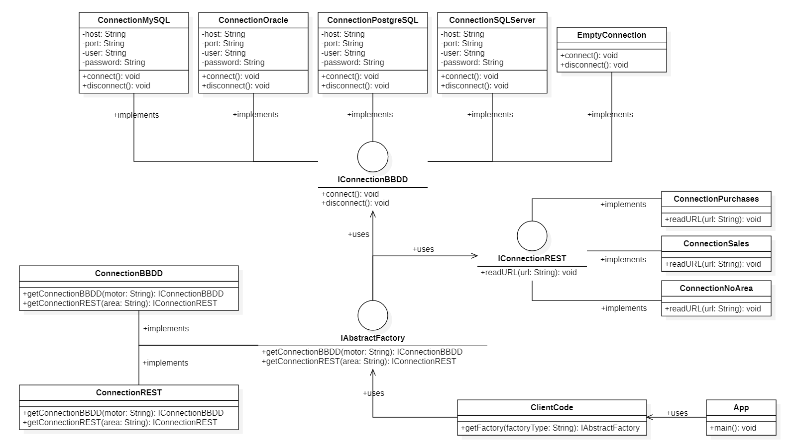
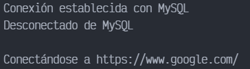

# Abstract Factory - Database and REST Connection

Este ejemplo fue obtenido de [Curso de Patrones de diseño - 4 Fábrica Abstracta | MitoCode](https://www.youtube.com/watch?v=QmE-o5R7ZF4).

## Diagrama de clases UML

## Output

