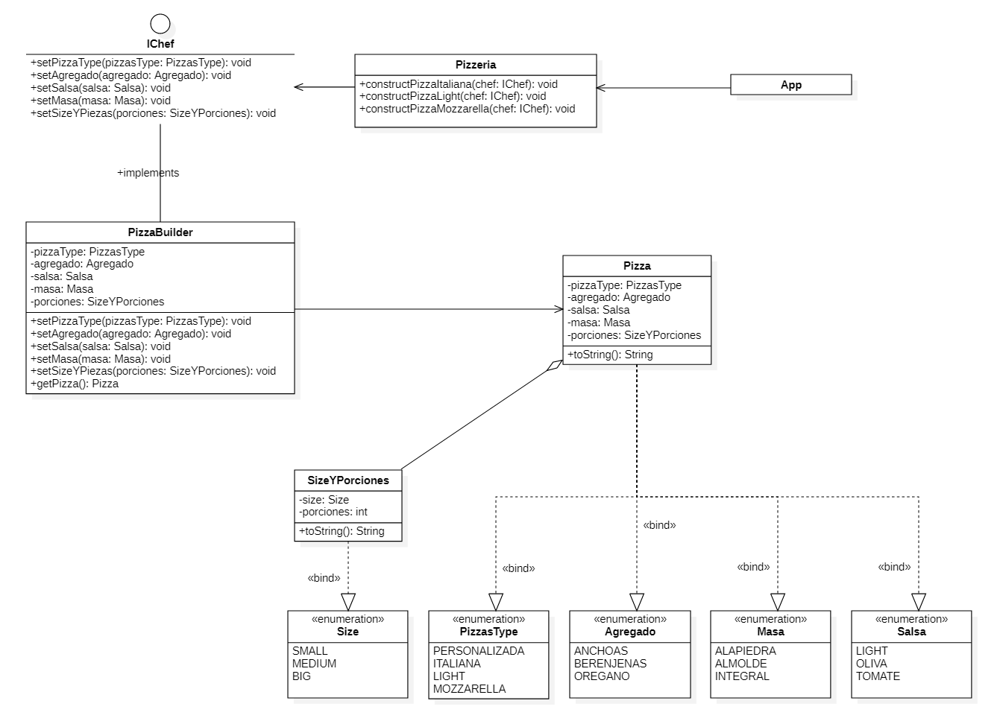
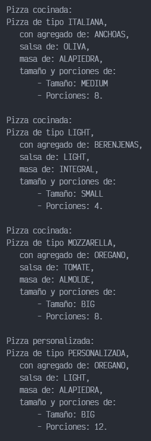

# Builder - Pizzeria

Este ejemplo fue obtenido y modificado de [El patrón Builder (con ejemplo práctico en C#)](https://www.youtube.com/watch?v=aeownlEi_yI)

## Diagrama de clases UML

## Output

