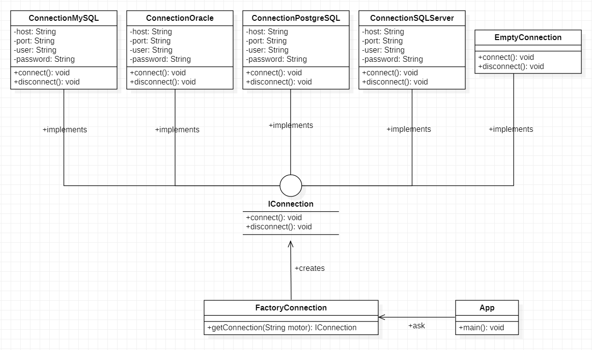
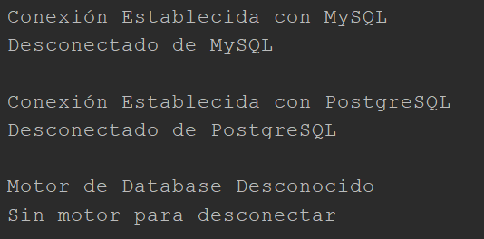

# Factory Method - Databases Connection

Este ejemplo fue obtenido de la explicación de [Curso de Patrones de diseño - 3 Fábrica | MitoCode](https://www.youtube.com/watch?v=R6Ef64hDwGo&ab_channel=MitoCode).

## Diagrama de clases UML

## Output

