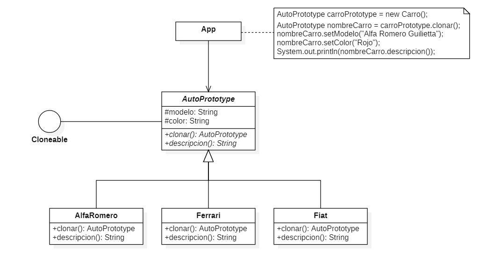
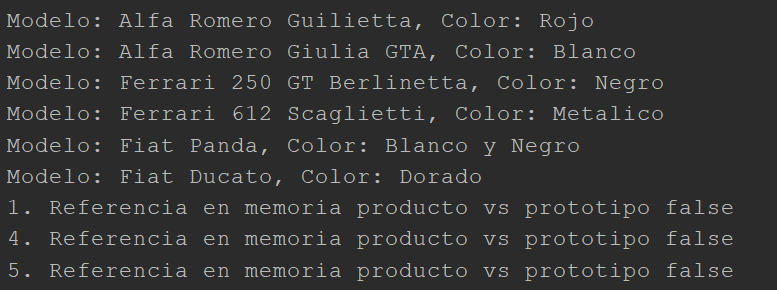

# Prototype - Cuenta de Ahorro

Este ejemplo fue tomado de la explicación de [El patrón Prototype (con ejemplo práctico en C#)](https://www.youtube.com/watch?v=mWLeTd-Gi34)

## Diagrama de clases UML

## Output

